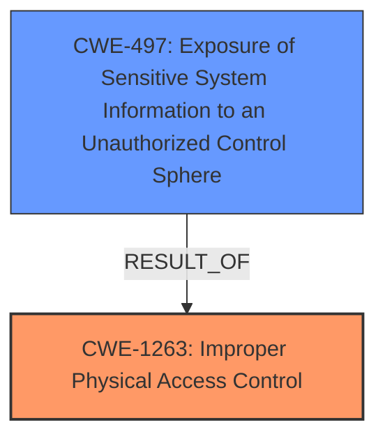

# Enhanced Analysis for CVE-2025-30439

# Summary
| CWE ID | CWE Name | Confidence | CWE Abstraction Level | CWE Vulnerability Mapping Label | CWE-Vulnerability Mapping Notes |
|---|---|---|---|---|---|
| CWE-1263 | Improper Physical Access Control | 0.8 | Class | Allowed-with-Review | Root Cause |
| CWE-497 | Exposure of Sensitive System Information to an Unauthorized Control Sphere | 0.7 | Base | Allowed | Secondary |

## Evidence and Confidence

*   **Confidence Score:** 0.75
*   **Evidence Strength:** MEDIUM

## Relationship Analysis
The primary CWE is CWE-1263, which is at the Class level. While it doesn't have specific child CWEs directly related, it falls under the broader category of access control issues. The secondary CWE, CWE-497, is at the Base level and represents the specific impact of the vulnerability. The relationship here is more about cause and effect: the **improper physical access control** (CWE-1263) leads to the **exposure of sensitive information** (CWE-497).



## Vulnerability Chain
The chain starts with the attacker gaining **physical access to a locked device.** Due to **improper physical access control** (CWE-1263), the attacker is then able to **view sensitive user information**, which represents the **exposure of sensitive system information** (CWE-497). The vulnerability chain is: Physical Access -> CWE-1263 -> CWE-497

## Summary of Analysis
The analysis indicates that an attacker with **physical access to a locked device** can **view sensitive user information**. The root cause is an **improper physical access control** (CWE-1263). The impact is the **exposure of sensitive system information** (CWE-497).

The retriever results suggested several potential CWEs, including CWE-787 (Out-of-bounds Write), CWE-285 (Improper Authorization), and CWE-203 (Observable Discrepancy). However, these options were not as fitting as CWE-1263 and CWE-497. CWE-787 is not relevant as there is no indication of memory corruption or buffer overflows. CWE-285, while related to authorization, is more suitable for logical access control issues rather than physical access. CWE-203, while potentially related to how information is displayed, doesn't capture the core issue of unauthorized access to sensitive information.

The primary selection of CWE-1263 is based on the vulnerability description explicitly mentioning **physical access to a locked device**, which directly aligns with the definition of **Improper Physical Access Control**. The selection of CWE-497 is based on the fact that the attacker can **view sensitive user information**. The evidence is derived from the "Vulnerability Description" and "CVE Reference Links Content Summary" sections, which both highlight the ability to **view sensitive user information** as the impact of the vulnerability.

Relevant CWE Information:

# Enhanced Context (25 CWEs)
The following CWEs were identified as potentially relevant to this vulnerability:

## CWE-203: Observable Discrepancy
**Abstraction Level**: Base
**Similarity Score**: 0.75
**Source**: dense

**Description**:
The product behaves differently or sends different responses under different circumstances in a way that is observable to an unauthorized actor, which exposes security-relevant information about the state of the product, such as whether a particular operation was successful or not.

**Mapping Guidance**:
- Usage: Allowed
- Rationale: This CWE entry is at the Base level of abstraction, which is a preferred level of abstraction for mapping to the root causes of vulnerabilities.

## CWE-451: User Interface (UI) Misrepresentation of Critical Information
**Abstraction Level**: Class
**Similarity Score**: 0.73
**Source**: dense

**Description**:
The user interface (UI) does not properly represent critical information to the user, allowing the information - or its source - to be obscured or spoofed. This is often a component in phishing attacks.

**Mapping Guidance**:
- Usage: Allowed-with-Review
- Rationale: This CWE entry is a Class and might have Base-level children that would be more appropriate

## CWE-843: Access of Resource Using Incompatible Type ('Type Confusion')
**Abstraction Level**: Base
**Similarity Score**: 0.73
**Source**: dense

**Description**:
The product allocates or initializes a resource such as a pointer, object, or variable using one type, but it later accesses that resource using a type that is incompatible with the original type.

**Mapping Guidance**:
- Usage: Allowed
- Rationale: This CWE entry is at the Base level of abstraction, which is a preferred level of abstraction for mapping to the root causes of vulnerabilities.

## CWE-497: Exposure of Sensitive System Information to an Unauthorized Control Sphere
**Abstraction Level**: Base
**Similarity Score**: 0.72
**Source**: dense

**Description**:
The product does not properly prevent sensitive system-level information from being accessed by unauthorized actors who do not have the same level of access to the underlying system as the product does.

**Mapping Guidance**:
- Usage: Allowed
- Rationale: This CWE entry is at the Base level of abstraction, which is a preferred level of abstraction for mapping to the root causes of vulnerabilities.

**Technical Explanation for CWE-1263:**
*   **How the vulnerability's details match the CWE's characteristics:** The vulnerability involves an attacker gaining **physical access to a locked device** and viewing sensitive information. This aligns directly with the concept of **Improper Physical Access Control** (CWE-1263), where physical security mechanisms are inadequate to protect sensitive assets.
*   **The security implications and potential impact:** The primary security implication is the unauthorized viewing of sensitive user information, which can lead to privacy violations, identity theft, and other related harms.
*   **Any parent-child relationships or chain patterns that influenced your mapping:** CWE-1263 is a Class-level CWE, and while it doesn't have immediate child CWEs, it generally relates to broader access control failures. The chain pattern here is Physical Access -> Improper Control -> Information Exposure.
*   **Whether the weakness is primary or secondary in the vulnerability:** This is the primary weakness, as it is the root cause that enables the subsequent information exposure.
*   **How the official MITRE mapping guidance influenced your decision:** The MITRE mapping guidance for CWE-1263 allows for its use but suggests reviewing for more specific Base-level children if available. In this case, no more specific child is available.

**Technical Explanation for CWE-497:**
*   **How the vulnerability's details match the CWE's characteristics:** The vulnerability results in the **exposure of sensitive user information** to an attacker who has gained unauthorized **physical access**. This directly matches the definition of **Exposure of Sensitive System Information to an Unauthorized Control Sphere** (CWE-497).
*   **The security implications and potential impact:** The exposure of sensitive information can lead to severe consequences, including privacy breaches, identity theft, financial loss, and reputational damage.
*   **Any parent-child relationships or chain patterns that influenced your mapping:** CWE-497 is a Base-level CWE, representing a specific type of information exposure. The chain pattern is Physical Access -> Improper Control -> Information Exposure (CWE-497).
*   **Whether the weakness is primary or secondary in the vulnerability:** This is a secondary weakness, as it represents the impact of the primary weakness (CWE-1263).
*   **How the official MITRE mapping guidance influenced your decision:** The MITRE mapping guidance for CWE-497 allows for its use at the Base level, which is the appropriate level of abstraction for this vulnerability.

**CWEs Considered But Not Used:**

*   **CWE-203 (Observable Discrepancy):** While there might be some observable difference in the device's state that allows the attacker to view the information, this CWE doesn't fully capture the core issue of **physical access control** and information exposure.
*   **CWE-285 (Improper Authorization):** This is more applicable to logical authorization flaws, not physical access issues.
*   **CWE-787 (Out-of-bounds Write):** There's no evidence of memory corruption or buffer overflows in the provided description.


## CWE Relationship Analysis

Current CWEs represent these abstraction levels: .


### Vulnerability Chain Analysis

**Chain starting from CWE-203:**
- 203 (Observable Discrepancy) - ROOT


**Chain starting from CWE-787:**
- 787 (Out-of-bounds Write) - ROOT


### CWE Relationship Diagram

```mermaid
graph TD
    classDef primary fill:#f96,stroke:#333,stroke-width:2px
    classDef secondary fill:#69f,stroke:#333
    classDef tertiary fill:#9e9,stroke:#333
```