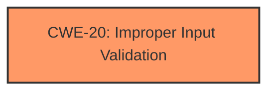

# Raw Analyzer Response for CVE-2025-30442

# Summary
| CWE ID | CWE Name | Confidence | CWE Abstraction Level | CWE Vulnerability Mapping Label | CWE-Vulnerability Mapping Notes |
|---|---|---|---|---|---|
| CWE-20 | Improper Input Validation | 0.7 | Class | Primary | Discouraged |

## Evidence and Confidence

*   **Confidence Score:** 0.7
*   **Evidence Strength:** LOW

## Relationship Analysis
The analysis is based on the high-level description of the vulnerability. CWE-20 is a class-level CWE, which is not ideal, but given the limited information, it is the most appropriate. The primary relationship to consider is that CWE-20 is a class-level weakness, suggesting there might be more specific base or variant level CWEs that could apply if more information were available.

## Vulnerability Chain
The chain starts with **improper input sanitization** (root cause) leading to an app gaining elevated privileges (impact).

## Summary of Analysis
The vulnerability description states the issue was addressed with improved **input sanitization**, which directly aligns with CWE-20 (Improper Input Validation). The impact is that an app may gain elevated privileges.

The analysis is heavily based on the limited information provided, specifically the phrase "**input sanitization**". Without more details, CWE-20 is the most appropriate, albeit a high-level classification.

CWE-20 is a Class-level CWE, and the guidance discourages its use when more specific CWEs are available. However, in this case, the lack of detailed information prevents a more precise mapping.

Relevant CWE Information:

# Enhanced Context (25 CWEs)
The following CWEs were identified as potentially relevant to this vulnerability:

## CWE Classification Guidance

The following guidance has been automatically included because relevant keywords were detected in the vulnerability description:

### Privileges vs Permissions Guidance

## Complete CWE Specifications

CWE-843: Access of Resource Using Incompatible Type ('Type Confusion')

CWE-787: Out-of-bounds Write

CWE-138: Improper Neutralization of Special Elements

CWE-20: Improper Input Validation

CWE-665: Improper Initialization

CWE-187: Partial String Comparison

CWE-415: Double Free

CWE-277: Insecure Inherited Permissions

CWE-347: Improper Verification of Cryptographic Signature

CWE-770: Allocation of Resources Without Limits or Throttling
CWEs Considered but not Used:

*   CWE-843 (Access of Resource Using Incompatible Type ('Type Confusion')): While potentially relevant, the description doesn't indicate type confusion.
*   CWE-787 (Out-of-bounds Write): There is no mention of memory corruption, making this less likely.
*   CWE-138 (Improper Neutralization of Special Elements): Could be a possibility but not explicitly mentioned.
*   CWE-665 (Improper Initialization): There's no clear indication of initialization issues.
*   CWE-347 (Improper Verification of Cryptographic Signature): This CWE is related to cryptographic signatures, which are not mentioned in the vulnerability description.