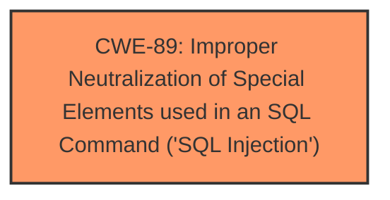

# Analysis Report for CVE-2025-3045

# Vulnerability Analysis Report: CVE-2025-3045

## Description

A vulnerability, which was classified as critical, was found in oretnom23/SourceCodester Apartment Visitor Management System 1.0. Affected is an unknown function of the file /remove-apartment.php. The manipulation of the argument ID leads to **sql injection**. It is possible to launch the attack remotely. The exploit has been disclosed to the public and may be used.

## Vulnerability Description Key Phrases

- **Weakness:** sql injection
- **Vector:** manipulation of ID argument
- **Product:** oretnom23/SourceCodester Apartment Visitor Management System
- **Version:** 1
- **Component:** /remove-apartment.php

## Analysis (with Relationship Data)

# Summary
| CWE ID | CWE Name | Confidence | CWE Abstraction Level | CWE Vulnerability Mapping Label | CWE-Vulnerability Mapping Notes |
|---|---|---|---|---|---|
| CWE-89 | Improper Neutralization of Special Elements used in an SQL Command ('SQL Injection') | 1.0 | Base | Allowed | Primary CWE. The vulnerability description explicitly mentions **SQL injection** due to improper neutralization of special elements. |

## Evidence and Confidence

*   **Confidence Score:** 1.0
*   **Evidence Strength:** HIGH

## Relationship Analysis
The primary identified weakness is CWE-89 [CWE-89: Improper Neutralization of Special Elements used in an SQL Command ('SQL Injection')]. This is a base-level CWE, which is the preferred level of abstraction. No parent or child relationships influenced the decision in this case, as the description clearly points to SQL injection.



## Vulnerability Chain
The vulnerability chain starts with the **improper neutralization** of special elements in the ID argument, leading directly to **SQL injection**.

## Summary of Analysis
The vulnerability description explicitly states that the manipulation of the ID argument in `/remove-apartment.php` leads to **SQL injection**. The direct mention of "sql injection" aligns perfectly with CWE-89 [CWE-89: Improper Neutralization of Special Elements used in an SQL Command ('SQL Injection')], which describes this type of vulnerability. The retriever results also list CWE-89 as the top candidate. Therefore, CWE-89 is the most appropriate CWE for this vulnerability.

Relevant CWE Information:
- **CWE-89**:  The product constructs all or part of an SQL command using externally-influenced input, but it does not neutralize or incorrectly neutralizes special elements that could modify the intended SQL command.  This aligns directly with the vulnerability description.


## CWE Relationship Analysis

Current CWEs represent these abstraction levels: .


### Vulnerability Chain Analysis

**Chain starting from CWE-89:**
- 89 (Improper Neutralization of Special Elements used in an SQL Command ('SQL Injection')) - ROOT


### CWE Relationship Diagram

```mermaid
graph TD
    classDef primary fill:#f96,stroke:#333,stroke-width:2px
    classDef secondary fill:#69f,stroke:#333
    classDef tertiary fill:#9e9,stroke:#333
```


*Report generated on 2025-07-14 17:27:55*
