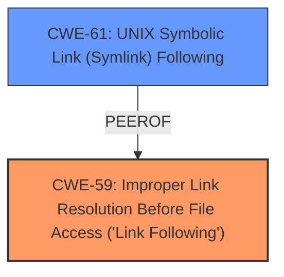

# Enhanced Analysis for CVE-2025-30450

# Summary
| CWE ID | CWE Name | Confidence | CWE Abstraction Level | CWE Vulnerability Mapping Label | CWE-Vulnerability Mapping Notes |
|---|---|---|---|---|---|
| CWE-59 | Improper Link Resolution Before File Access ('Link Following') | 0.8 | Base | Allowed | Primary CWE. The vulnerability description explicitly mentions improved validation of symlinks. |
| CWE-61 | UNIX Symbolic Link (Symlink) Following | 0.7 | Compound | Allowed | Secondary CWE. This is a more specific compound weakness involving symbolic links. |

## Evidence and Confidence

*   **Confidence Score:** 0.8
*   **Evidence Strength:** MEDIUM

## Relationship Analysis
The primary CWE is CWE-59 **Improper Link Resolution Before File Access ('Link Following')**, a base level CWE. CWE-61 **UNIX Symbolic Link (Symlink) Following** is a compound CWE that is more specific to symlinks and their potential misuse. CWE-61 can be considered a specific instance of the more general CWE-59.



## Vulnerability Chain
The vulnerability chain starts with the **improper validation of symlinks** (CWE-59). This can lead to an application accessing sensitive user data. The chain consists of:

1.  **Root Cause:** **Improper Link Resolution Before File Access ('Link Following')** (CWE-59): The application does not properly validate symlinks.
2.  **Impact:** An app may be able to access sensitive user data.

## Summary of Analysis
The vulnerability description explicitly mentions "improved validation of symlinks". This points directly to CWE-59 **Improper Link Resolution Before File Access ('Link Following')**. The "CVE Reference Links Content Summary" also reinforces this by mentioning the mitigation/fix is "Improved validation of symlinks."

CWE-61 **UNIX Symbolic Link (Symlink) Following** is also included since the vulnerability involves symlinks which are specific to UNIX-like systems.

The retriever results listed CWE-787 **Out-of-bounds Write**, CWE-843 **Access of Resource Using Incompatible Type ('Type Confusion')**, and CWE-665 **Improper Initialization** as top candidates. However, these do not directly relate to the vulnerability description focusing on symlink validation. CWE-20 **Improper Input Validation** is too generic and doesn't accurately represent the specific weakness.

My assessment is heavily based on the provided evidence, particularly the vulnerability description and the "CVE Reference Links Content Summary". The selected CWEs are at the optimal level of specificity, addressing the root cause (symlink validation) and the potential impact (accessing sensitive user data).


## CWE Relationship Analysis

Current CWEs represent these abstraction levels: .


### Vulnerability Chain Analysis

**Chain starting from CWE-59:**
- 59 (Improper Link Resolution Before File Access ('Link Following')) - ROOT


**Chain starting from CWE-787:**
- 787 (Out-of-bounds Write) - ROOT


### CWE Relationship Diagram

```mermaid
graph TD
    classDef primary fill:#f96,stroke:#333,stroke-width:2px
    classDef secondary fill:#69f,stroke:#333
    classDef tertiary fill:#9e9,stroke:#333
```