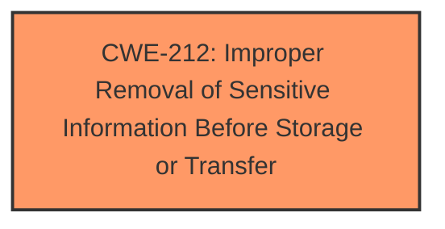

# Raw Analyzer Response for CVE-2025-30451

# Summary
| CWE ID | CWE Name | Confidence | CWE Abstraction Level | CWE Vulnerability Mapping Label | CWE-Vulnerability Mapping Notes |
|---|---|---|---|---|---|
| CWE-212 | Improper Removal of Sensitive Information Before Storage or Transfer | 0.8 | Base | Primary CWE | Allowed |

## Evidence and Confidence

*   **Confidence Score:** 0.8
*   **Evidence Strength:** MEDIUM

## Relationship Analysis
The primary CWE is CWE-212, which focuses on the improper removal of sensitive information. This is a base-level CWE. Several other CWEs were considered, particularly those related to out-of-bounds access and type confusion, but they were not as directly relevant as CWE-212. No strong chain relationships were identified in this case, as the vulnerability primarily involves the **failure to properly redact sensitive information**, leading to its exposure.

## Vulnerability Chain
The vulnerability chain is relatively simple:
1.  **Root Cause:** **Improper redaction of sensitive information** (CWE-212).
2.  **Impact:** An app gains unauthorized access to sensitive user data.

## Summary of Analysis
The primary focus is on the **improved redaction of sensitive information** to address the vulnerability. The vulnerability description and CVE summary both emphasize this aspect, which aligns directly with CWE-212. The other suggested CWEs, while potentially related in other contexts, do not fit as precisely as CWE-212. Therefore, CWE-212 is selected as the primary CWE at its base level. This assessment is based on the provided evidence, focusing on the root cause.

Relevant CWE Information:

# Enhanced Context (25 CWEs)

## CWE-203: Observable Discrepancy
**Abstraction Level**: Base
**Similarity Score**: 0.70
**Source**: dense

**Description**:
The product behaves differently or sends different responses under different circumstances in a way that is observable to an unauthorized actor, which exposes security-relevant information about the state of the product, such as whether a particular operation was successful or not.

**Mapping Guidance**:
- Usage: Allowed
- Rationale: This CWE entry is at the Base level of abstraction, which is a preferred level of abstraction for mapping to the root causes of vulnerabilities.

## CWE-347: Improper Verification of Cryptographic Signature
**Abstraction Level**: Base
**Similarity Score**: 0.68
**Source**: dense

**Description**:
The product does not verify, or incorrectly verifies, the cryptographic signature for data.

**Mapping Guidance**:
- Usage: Allowed
- Rationale: This CWE entry is at the Base level of abstraction, which is a preferred level of abstraction for mapping to the root causes of vulnerabilities.

## CWE-451: User Interface (UI) Misrepresentation of Critical Information
**Abstraction Level**: Class
**Similarity Score**: 0.68
**Source**: dense

**Description**:
The user interface (UI) does not properly represent critical information to the user, allowing the information - or its source - to be obscured or spoofed. This is often a component in phishing attacks.

**Mapping Guidance**:
- Usage: Allowed-with-Review
- Rationale: This CWE entry is a Class and might have Base-level children that would be more appropriate

## CWE-667: Improper Locking
**Abstraction Level**: Class
**Similarity Score**: 0.68
**Source**: dense

**Description**:
The product does not properly acquire or release a lock on a resource, leading to unexpected resource state changes and behaviors.

**Mapping Guidance**:
- Usage: Allowed-with-Review
- Rationale: This CWE entry is a Class and might have Base-level children that would be more appropriate

## CWE-212: Improper Removal of Sensitive Information Before Storage or Transfer
**Abstraction Level**: Base
**Similarity Score**: 0.68
**Source**: dense

**Description**:
The product stores, transfers, or shares a resource that contains sensitive information, but it does not properly remove that information before the product makes the resource available to unauthorized actors.

**Mapping Guidance**:
- Usage: Allowed
- Rationale: This CWE entry is at the Base level of abstraction, which is a preferred level of abstraction for mapping to the root causes of vulnerabilities.

**Technical Explanation for CWE-212:**

*   **How the vulnerability's details match the CWE's characteristics:** The vulnerability description mentions "improved redaction of sensitive information." This directly aligns with CWE-212, which focuses on the **failure to properly remove sensitive information** before storage or transfer. In this case, the sensitive user data was not adequately redacted, leading to potential unauthorized access.
*   **The security implications and potential impact:** The security implication is the exposure of sensitive user data to unauthorized apps. The impact could range from privacy violations to more severe security breaches, depending on the nature of the data accessed.
*   **Any parent-child relationships or chain patterns that influenced your mapping:** There is no direct parent-child relationship that strongly influences the mapping. The focus is on the specific action of **improper redaction**.
*   **Whether the weakness is primary or secondary in the vulnerability:** This weakness is primary, as the **improper redaction** is the direct cause of the vulnerability.
*   **How the official MITRE mapping guidance influenced your decision:** The MITRE mapping guidance allows for the use of CWE-212 at the Base level, reinforcing its appropriateness for this vulnerability.

**CWEs Considered but Not Used:**

*   **CWE-787: Out-of-bounds Write:** While out-of-bounds write can lead to data corruption and potential unauthorized access, the description doesn't suggest memory corruption as the primary issue.
*   **CWE-843: Access of Resource Using Incompatible Type ('Type Confusion'):** Type confusion can lead to data being misinterpreted, but the description focuses on redaction issues rather than type mismatches.
*   **CWE-347: Improper Verification of Cryptographic Signature:** The description does not refer to cryptographic signatures, so this CWE is not applicable.
*   **CWE-125: Out-of-bounds Read:** Similar to CWE-787, the primary issue is with the redaction of sensitive data, not necessarily reading beyond buffer boundaries.
*   **CWE-285: Improper Authorization:** While related to access control, the description doesn't emphasize an authorization **failure**. Instead, the focus is on the data being accessible because it wasn't properly redacted.
*   **CWE-532: Insertion of Sensitive Information into Log File:** The vulnerability is more focused on general sensitive data access than log files specifically.
*   **CWE-20: Improper Input Validation:** This is a broad category, and the specific weakness of **improper redaction** is better captured by CWE-212.