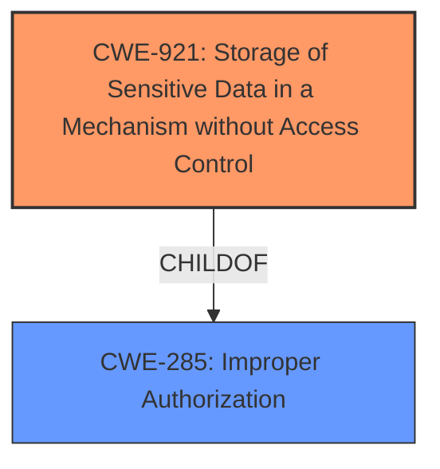

# Enhanced Analysis for CVE-2025-30463

# Summary
| CWE ID | CWE Name | Confidence | CWE Abstraction Level | CWE Vulnerability Mapping Label | CWE-Vulnerability Mapping Notes |
|---|---|---|---|---|---|
| CWE-921 | Storage of Sensitive Data in a Mechanism without Access Control | 0.8 | Base | Allowed | Primary CWE |

## Evidence and Confidence

*   **Confidence Score:** 0.8
*   **Evidence Strength:** MEDIUM

## Relationship Analysis
The primary relationship considered was that CWE-921 directly addresses the core issue of sensitive data being accessible due to lack of access control. While other CWEs like CWE-285 (Improper Authorization) were considered, they were deemed too high-level. CWE-921 provides a more specific and accurate representation of the **root cause**.



## Vulnerability Chain
The vulnerability chain is as follows:
1.  **Root Cause:** CWE-921 (Storage of Sensitive Data in a Mechanism without Access Control) - Sensitive user data is stored without proper access controls.
2.  **Impact:** An app can access sensitive user data.

## Summary of Analysis
The vulnerability description indicates that an app can access sensitive user data due to a flaw in data container access restrictions. The provided information points towards **improper access control** mechanisms, making CWE-921 (Storage of Sensitive Data in a Mechanism without Access Control) the most appropriate primary CWE. The description states: "The issue was addressed with improved restriction of data container access". This directly implies a problem with how access controls were implemented for sensitive data containers. While other CWEs like CWE-285 (Improper Authorization) could be considered, CWE-921 is more specific and accurately captures the **root cause** of the vulnerability.

The retriever results also list CWE-921 with a high density score, further supporting this selection. The MITRE mapping guidance allows the use of CWE-921 at the Base level, making it a suitable choice. The confidence level is high due to the direct link between the vulnerability description and the CWE's characteristics.

CWEs considered but not used:

*   CWE-787 (Out-of-bounds Write): This CWE relates to memory corruption issues. There is no evidence in the description to suggest memory corruption.
*   CWE-285 (Improper Authorization): While related to access control, it is a higher-level class. CWE-921 provides a more specific characterization of the problem.
*   CWE-843 (Access of Resource Using Incompatible Type ('Type Confusion')): This CWE involves type confusion issues. There is no evidence to suggest type confusion.
*   CWE-665 (Improper Initialization): This CWE relates to uninitialized resources. There is no evidence to support this.
*   CWE-277 (Insecure Inherited Permissions): While relevant to permissions, it does not directly address the storage of sensitive data without access control.
*   CWE-20 (Improper Input Validation): This CWE relates to input validation issues. There is no evidence to suggest input validation problems.


## CWE Relationship Analysis

Current CWEs represent these abstraction levels: .


### Vulnerability Chain Analysis

**Chain starting from CWE-787:**
- 787 (Out-of-bounds Write) - ROOT


**Chain starting from CWE-921:**
- 921 (Storage of Sensitive Data in a Mechanism without Access Control) - ROOT


### CWE Relationship Diagram

```mermaid
graph TD
    classDef primary fill:#f96,stroke:#333,stroke-width:2px
    classDef secondary fill:#69f,stroke:#333
    classDef tertiary fill:#9e9,stroke:#333
```