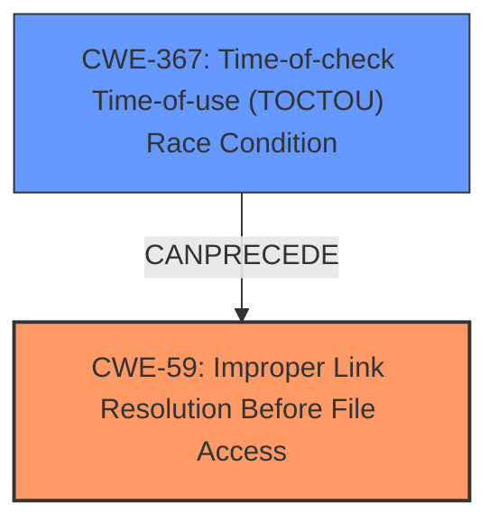

# Analysis for CVE-2025-3048

# Summary
| CWE ID | CWE Name | Confidence | CWE Abstraction Level | CWE Vulnerability Mapping Label | CWE-Vulnerability Mapping Notes |
|---|---|---|---|---|---|
| CWE-59 | Improper Link Resolution Before File Access ('Link Following') | 0.85 | Base | Allowed | Primary CWE - Addresses the **improper handling of symbolic links** during file access. |
| CWE-367 | Time-of-check Time-of-use (TOCTOU) Race Condition | 0.65 | Base | Allowed | Secondary CWE - A race condition could theoretically exist during the copying of symlink contents. |

## Evidence and Confidence

*   **Confidence Score:** 0.75
*   **Evidence Strength:** MEDIUM

## Relationship Analysis
The primary CWE, CWE-59, describes the core issue of **improperly handling symlinks**. CWE-367, a secondary consideration, represents a potential race condition that *could* occur during the symlink processing. The relationship between these CWEs is that CWE-367 (Time-of-check Time-of-use Race Condition) can precede CWE-59 (Improper Link Resolution Before File Access ('Link Following')). CWE-59 is at the Base level of abstraction, which is a preferred level.

## Vulnerability Chain
The vulnerability chain starts with the AWS SAM CLI **improperly handling symlinks** during the build process, leading to the content of these symlinks being copied to the local workspace cache as regular files/directories. This results in unauthorized users gaining access to the symlink content.

## Summary of Analysis
The initial analysis focused on identifying the root cause of the vulnerability. The description clearly states that the issue lies in how AWS SAM CLI handles symlinks. After building an application with symlinks, it copies the content of the symlinks to the local workspace cache as regular files or directories. This copying action allows users without the necessary permissions outside the Docker container to access these files, representing a significant security risk.

The primary CWE selected is **CWE-59: Improper Link Resolution Before File Access ('Link Following')**. This is because the vulnerability stems from the product's failure to properly prevent a filename from identifying a link or shortcut that resolves to an unintended resource, as evidenced by:

*   "After completing a build with AWS Serverless Application Model Command Line Interface (SAM CLI) which include symlinks, the content of those symlinks are copied to the cache of the local workspace as regular files or directories."
*   "As a result, a user who does not have access to those symlinks outside of the Docker container would now have access via the local workspace."

CWE-59 accurately describes the **improper handling of symbolic links** during file access, which is the core issue.

CWE-367 (Time-of-check Time-of-use (TOCTOU) Race Condition) was considered as a secondary CWE because there *could* be a race condition during the copying of the symlink content, but there is not sufficient evidence in the vulnerability description to confirm this. It is included because the Retriever results identified it as a potential issue and this can precede CWE-59.

CWE-61 (UNIX Symbolic Link (Symlink) Following) was considered but not selected as the primary CWE because it is a compound weakness. The root cause is the **improper handling of the symlink**, which is better captured by CWE-59.

The selected CWEs are at the optimal level of specificity, with CWE-59 being a Base level CWE. This provides a clear and accurate representation of the vulnerability.