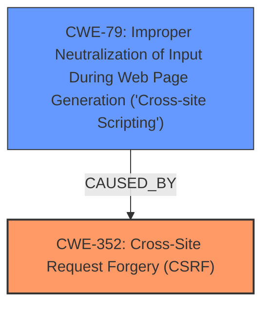

# Raw Analyzer Response for CVE-2025-30565

# Summary

| CWE ID | CWE Name | Confidence | CWE Abstraction Level | CWE Vulnerability Mapping Label | CWE-Vulnerability Mapping Notes |
|---|---|---|---|---|---|
| CWE-352 | Cross-Site Request Forgery (CSRF) | 0.9 | Compound | Primary | Allowed |
| CWE-79 | Improper Neutralization of Input During Web Page Generation ('Cross-site Scripting') | 0.8 | Base | Secondary | Allowed |

## Evidence and Confidence

*   **Confidence Score:** 0.85
*   **Evidence Strength:** HIGH

## Relationship Analysis
The primary weakness is CWE-352 [Cross-Site Request Forgery (CSRF)], a compound weakness where the application does not sufficiently verify the request's origin. This allows an attacker to induce a user to perform unwanted actions. The secondary weakness is CWE-79 [Improper Neutralization of Input During Web Page Generation ('Cross-site Scripting')], because the CSRF allows for Stored XSS via the higher privileged user.

## Vulnerability Chain
The vulnerability chain begins with **CWE-352 [Cross-Site Request Forgery (CSRF)]**, where the application **fails to validate the origin of requests**. This allows an attacker to forge requests on behalf of an authenticated user, leading to **CWE-79 [Improper Neutralization of Input During Web Page Generation ('Cross-site Scripting')]** and resulting in Stored XSS. The root cause is the **missing CSRF protection**, which then enables the XSS vulnerability.

## Summary of Analysis
The analysis is based on the provided vulnerability description and CVE reference. The description highlights a Cross-Site Request Forgery (CSRF) vulnerability leading to Stored XSS in the karrikas banner-manager plugin.

The primary CWE is CWE-352 [Cross-Site Request Forgery (CSRF)], with a confidence score of 0.9, because the root cause of the vulnerability is the **lack of CSRF protection**. This allows an attacker to induce an authenticated user to perform actions, such as modifying settings to inject malicious scripts.

The secondary CWE is CWE-79 [Improper Neutralization of Input During Web Page Generation ('Cross-site Scripting')], with a confidence score of 0.8, because the impact described is Stored XSS, which is **caused by the lack of CSRF protection**.

The selected CWEs are at the appropriate level of specificity. CWE-352 [Cross-Site Request Forgery (CSRF)] directly addresses the **root cause**, and CWE-79 [Improper Neutralization of Input During Web Page Generation ('Cross-site Scripting')] describes the resulting XSS.

Relevant CWE Information: