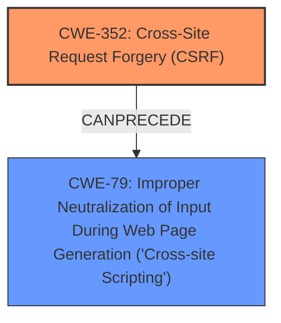

# Raw Analyzer Response for CVE-2025-30583

# Summary
| CWE ID  | CWE Name                                                                             | Confidence | CWE Abstraction Level | CWE Vulnerability Mapping Label | CWE-Vulnerability Mapping Notes |
| :-------- | :----------------------------------------------------------------------------------- | :--------- | :---------------------- | :------------------------------ | :-------------------------------- |
| CWE-352   | Cross-Site Request Forgery (CSRF)                                                   | 1.0        | Compound                | Primary CWE                     | Allowed                           |
| CWE-79    | Improper Neutralization of Input During Web Page Generation ('Cross-site Scripting') | 0.9        | Base                    | Secondary Candidate             | Allowed                           |

## Evidence and Confidence

*   **Confidence Score:** 0.95
*   **Evidence Strength:** HIGH

## Relationship Analysis
The primary weakness is identified as CWE-352: Cross-Site Request Forgery (CSRF). The vulnerability description also mentions Stored XSS, which maps to CWE-79: Improper Neutralization of Input During Web Page Generation ('Cross-site Scripting'). The CSRF allows the attacker to perform actions on behalf of a user, which in this case leads to stored XSS.

## Vulnerability Chain
The vulnerability chain starts with **CWE-352 (Cross-Site Request Forgery)**, where an attacker tricks a user into performing an action. This action then leads to **CWE-79 (Improper Neutralization of Input During Web Page Generation ('Cross-site Scripting'))**, where the input is not properly neutralized, resulting in stored XSS.
  - The **Primary CWE** should identify the issue that led to the vulnerability, in this case **CWE-352** led to the **weakness** of XSS.

## Summary of Analysis
The initial assessment based on the **Vulnerability Description Key Phrases** and **CVE Reference Links Content Summary** points towards **CWE-352 (Cross-Site Request Forgery)** as the primary root cause, leading to a **weakness** of XSS. The graph relationships also confirm the chain of events, where CSRF can precede XSS.
The selection is based on the evidence provided, and the CWEs chosen are at the optimal level of specificity. **CWE-352** is the root cause, while **CWE-79** is the resulting vulnerability due to the **improper neutralization** of input.

Relevant CWE Information:

# Enhanced Context (25 CWEs)
The following CWEs were identified as potentially relevant to this vulnerability:

## CWE-352: Cross-Site Request Forgery (CSRF)
**Abstraction Level**: Compound
**Similarity Score**: 0.77
**Source**: dense

**Description**:
The web application does not, or can not, sufficiently verify whether a well-formed, valid, consistent request was intentionally provided by the user who submitted the request.

**Mapping Guidance**:
- Usage: Allowed
- Rationale: This is a well-known Composite of multiple weaknesses that must all occur simultaneously, although it is attack-oriented in nature.

**Technical Explanation:**

*   **CWE-352: Cross-Site Request Forgery (CSRF)**: This vulnerability occurs because the application **does not properly verify** that a request is intentionally made by the user. The **security implication** is that an attacker can trick a user into performing actions they did not intend to, leading to unauthorized actions or data modification.

*   **CWE-79: Improper Neutralization of Input During Web Page Generation ('Cross-site Scripting')**: This vulnerability arises because the application **does not neutralize or incorrectly neutralizes** user-controllable input before placing it in the output used as a web page. This allows an attacker to inject malicious scripts into the web page, which will be executed by other users' browsers. The **security implication** is that an attacker can steal cookies, redirect users, deface websites, or even gain control of the victim's machine. Since the XSS is stored, it means the injected script is persistently stored on the server.

The retriever results also confirm that **CWE-79** and **CWE-352** are highly relevant. The **Vulnerability Description** mentions "**Cross-Site Request Forgery** (CSRF) vulnerability in ProRankTracker Pro Rank Tracker allows Stored XSS" which supports the selection of both **CWE-352** and **CWE-79**. The **CVE Reference Links Content Summary** also highlights CSRF as the root cause.

CWEs Considered but Not Used:

*   CWE-89: Improper Neutralization of Special Elements used in an SQL Command ('SQL Injection'): While injection is mentioned in the OWASP category, the primary vulnerability isn't SQL injection, but XSS triggered via CSRF.
*   CWE-918: Server-Side Request Forgery (SSRF): Not directly related to the described vulnerability.
*   CWE-601: URL Redirection to Untrusted Site ('Open Redirect'): Not directly related to the described vulnerability.
*   CWE-434: Unrestricted Upload of File with Dangerous Type: Not directly related to the described vulnerability.
*   CWE-425: Direct Request ('Forced Browsing'): Not directly related to the described vulnerability.