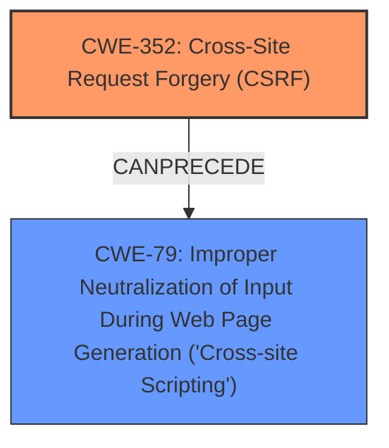

# Analysis Report for CVE-2025-30588

# Vulnerability Analysis Report: CVE-2025-30588

## Description

Cross-Site Request Forgery (CSRF) vulnerability in ryan_xantoo Map Contact allows Stored **XSS**. This issue affects Map Contact from n/a through 3.0.4.

## Vulnerability Description Key Phrases

- **Rootcause:** cross-site request forgery
- **Weakness:** ['cross-site scripting', 'XSS']
- **Product:** Map Contact
- **Version:** n/a through 3.0.4

## Analysis (with Relationship Data)

# Summary

| CWE ID  | CWE Name                                                                     | Confidence | CWE Abstraction Level | CWE Vulnerability Mapping Label | CWE-Vulnerability Mapping Notes |
| :-------- | :--------------------------------------------------------------------------- | :--------- | :---------------------- | :------------------------------ | :------------------------------ |
| CWE-352 | Cross-Site Request Forgery (CSRF)                                          | 0.9        | Compound                | Primary                         | Allowed                       |
| CWE-79  | Improper Neutralization of Input During Web Page Generation ('Cross-site Scripting') | 0.9        | Base                    | Secondary                       | Allowed                       |

## Evidence and Confidence

*   **Confidence Score:** 0.9
*   **Evidence Strength:** HIGH

## Relationship Analysis

The primary weakness is CWE-352 [Cross-Site Request Forgery (CSRF)], where the application doesn't properly verify if a request was intentionally made by the user. This can lead to CWE-79 [Improper Neutralization of Input During Web Page Generation ('Cross-site Scripting')] if a successful CSRF attack injects malicious script into the web page. The relationship is that CSRF can *precede* XSS by allowing an attacker to inject the XSS payload. Both CWEs are at appropriate levels of abstraction.



## Vulnerability Chain

The vulnerability chain starts with **CWE-352 [Cross-Site Request Forgery (CSRF)]**, where the application fails to validate the origin of the request. This allows an attacker to potentially inject malicious input. If the application then fails to neutralize this input properly, it leads to **CWE-79 [Improper Neutralization of Input During Web Page Generation ('Cross-site Scripting')]**, resulting in the execution of the attacker's script in the victim's browser.

## Summary of Analysis

The initial assessment focused on identifying the root cause and subsequent weaknesses described in the vulnerability. The description clearly states a "Cross-Site Request Forgery (CSRF) vulnerability" and "Stored XSS." The key is to understand that CSRF is the mechanism used to inject the XSS payload.

The vulnerability description explicitly mentions "Cross-Site Request Forgery (CSRF) vulnerability" and "Stored XSS." This direct evidence supports the selection of both CWE-352 [Cross-Site Request Forgery (CSRF)] and CWE-79 [Improper Neutralization of Input During Web Page Generation ('Cross-site Scripting')]. The high retriever scores for both CWEs further reinforce this decision.

CWE-352 [Cross-Site Request Forgery (CSRF)] is the primary vulnerability, as it allows the attacker to inject the malicious script. CWE-79 [Improper Neutralization of Input During Web Page Generation ('Cross-site Scripting')] is the secondary vulnerability, resulting from the **improper** handling of the injected input.

I considered other CWEs like CWE-89 [Improper Neutralization of Special Elements used in an SQL Command ('SQL Injection')], CWE-918 [Server-Side Request Forgery (SSRF)], CWE-80 [Improper Neutralization of Script-Related HTML Tags in a Web Page (Basic XSS)], and CWE-601 [URL Redirection to Untrusted Site ('Open Redirect')], but these did not directly match the vulnerability description as precisely as CWE-352 and CWE-79.


## CWE Relationship Analysis

Current CWEs represent these abstraction levels: .


### Vulnerability Chain Analysis

**Chain starting from CWE-89:**
- 89 (Improper Neutralization of Special Elements used in an SQL Command ('SQL Injection')) - ROOT


**Chain starting from CWE-80:**
- 80 (Improper Neutralization of Script-Related HTML Tags in a Web Page (Basic XSS)) - ROOT


### CWE Relationship Diagram

```mermaid
graph TD
    classDef primary fill:#f96,stroke:#333,stroke-width:2px
    classDef secondary fill:#69f,stroke:#333
    classDef tertiary fill:#9e9,stroke:#333
```


*Report generated on 2025-07-14 17:39:51*
