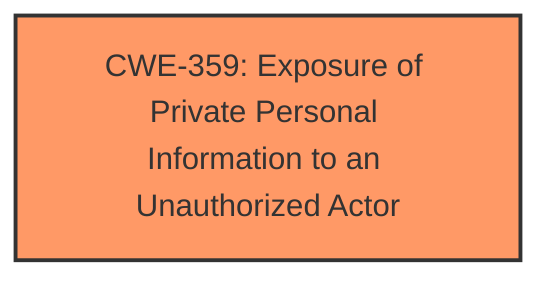

# Raw Analyzer Response for CVE-2025-3059

# Summary
| CWE ID | CWE Name | Confidence | CWE Abstraction Level | CWE Vulnerability Mapping Label | CWE-Vulnerability Mapping Notes |
|---|---|---|---|---|---|
| CWE-359 | Exposure of Private Personal Information to an Unauthorized Actor | 0.6 | Base | Allowed | Primary CWE. The vulnerability involves a Drupal module, Profile Private, suggesting the issue is with the exposure of private information. |
| CWE-201 | Insertion of Sensitive Information Into Sent Data | 0.3 | Base | Allowed | Secondary candidate. There is a possibility that sensitive data is being sent, but there is no direct evidence to support this. |

## Evidence and Confidence

*   **Confidence Score:** 0.6
*   **Evidence Strength:** LOW

## Relationship Analysis
The primary identified CWE, CWE-359, stands alone without any direct parent-child or peer relationships significantly influencing its selection in this specific context. While CWE-359 could potentially be part of a larger vulnerability chain, the limited information does not provide enough evidence to map additional relationships.

## Vulnerability Chain
The vulnerability chain is short and lacks detail. It starts with a potential **missing** or **improper** access control mechanism in the Drupal Profile Private module, leading to the exposure of private personal information.

Missing Access Control (Hypothetical) -> CWE-359: Exposure of Private Personal Information to an Unauthorized Actor

## Summary of Analysis
Based on the provided information, the primary weakness identified is the exposure of private personal information. The vulnerability description explicitly mentions "Drupal Profile Private," which suggests that the issue relates to the module's handling of private user profiles.

The selection of CWE-359 is based on the name of the affected module and the general description of the vulnerability. The evidence is weak, as the description lacks specific details about the root cause.

CWE-201 was considered because it involves the insertion of sensitive information, but there is no direct evidence to support this. The other CWEs were also considered but ultimately deemed less relevant due to the lack of specific details in the vulnerability description.