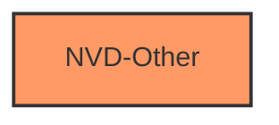

# Analysis Report for CVE-2025-3062

# Vulnerability Analysis Report: CVE-2025-3062

## Description

Vulnerability in Drupal Drupal Admin LTE theme.This issue affects Drupal Admin LTE theme *.*.

## Vulnerability Description Key Phrases

- **Product:** Drupal Drupal Admin LTE theme
- **Version:** *.*

## Analysis (with Relationship Data)

# Summary
| CWE ID | CWE Name | Confidence | CWE Abstraction Level | CWE Vulnerability Mapping Label | CWE-Vulnerability Mapping Notes |
|---|---|---|---|---|---|
| CWE-NVD-Other | NVD-Other | 1.0 | N/A | N/A | N/A |

## Evidence and Confidence

*   **Confidence Score:** 1.0
*   **Evidence Strength:** LOW

## Relationship Analysis
There are no relationships to analyze since no specific CWE was identified.



## Vulnerability Chain
There is no chain of weaknesses to map due to the lack of information.

## Summary of Analysis
The provided vulnerability description is extremely vague and lacks any specific technical details about the root cause or nature of the vulnerability. It simply states: "Vulnerability in Drupal Drupal Admin LTE theme. This issue affects Drupal Admin LTE theme *.*."

Due to the absence of any concrete information, it is impossible to assign a specific CWE with any degree of confidence. There is no mention of input validation, authentication, authorization, code injection, or any other common vulnerability patterns.

The Retriever Results offer several potential CWEs, but none of them can be definitively linked to the vulnerability description without further information. The top suggestions like CWE-434 (Unrestricted Upload of File with Dangerous Type), CWE-94 (Improper Control of Generation of Code), and CWE-306 (Missing Authentication for Critical Function) are all plausible in the context of a Drupal theme, but there's no evidence to support any of them.

Therefore, the only appropriate course of action is to assign CWE-NVD-Other, indicating that the vulnerability description does not provide enough information for proper CWE classification. This assessment is based entirely on the lack of provided evidence.

Relevant CWE Information:
N/A


## CWE Relationship Analysis

Current CWEs represent these abstraction levels: .


### Vulnerability Chain Analysis

**Chain starting from CWE-306:**
- 306 (Missing Authentication for Critical Function) - ROOT


**Chain starting from CWE-94:**
- 94 (Improper Control of Generation of Code ('Code Injection')) - ROOT


### CWE Relationship Diagram

```mermaid
graph TD
    classDef primary fill:#f96,stroke:#333,stroke-width:2px
    classDef secondary fill:#69f,stroke:#333
    classDef tertiary fill:#9e9,stroke:#333
```


*Report generated on 2025-07-14 17:42:16*
