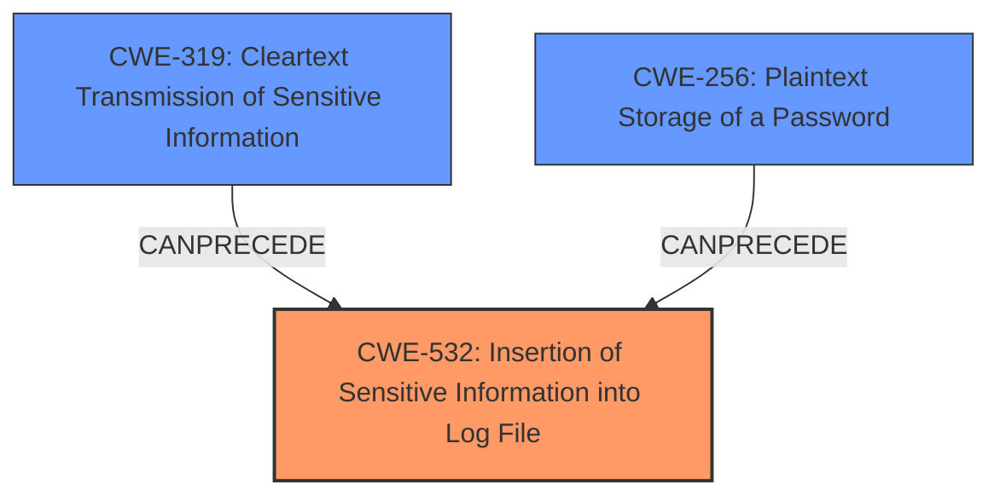

# Analysis Report for CVE-2025-30677

# Vulnerability Analysis Report: CVE-2025-30677

## Description

Apache Pulsar contains multiple connectors for integrating with Apache Kafka. The Pulsar IO Apache Kafka Source Connector, Sink Connector, and Kafka Connect Adaptor Sink Connector **log sensitive configuration properties in plain text in application logs**. This vulnerability can lead to unintended exposure of credentials in log files, potentially allowing attackers with access to these logs to obtain Apache Kafka credentials. The vulnerabilitys impact is limited by the fact that an attacker would need access to the application logs to exploit this issue. This issue affects Apache Pulsar IOs Apache Kafka connectors in all versions before 3.0.11, 3.3.6, and 4.0.4. 3.0.x version users should upgrade to at least 3.0.11. 3.3.x version users should upgrade to at least 3.3.6. 4.0.x version users should upgrade to at least 4.0.4. Users operating versions prior to those listed above should upgrade to the aforementioned patched versions or newer versions.

## Vulnerability Description Key Phrases

- **Component:** ['Apache Kafka Source Connector', 'Sink Connector', 'Kafka Connect Adaptor Sink Connector']
- **Weakness:** log sensitive configuration properties in plain text in application logs
- **Product:** Apache Pulsar IO
- **Impact:** Apache Kafka credentials exposure, exposure of credentials in log files
- **Attacker:** attackers with access to these logs
- **Version:** ['before 3.0.11', '3.3.6', '4.0.4']

## Analysis (with Relationship Data)

# Summary
| CWE ID | CWE Name | Confidence | CWE Abstraction Level | CWE Vulnerability Mapping Label | CWE-Vulnerability Mapping Notes |
|---|---|---|---|---|---|
| CWE-532 | Insertion of Sensitive Information into Log File | 1.0 | Base | Allowed | Primary CWE. The vulnerability involves logging sensitive information in plain text. |
| CWE-319 | Cleartext Transmission of Sensitive Information | 0.7 | Base | Allowed | The sensitive information is transmitted to the log file in cleartext. |
| CWE-256 | Plaintext Storage of a Password | 0.6 | Base | Allowed | The credentials are stored in plaintext format. |

## Evidence and Confidence

*   **Confidence Score:** 0.9
*   **Evidence Strength:** HIGH

## Relationship Analysis
The primary CWE is CWE-532 (Insertion of Sensitive Information into Log File), which directly reflects the vulnerability of logging sensitive information in plaintext. CWE-319 (Cleartext Transmission of Sensitive Information) and CWE-256 (Plaintext Storage of a Password) are related as they describe the mechanism by which the sensitive information is exposed (transmitted in cleartext to the log file and stored in plaintext, respectively). CWE-532 is the root cause, while CWE-319 and CWE-256 further specify the nature of the **weakness**.



## Vulnerability Chain
The vulnerability chain starts with the **logging of sensitive configuration properties in plain text** (CWE-532). The sensitive information is transmitted in cleartext (CWE-319) and then stored in the logs in plaintext (CWE-256). This leads to the potential exposure of Apache Kafka credentials to attackers who have access to the logs.

## Summary of Analysis
The analysis is based on the provided vulnerability description and the CVE reference link content summary, which explicitly states that the Pulsar IO Apache Kafka connectors **log sensitive configuration properties in plain text in application logs**.

The primary CWE, CWE-532, is the most accurate representation of the root cause. The retriever results also strongly suggest CWE-532 as the top candidate. The related CWEs, CWE-319 and CWE-256, provide further context about the nature of the **weakness**, specifically how the sensitive information is handled.

The selected CWEs are at the optimal level of specificity as they accurately describe the vulnerability and its underlying causes.

Relevant CWE Information:

# Enhanced Context (25 CWEs)
The following CWEs were identified as potentially relevant to this vulnerability:

## CWE-532: Insertion of Sensitive Information into Log File
**Abstraction Level**: Base
**Similarity Score**: 0.77
**Source**: dense

**Description**:
The product writes sensitive information to a log file.

**Mapping Guidance**:
- Usage: Allowed
- Rationale: This CWE entry is at the Base level of abstraction, which is a preferred level of abstraction for mapping to the root causes of vulnerabilities.

## CWE-538: Insertion of Sensitive Information into Externally-Accessible File or Directory
**Abstraction Level**: Base
**Similarity Score**: 0.75
**Source**: dense

**Description**:
The product places sensitive information into files or directories that are accessible to actors who are allowed to have access to the files, but not to the sensitive information.

**Mapping Guidance**:
- Usage: Allowed
- Rationale: This CWE entry is at the Base level of abstraction, which is a preferred level of abstraction for mapping to the root causes of vulnerabilities.

## CWE-497: Exposure of Sensitive System Information to an Unauthorized Control Sphere
**Abstraction Level**: Base
**Similarity Score**: 0.75
**Source**: dense

**Description**:
The product does not properly prevent sensitive system-level information from being accessed by unauthorized actors who do not have the same level of access to the underlying system as the product does.

**Mapping Guidance**:
- Usage: Allowed
- Rationale: This CWE entry is at the Base level of abstraction, which is a preferred level of abstraction for mapping to the root causes of vulnerabilities.

## CWE-522: Insufficiently Protected Credentials
**Abstraction Level**: Class
**Similarity Score**: 0.74
**Source**: dense

**Description**:
The product transmits or stores authentication credentials, but it uses an insecure method that is susceptible to unauthorized interception and/or retrieval.

**Mapping Guidance**:
- Usage: Allowed-with-Review
- Rationale: This CWE entry is a Class and might have Base-level children that would be more appropriate

## CWE-212: Improper Removal of Sensitive Information Before Storage or Transfer
**Abstraction Level**: Base
**Similarity Score**: 0.74
**Source**: dense

**Description**:
The product stores, transfers, or shares a resource that contains sensitive information, but it does not properly remove that information before the product makes the resource available to unauthorized actors.

**Mapping Guidance**:
- Usage: Allowed
- Rationale: This CWE entry is at the Base level of abstraction, which is a preferred level of abstraction for mapping to the root causes of vulnerabilities.

## CWE-201: Insertion of Sensitive Information Into Sent Data
**Abstraction Level**: Base
**Similarity Score**: 0.74
**Source**: dense

**Description**:
The code transmits data to another actor, but a portion of the data includes sensitive information that should not be accessible to that actor.

**Mapping Guidance**:
- Usage: Allowed
- Rationale: This CWE entry is at the Base level of abstraction, which is a preferred level of abstraction for mapping to the root causes of vulnerabilities.

## CWE-319: Cleartext Transmission of Sensitive Information
**Abstraction Level**: Base
**Similarity Score**: 0.74
**Source**: dense

**Description**:
The product transmits sensitive or security-critical data in cleartext in a communication channel that can be sniffed by unauthorized actors.

**Mapping Guidance**:
- Usage: Allowed
- Rationale: This CWE entry is at the Base level of abstraction, which is a preferred level of abstraction for mapping to the root causes of vulnerabilities.

## CWE-200: Exposure of Sensitive Information to an Unauthorized Actor
**Abstraction Level**: Class
**Similarity Score**: 0.73
**Source**: dense

**Description**:
The product exposes sensitive information to an actor that is not explicitly authorized to have access to that information.

**Mapping Guidance**:
- Usage: Discouraged
- Rationale: CWE-200 is commonly misused to represent the loss of confidentiality in a vulnerability, but confidentiality loss is a technical impact - not a root cause error. As of CWE 4.9, over 400 CWE entries can lead to a loss of confidentiality. Other options are often available. [REF-1287].

## CWE-668: Exposure of Resource to Wrong Sphere
**Abstraction Level**: Class
**Similarity Score**: 0.73
**Source**: dense

**Description**:
The product exposes a resource to the wrong control sphere, providing unintended actors with inappropriate access to the resource.

**Mapping Guidance**:
- Usage: Discouraged
- Rationale: CWE-668 is high-level and is often misused as a catch-all when lower-level CWE IDs might be applicable. It is sometimes used for low-information vulnerability reports [REF-1287]. It is a level-1 Class (i.e., a child of a Pillar). It is not useful for trend analysis.

## CWE-923: Improper Restriction of Communication Channel to Intended Endpoints
**Abstraction Level**: Class
**Similarity Score**: 0.73
**Source**: dense

**Description**:
The product establishes a communication channel to (or from) an endpoint for privileged or protected operations, but it does not properly ensure that it is communicating with the correct endpoint.

**Mapping Guidance**:
- Usage: Allowed-with-Review
- Rationale: This CWE entry is a Class and might have Base-level children that would be more appropriate

## CWE-532: Insertion of Sensitive Information into Log File
**Abstraction Level**: Base
**Similarity Score**: 1167.56
**Source**: sparse

**Description**:
The product writes sensitive information to a log file.

**Mapping Guidance**:
- Usage: Allowed
- Rationale: This CWE entry is at the Base level of abstraction, which is a preferred level of abstraction for mapping to the root causes of vulnerabilities.

## CWE-22: Improper Limitation of a Pathname to a Restricted Directory ('Path Traversal')
**Abstraction Level**:


## CWE Relationship Analysis

Current CWEs represent these abstraction levels: .


### Vulnerability Chain Analysis

**Chain starting from CWE-22:**
- 22 (Improper Limitation of a Pathname to a Restricted Directory ('Path Traversal')) - ROOT


**Chain starting from CWE-319:**
- 319 (Cleartext Transmission of Sensitive Information) - ROOT


### CWE Relationship Diagram

```mermaid
graph TD
    classDef primary fill:#f96,stroke:#333,stroke-width:2px
    classDef secondary fill:#69f,stroke:#333
    classDef tertiary fill:#9e9,stroke:#333
```


*Report generated on 2025-07-14 17:46:07*
