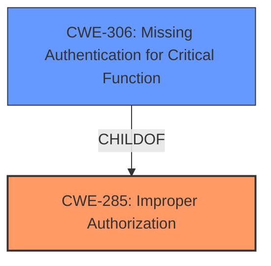

# Analysis for CVE-2025-30697

# Summary

| CWE ID | CWE Name | Confidence | CWE Abstraction Level | CWE Vulnerability Mapping Label | CWE-Vulnerability Mapping Notes |
|---|---|---|---|---|---|
| CWE-285 | Improper Authorization | 0.75 | Class | Primary CWE | Discouraged |
| CWE-306 | Missing Authentication for Critical Function | 0.65 | Base | Secondary Candidate | Allowed |

## Evidence and Confidence

*   **Confidence Score:** 0.7
*   **Evidence Strength:** MEDIUM

## Relationship Analysis
The primary relationship considered was the hierarchical one between CWE-285 (Improper Authorization) and its potential children, including CWE-306 (Missing Authentication for Critical Function). Given the vulnerability description mentions a "low privileged attacker," it is reasonable to assume that the system may not be properly checking if the attacker is authorized to perform the actions they are attempting. Since the vulnerability description does not explicitly state that authentication is missing, CWE-285 is the more appropriate choice as a primary weakness, but there is a chance Authentication is missing, so it's a secondary weakness candidate.

## Vulnerability Chain
The vulnerability chain appears to start with **Improper Authorization (CWE-285)**, potentially leading to unauthorized data access and modification.

## Summary of Analysis
The initial assessment focused on identifying the root cause of the vulnerability. The description highlights that a "low privileged attacker" can perform unauthorized actions, suggesting an authorization issue.

The primary decision was to map the vulnerability to **CWE-285 (Improper Authorization)**. This is because the vulnerability description states that successful attacks can result in "unauthorized update, insert or delete access to some of PeopleSoft Enterprise PeopleTools accessible data as well as unauthorized read access to a subset of PeopleSoft Enterprise PeopleTools accessible data." This aligns with the definition of Improper Authorization, where the product does not perform or incorrectly performs an authorization check when an actor attempts to access a resource or perform an action.

Although the retriever results listed several CWEs, including **CWE-306 (Missing Authentication for Critical Function)**, **CWE-732 (Incorrect Permission Assignment for Critical Resource)**, and **CWE-807 (Reliance on Untrusted Inputs in a Security Decision)**, **CWE-285** was deemed most appropriate due to its direct relevance to the unauthorized access described in the vulnerability. However, **CWE-306 (Missing Authentication for Critical Function)** was added as a secondary candidate.

The evidence supporting this decision comes directly from the vulnerability description's impact statement, which clearly indicates unauthorized access to data. The confidence level is 0.7, reflecting the reasonable certainty that **CWE-285** is a suitable primary mapping, and the additional confidence that authentication may be missing.

Relevant CWE Information:

# Enhanced Context (25 CWEs)
The following CWEs were identified as potentially relevant to this vulnerability:

## CWE-807: Reliance on Untrusted Inputs in a Security Decision
**Abstraction Level**: Base
**Similarity Score**: 0.74
**Source**: dense

**Description**:
The product uses a protection mechanism that relies on the existence or values of an input, but the input can be modified by an untrusted actor in a way that bypasses the protection mechanism.

**Mapping Guidance**:
- Usage: Allowed
- Rationale: This CWE entry is at the Base level of abstraction, which is a preferred level of abstraction for mapping to the root causes of vulnerabilities.

## CWE-306: Missing Authentication for Critical Function
**Abstraction Level**: Base
**Similarity Score**: 544.70
**Source**: sparse

**Description**:
The product does not perform any authentication for functionality that requires a provable user identity or consumes a significant amount of resources.

**Mapping Guidance**:
- Usage: Allowed
- Rationale: This CWE entry is at the Base level of abstraction, which is a preferred level of abstraction for mapping to the root causes of vulnerabilities.

## CWE-285: Improper Authorization
**Abstraction Level**: Class
**Similarity Score**: 566.08
**Source**: sparse

**Description**:
The product does not perform or incorrectly performs an authorization check when an actor attempts to access a resource or perform an action.

**Mapping Guidance**:
- Usage: Discouraged
- Rationale: CWE-285 is high-level and lower-level CWEs can frequently be used instead. It is a level-1 Class (i.e., a child of a Pillar).

## CWE-732: Incorrect Permission Assignment for Critical Resource
**Abstraction Level**: Class
**Similarity Score**: 551.51
**Source**: sparse

**Description**:
The product specifies permissions for a security-critical resource in a way that allows that resource to be read or modified by unintended actors.

**Mapping Guidance**:
- Usage: Allowed-with-Review
- Rationale: While the name itself indicates an assignment of permissions for resources, this is often misused for vulnerabilities in which "permissions" are not checked, which is an "authorization" weakness (CWE-285 or descendants) within CWE's model [REF-1287].

## Other CWEs Considered:

*   **CWE-306 (Missing Authentication for Critical Function)**: While this could be a contributing factor, the vulnerability description focuses more on the ability to perform unauthorized actions, suggesting an authorization problem is the primary issue.
*   **CWE-732 (Incorrect Permission Assignment for Critical Resource)**: This is similar to authorization, but the description doesn't specifically mention incorrect assignment, only that unauthorized actions are possible.
*   **CWE-807 (Reliance on Untrusted Inputs in a Security Decision)**: This is a more general weakness and doesn't directly address the authorization issue described in the vulnerability.