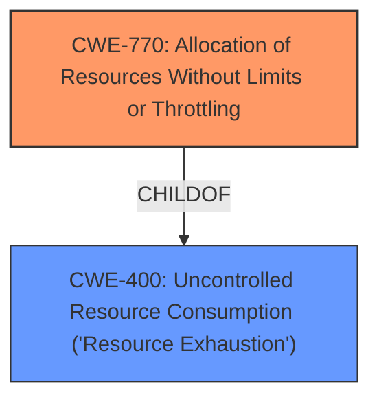

# Enhanced Analysis for CVE-2025-30715

# Summary
| CWE ID | CWE Name | Confidence | CWE Abstraction Level | CWE Vulnerability Mapping Label | CWE-Vulnerability Mapping Notes |
|---|---|---|---|---|---|
| CWE-770 | Allocation of Resources Without Limits or Throttling | 0.7 | Base | Allowed | Primary CWE |
| CWE-400 | Uncontrolled Resource Consumption ('Resource Exhaustion') | 0.6 | Class | Allowed | Secondary Candidate |

## Evidence and Confidence

*   **Confidence Score:** 0.7
*   **Evidence Strength:** MEDIUM

## Relationship Analysis
The primary CWE selected is CWE-770, which describes the **allocation of resources without limits or throttling**. This CWE is a base-level weakness. A related Class-level CWE is CWE-400, **Uncontrolled Resource Consumption ('Resource Exhaustion')**, which is a parent of CWE-770. The vulnerability description mentions "cause a hang or frequently repeatable crash (complete DOS) of MySQL Server", indicating a denial-of-service condition due to resource exhaustion. The relationship between CWE-770 and CWE-400 is that CWE-770 can lead to CWE-400.



## Vulnerability Chain
The vulnerability chain starts with a high-privileged attacker gaining network access via multiple protocols, leading to **allocation of resources without limits or throttling** (CWE-770), which ultimately results in a hang or crash of the MySQL server due to **uncontrolled resource consumption** (CWE-400), causing a denial-of-service.

## Summary of Analysis
Based on the vulnerability description, the primary weakness is the **uncontrolled allocation of resources**, which leads to a denial-of-service. CWE-770, **Allocation of Resources Without Limits or Throttling**, is the most appropriate CWE to represent this weakness, as it directly addresses the root cause. The description includes the phrase "cause a hang or frequently repeatable crash (complete DOS) of MySQL Server", supporting this assessment. CWE-400, **Uncontrolled Resource Consumption**, represents the impact (denial of service).

The retriever results listed CWE-770 with a score of 0.139 which supports the assessment.

Other CWEs considered but not used:

*   CWE-20 (**Improper Input Validation**): While input validation issues can contribute to resource exhaustion, the primary issue here is the **lack of limits on resource allocation**, making CWE-770 a more direct fit.
*   CWE-89 (**Improper Neutralization of Special Elements used in an SQL Command ('SQL Injection')**): SQL injection is not indicated in the description.
*   CWE-129 (**Improper Validation of Array Index**): Array index validation is not indicated in the description.
*   CWE-173 (**Improper Handling of Alternate Encoding**): Alternate encoding issues are not indicated in the description.
* CWE-190 (**Integer Overflow or Wraparound**): Integer overflow issues are not indicated in the description.
* CWE-1284 (**Improper Validation of Specified Quantity in Input**): Improper validation of input quantity issues are not indicated in the description.

The selection of CWE-770 is at the optimal level of specificity because it directly describes the **uncontrolled allocation of resources**.


## CWE Relationship Analysis

Current CWEs represent these abstraction levels: .


### Vulnerability Chain Analysis

**Chain starting from CWE-89:**
- 89 (Improper Neutralization of Special Elements used in an SQL Command ('SQL Injection')) - ROOT


**Chain starting from CWE-1284:**
- 1284 (Improper Validation of Specified Quantity in Input) - ROOT


### CWE Relationship Diagram

```mermaid
graph TD
    classDef primary fill:#f96,stroke:#333,stroke-width:2px
    classDef secondary fill:#69f,stroke:#333
    classDef tertiary fill:#9e9,stroke:#333
```