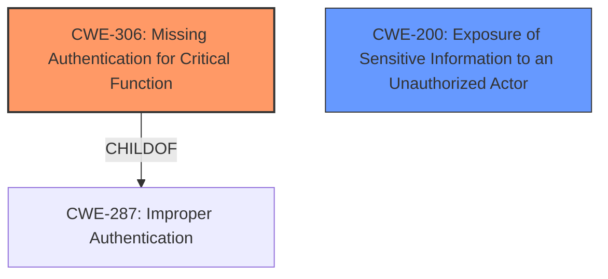

# Enhanced Analysis for CVE-2025-30740

# Summary
| CWE ID | CWE Name | Confidence | CWE Abstraction Level | CWE Vulnerability Mapping Label | CWE-Vulnerability Mapping Notes |
|---|---|---|---|---|---|
| CWE-306 | Missing Authentication for Critical Function | 0.8 | Base | Allowed | Primary CWE |
| CWE-200 | Exposure of Sensitive Information to an Unauthorized Actor | 0.5 | Class | Discouraged | Secondary Candidate |

## Evidence and Confidence

*   **Confidence Score:** 0.7
*   **Evidence Strength:** MEDIUM

## Relationship Analysis
The primary relationship influencing the decision is the ChildOf relationship where CWE-306 [CWE-306: Missing Authentication for Critical Function] is a child of CWE-287 [CWE-287: Improper Authentication]. Since there's no authentication required for a critical function, it leads directly to unauthorized access, making CWE-306 [CWE-306: Missing Authentication for Critical Function] the more specific and appropriate choice. CWE-200 [CWE-200: Exposure of Sensitive Information to an Unauthorized Actor] is a high-level class that represents the impact.



## Vulnerability Chain
The vulnerability chain starts with the **missing authentication** for a critical function (CWE-306 [CWE-306: Missing Authentication for Critical Function]), which allows a low-privileged attacker to gain unauthorized access to critical data (CWE-200 [CWE-200: Exposure of Sensitive Information to an Unauthorized Actor]).

## Summary of Analysis
The initial analysis focused on identifying the root cause of the vulnerability, which is the **lack of authentication** for critical functions within the JD Edwards EnterpriseOne Tools product. The vulnerability description states that a "low privileged attacker with network access via HTTP to compromise JD Edwards EnterpriseOne Tools. Successful attacks of this vulnerability can result in unauthorized access to critical data or complete access to all JD Edwards EnterpriseOne Tools accessible data." This directly implies that authentication is either missing or insufficient for critical functions, allowing unauthorized access.

CWE-306 [CWE-306: Missing Authentication for Critical Function] aligns perfectly with this description. It describes a scenario where "authentication is missing for a critical function," which allows attackers to bypass security controls and perform unauthorized actions.

Other CWEs were considered but deemed less appropriate. CWE-200 [CWE-200: Exposure of Sensitive Information to an Unauthorized Actor] represents the impact of the vulnerability (unauthorized access to data) rather than the root cause. The retriever results listed several other CWEs like CWE-173 [CWE-173: Improper Handling of Alternate Encoding], CWE-611 [CWE-611: Improper Restriction of XML External Entity Reference], and CWE-22 [CWE-22: Improper Limitation of a Pathname to a Restricted Directory ('Path Traversal')], but these do not directly address the **missing authentication** aspect.

The selection of CWE-306 [CWE-306: Missing Authentication for Critical Function] is based on the evidence that **authentication is missing** for critical functions, leading to unauthorized access. This aligns with the CWE's description and MITRE's mapping guidance for Base-level CWEs. The level of specificity is optimal, as it directly represents the root cause of the vulnerability.


## CWE Relationship Analysis

Current CWEs represent these abstraction levels: .


### Vulnerability Chain Analysis

**Chain starting from CWE-611:**
- 611 (Improper Restriction of XML External Entity Reference) - ROOT


**Chain starting from CWE-173:**
- 173 (Improper Handling of Alternate Encoding) - ROOT


### CWE Relationship Diagram

```mermaid
graph TD
    classDef primary fill:#f96,stroke:#333,stroke-width:2px
    classDef secondary fill:#69f,stroke:#333
    classDef tertiary fill:#9e9,stroke:#333
```