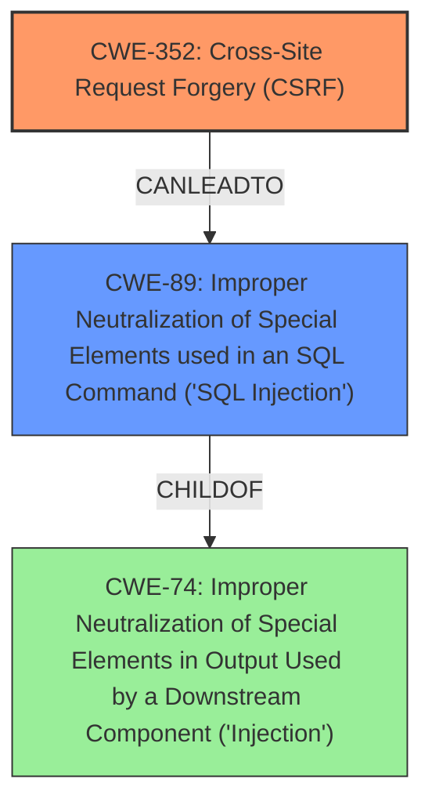

# Raw Analyzer Response for CVE-2025-30788

# Summary
| CWE ID | CWE Name | Confidence | CWE Abstraction Level | CWE Vulnerability Mapping Label | CWE-Vulnerability Mapping Notes |
|---|---|---|---|---|---|
| CWE-352 | Cross-Site Request Forgery (CSRF) | 0.9 | Compound | Primary | Allowed |
| CWE-89 | Improper Neutralization of Special Elements used in an SQL Command ('SQL Injection') | 0.9 | Base | Secondary | Allowed |

## Evidence and Confidence

*   **Confidence Score:** 0.9
*   **Evidence Strength:** HIGH

## Relationship Analysis
The primary weakness is **CWE-352 [Cross-Site Request Forgery (CSRF)]**, which is a compound weakness. It can lead to other vulnerabilities if successfully exploited. The secondary weakness is **CWE-89 [Improper Neutralization of Special Elements used in an SQL Command ('SQL Injection')]**, which can be a consequence of successful **CWE-352 [Cross-Site Request Forgery (CSRF)]** if the forged request is crafted to inject malicious SQL code. **CWE-89 [Improper Neutralization of Special Elements used in an SQL Command ('SQL Injection')]** is a child of **CWE-74 [Improper Neutralization of Special Elements in Output Used by a Downstream Component ('Injection')]**. The abstraction level of **CWE-352 [Cross-Site Request Forgery (CSRF)]** is Compound, while **CWE-89 [Improper Neutralization of Special Elements used in an SQL Command ('SQL Injection')]** is Base. Choosing the base level is preferred when it accurately represents the weakness.

## Vulnerability Chain
The vulnerability chain begins with **CWE-352 [Cross-Site Request Forgery (CSRF)]**, due to the **lack of CSRF protection**. An attacker can then leverage the forged request to perform **SQL injection**, leading to **CWE-89 [Improper Neutralization of Special Elements used in an SQL Command ('SQL Injection')]**. The root cause is the missing CSRF protection.

## Summary of Analysis
The initial assessment, based on the vulnerability description, identifies **Cross-Site Request Forgery** and **SQL Injection** as the main weaknesses. The retriever results support these findings, with **CWE-89 [Improper Neutralization of Special Elements used in an SQL Command ('SQL Injection')]** and **CWE-352 [Cross-Site Request Forgery (CSRF)]** having high relevance scores. The evidence from the CVE reference link content summary confirms the **lack of proper CSRF protection** as a root cause. The graph relationships show that **CWE-89 [Improper Neutralization of Special Elements used in an SQL Command ('SQL Injection')]** is a child of **CWE-74 [Improper Neutralization of Special Elements in Output Used by a Downstream Component ('Injection')]**, but **CWE-89 [Improper Neutralization of Special Elements used in an SQL Command ('SQL Injection')]** is more specific. **CWE-352 [Cross-Site Request Forgery (CSRF)]** is the primary weakness, as it enables the **SQL Injection** vulnerability. Both CWEs are at the appropriate level of specificity.

Relevant CWE Information:

*   **CWE-352 [Cross-Site Request Forgery (CSRF)]**: The **web application does not sufficiently verify** whether a request was intentionally provided by the user. The vulnerability description and CVE reference link content summary confirm the **lack of CSRF protection**.
*   **CWE-89 [Improper Neutralization of Special Elements used in an SQL Command ('SQL Injection')]**: The product does not neutralize special elements that could modify the intended SQL command. The vulnerability description explicitly mentions **SQL Injection**.

The following CWEs were considered but not used:

*   **CWE-918 [Server-Side Request Forgery (SSRF)]**, **CWE-601 [URL Redirection to Untrusted Site ('Open Redirect')]**, **CWE-116 [Improper Encoding or Escaping of Output]**, **CWE-79 [Improper Neutralization of Input During Web Page Generation ('Cross-site Scripting')]**, **CWE-138 [Improper Neutralization of Special Elements]**, **CWE-502 [Deserialization of Untrusted Data]**, **CWE-95 [Improper Neutralization of Directives in Dynamically Evaluated Code ('Eval Injection')]**, **CWE-613 [Insufficient Session Expiration]**, **CWE-425 [Direct Request ('Forced Browsing')]**, **CWE-94 [Improper Control of Generation of Code ('Code Injection')]**, **CWE-184 [Incomplete List of Disallowed Inputs]**, **CWE-494 [Download of Code Without Integrity Check]**, **CWE-471 [Modification of Assumed-Immutable Data (MAID)]**: These CWEs were not selected because they do not directly relate to the **Cross-Site Request Forgery** and **SQL Injection** vulnerabilities described. They represent different types of weaknesses or attack vectors.