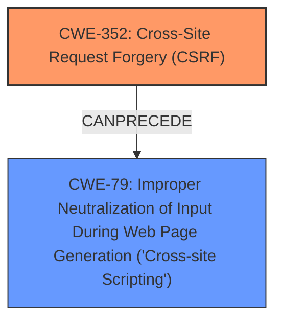

# Analysis Report for CVE-2025-30919

# Vulnerability Analysis Report: CVE-2025-30919

## Description

**Cross-Site Request Forgery** (CSRF) vulnerability in Store Locator Widgets Store Locator Widget allows Stored XSS. This issue affects Store Locator Widget from n/a through 20200131.

## Vulnerability Description Key Phrases

- **Component:** Store Locator Widget
- **Rootcause:** Cross-Site Request Forgery
- **Weakness:** Cross-Site Scripting
- **Product:** Store Locator Widgets
- **Impact:** Stored XSS, Stored XSS
- **Version:** n/a through 20200131

## Analysis (with Relationship Data)

# Summary

| CWE ID | CWE Name | Confidence | CWE Abstraction Level | CWE Vulnerability Mapping Label | CWE-Vulnerability Mapping Notes |
|---|---|---|---|---|---|
| CWE-352 | Cross-Site Request Forgery (CSRF) | 0.9 | Compound | Allowed | Primary CWE.  The vulnerability description and CVE summary explicitly mention CSRF as the root cause. |
| CWE-79 | Improper Neutralization of Input During Web Page Generation ('Cross-site Scripting') | 0.9 | Base | Allowed | Secondary CWE. The vulnerability description mentions Stored XSS as the impact of the CSRF. |

## Evidence and Confidence

*   **Confidence Score:** 0.9
*   **Evidence Strength:** HIGH

## Relationship Analysis
The primary relationship is that the **Cross-Site Request Forgery (CSRF)** vulnerability (CWE-352) allows an attacker to perform actions on behalf of a user, which in this case leads to **Cross-site Scripting (XSS)** (CWE-79) by injecting malicious scripts.



## Vulnerability Chain
The vulnerability chain starts with the **Cross-Site Request Forgery (CSRF)** (CWE-352), which allows an attacker to force a user to perform unwanted actions. This leads to **Improper Neutralization of Input During Web Page Generation ('Cross-site Scripting')** (CWE-79) because the forced actions inject malicious scripts into the web page.

## Summary of Analysis
The initial assessment identifies two key weaknesses: **Cross-Site Request Forgery (CSRF)** and **Cross-site Scripting (XSS)**.

The selection of CWE-352 as the primary CWE is based on the fact that the vulnerability description and CVE summary explicitly identify **Cross-Site Request Forgery** as the root cause. The description mentions a **Cross-Site Request Forgery** (CSRF) vulnerability in Store Locator Widget which leads to Stored XSS.

CWE-79 is selected as a secondary CWE because the successful exploitation of the **CSRF** vulnerability leads to Stored XSS. This aligns with CWE-79's description of **Improper Neutralization of Input During Web Page Generation**.

The evidence directly supports these classifications. The graph relationships show that CSRF can precede XSS, where a successful CSRF attack can lead to the injection of malicious scripts into a web page.

These CWEs are at the optimal level of specificity as they accurately represent the root cause and impact of the vulnerability.

Other CWEs Considered but Not Used:

*   CWE-89: Improper Neutralization of Special Elements used in an SQL Command ('SQL Injection') - While SQL Injection is a common web vulnerability, there is no evidence in the provided description or summary to suggest its presence.
*   CWE-918: Server-Side Request Forgery (SSRF) - Similar to SQL Injection, there is no evidence to suggest that this vulnerability is present.
*   CWE-601: URL Redirection to Untrusted Site ('Open Redirect') - This is not directly related to the described vulnerability, which focuses on CSRF leading to XSS.
*   CWE-1275: Sensitive Cookie with Improper SameSite Attribute - While cookies are relevant to web security, there is no specific mention of issues with the SameSite attribute in the description.
*   CWE-425: Direct Request ('Forced Browsing') - This is about bypassing authorization, which isn't the primary issue here.


## CWE Relationship Analysis

Current CWEs represent these abstraction levels: .


### Vulnerability Chain Analysis

**Chain starting from CWE-89:**
- 89 (Improper Neutralization of Special Elements used in an SQL Command ('SQL Injection')) - ROOT


**Chain starting from CWE-601:**
- 601 (URL Redirection to Untrusted Site ('Open Redirect')) - ROOT


### CWE Relationship Diagram

```mermaid
graph TD
    classDef primary fill:#f96,stroke:#333,stroke-width:2px
    classDef secondary fill:#69f,stroke:#333
    classDef tertiary fill:#9e9,stroke:#333
```


*Report generated on 2025-07-14 18:03:48*
