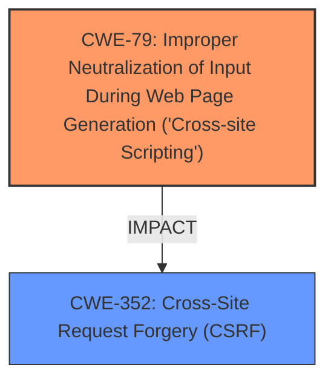

# Raw Analyzer Response for CVE-2025-31026

# Summary

| CWE ID | CWE Name | Confidence | CWE Abstraction Level | CWE Vulnerability Mapping Label | CWE-Vulnerability Mapping Notes |
|---|---|---|---|---|---|
| CWE-79 | Improper Neutralization of Input During Web Page Generation ('Cross-site Scripting') | 1.0 | Base | Allowed | Primary CWE: The vulnerability description explicitly states that the issue leads to Stored XSS. |
| CWE-352 | Cross-Site Request Forgery (CSRF) | 1.0 | Compound | Allowed | Secondary CWE: The vulnerability is triggered due to a CSRF vulnerability. |

## Evidence and Confidence

*   **Confidence Score:** 1.0
*   **Evidence Strength:** HIGH

## Relationship Analysis
The primary weakness is **CWE-79 [Improper Neutralization of Input During Web Page Generation ('Cross-site Scripting')]**, indicating that the application **fails to neutralize user-controllable input** before placing it in a web page, leading to XSS. The attack vector is **CWE-352 [Cross-Site Request Forgery (CSRF)]**, which enables an attacker to **force users to perform unwanted actions**.

## Vulnerability Chain
The vulnerability chain starts with **CWE-352 [Cross-Site Request Forgery (CSRF)]**, which allows an attacker to force a user into performing unwanted actions. The action then leads to **CWE-79 [Improper Neutralization of Input During Web Page Generation ('Cross-site Scripting')]** because the input provided by user is not correctly neutralized. The root cause is the **missing or insufficient CSRF protection**, which can allow an attacker to inject malicious scripts.

## Summary of Analysis
The analysis indicates a high confidence in the mapping. The vulnerability description explicitly mentions both **Cross-Site Request Forgery (CSRF)** and Stored **XSS**, which directly corresponds to **CWE-352 [Cross-Site Request Forgery (CSRF)]** and **CWE-79 [Improper Neutralization of Input During Web Page Generation ('Cross-site Scripting')]**, respectively. The "CVE Reference Links Content Summary" confirms that the WordPress Comment Validation Reloaded Plugin is vulnerable to CSRF, allowing malicious actors to force privileged users to execute unwanted actions. The primary weakness is the **improper neutralization of input**, leading to stored **XSS**, with CSRF being the attack vector.

The other CWEs were considered but deemed less relevant:

*   **CWE-89 [Improper Neutralization of Special Elements used in an SQL Command ('SQL Injection')]**: While injection is mentioned in the OWASP Top 10, the specific vulnerability described is XSS, not SQL injection.
*   **CWE-918 [Server-Side Request Forgery (SSRF)]** and **CWE-601 [URL Redirection to Untrusted Site ('Open Redirect')]**: These are not directly related to the described vulnerability.
*   **CWE-116 [Improper Encoding or Escaping of Output]** and **CWE-80 [Improper Neutralization of Script-Related HTML Tags in a Web Page (Basic XSS)]**: While related to XSS, **CWE-79 [Improper Neutralization of Input During Web Page Generation ('Cross-site Scripting')]** is more general and accurately captures the essence of the vulnerability.
*   **CWE-184 [Incomplete List of Disallowed Inputs]**: Not directly related, XSS is more to do with **improper neutralization** than disallowed inputs.