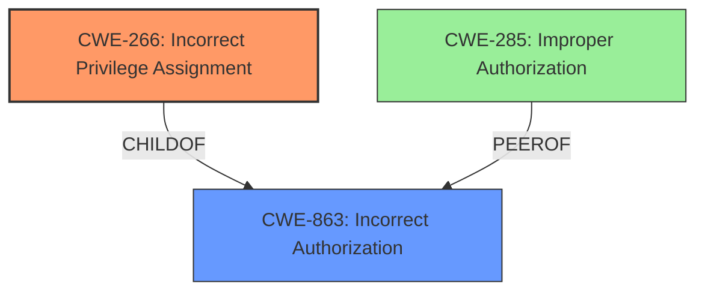

# Enhanced Analysis for CVE-2025-3105

# Summary
| CWE ID | CWE Name | Confidence | CWE Abstraction Level | CWE Vulnerability Mapping Label | CWE-Vulnerability Mapping Notes |
|---|---|---|---|---|---|
| CWE-266 | Incorrect Privilege Assignment | 0.8 | Base | Allowed | Primary CWE |
| CWE-863 | Incorrect Authorization | 0.6 | Class | Allowed-with-Review | Secondary Candidate |

## Evidence and Confidence

*   **Confidence Score:** 0.7
*   **Evidence Strength:** MEDIUM

## Relationship Analysis
The primary CWE, CWE-266, is a Base level CWE which is preferred. CWE-266 is related to privilege management, and the vulnerability involves **incorrect privilege assignment**, which is a direct fit. CWE-863 is a Class-level CWE and a parent of more specific Base-level CWEs. The relationship analysis guided the choice towards CWE-266 due to its greater specificity and direct relevance to the vulnerability's root cause.



## Vulnerability Chain
The vulnerability chain starts with the **improper validation of user meta fields** (**CWE-266**). This leads to the ability for authenticated users to escalate their privileges to Administrator. The root cause is the incorrect privilege assignment, which is the **Primary CWE**.

## Summary of Analysis
The initial analysis identified several potential CWEs based on keyword matching. However, after reviewing the vulnerability description and the provided CWE specifications, CWE-266 (Incorrect Privilege Assignment) emerged as the most appropriate primary CWE. This is because the root cause of the vulnerability is that the plugin **does not properly validate user meta fields prior to updating them in the database**, which results in authenticated users being able to escalate their privileges. This aligns directly with the description of CWE-266, which involves the system assigning incorrect privileges to a user. The **lack of proper validation** is the underlying coding error. The selection of CWE-266 is also supported by the MITRE mapping guidance, which recommends using specific Base-level CWEs when possible. CWE-863 was also considered but it's a higher level Class CWE. The choice of CWE-266 is at the optimal level of specificity because it directly reflects the root cause of the vulnerability.

Relevant CWE Information:

# Enhanced Context (25 CWEs)
The following CWEs were identified as potentially relevant to this vulnerability:

## CWE-266: Incorrect Privilege Assignment
**Abstraction Level**: Base
**Similarity Score**: 0.80
**Source**: dense

**Description**:
A product incorrectly assigns a privilege to a particular actor, creating an unintended sphere of control for that actor.

**Mapping Guidance**:
- Usage: Allowed
- Rationale: This CWE entry is at the Base level of abstraction, which is a preferred level of abstraction for mapping to the root causes of vulnerabilities.

## CWE-863: Incorrect Authorization
**Abstraction Level**: Class
**Similarity Score**: 1418.61
**Source**: sparse

**Description**:
The product performs an authorization check when an actor attempts to access a resource or perform an action, but it does not correctly perform the check.

**Mapping Guidance**:
- Usage: Allowed-with-Review
- Rationale: This CWE entry is a Class and might have Base-level children that would be more appropriate


## CWE Relationship Analysis

Current CWEs represent these abstraction levels: .


### Vulnerability Chain Analysis

**Chain starting from CWE-266:**
- 266 (Incorrect Privilege Assignment) - ROOT


**Chain starting from CWE-863:**
- 863 (Incorrect Authorization) - ROOT


### CWE Relationship Diagram

```mermaid
graph TD
    classDef primary fill:#f96,stroke:#333,stroke-width:2px
    classDef secondary fill:#69f,stroke:#333
    classDef tertiary fill:#9e9,stroke:#333
```