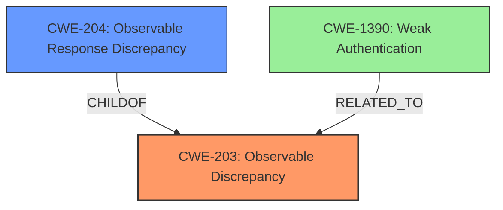

# Analysis Report for CVE-2025-31124

# Vulnerability Analysis Report: CVE-2025-31124

## Description

Zitadel is open-source identity infrastructure software. ZITADEL administrators can enable a setting called Ignoring unknown usernames which helps mitigate attacks that try to guess/enumerate usernames. If enabled, ZITADEL will show the password prompt even if the user doesnt exist and report Username or Password invalid. While the setting was correctly respected during the login flow, the users username was normalized leading to a disclosure of the users existence. This vulnerability is fixed in 2.71.6, 2.70.8, 2.69.9, 2.68.9, 2.67.13, 2.66.16, 2.65.7, 2.64.6, and 2.63.9.

## Vulnerability Description Key Phrases

- **Weakness:** username normalization
- **Impact:** disclosure of users existence
- **Product:** Zitadel
- **Component:** login flow

## Analysis (with Relationship Data)

# Summary
| CWE ID | CWE Name | Confidence | CWE Abstraction Level | CWE Vulnerability Mapping Label | CWE-Vulnerability Mapping Notes |
|---|---|---|---|---|---|
| CWE-203 | Observable Discrepancy | 0.9 | Base | Allowed | Primary CWE. The product behaves differently based on valid/invalid usernames, exposing security-relevant information. |
| CWE-204 | Observable Response Discrepancy | 0.7 | Base | Allowed | Secondary CWE. The response differs based on whether the username exists, revealing internal state. |
| CWE-1390 | Weak Authentication | 0.5 | Class | Allowed-with-Review | Authentication mechanism is indirectly weakened by allowing user enumeration. |

## Evidence and Confidence

*   **Confidence Score:** 0.8
*   **Evidence Strength:** HIGH

## Relationship Analysis
The primary CWE is CWE-203 (Observable Discrepancy), which is a parent of CWE-204 (Observable Response Discrepancy). CWE-203 captures the general issue of the system behaving differently based on valid/invalid usernames. CWE-204 is a more specific case where the difference is in the response. CWE-1390 (Weak Authentication) is a higher-level class that is indirectly related. The choice of CWE-203 as primary is based on its ability to capture the root cause, while CWE-204 is a more specific manifestation of this cause.



## Vulnerability Chain
The vulnerability chain starts with **username normalization** (the **weakness**) which leads to an **observable discrepancy** (CWE-203). The observable discrepancy allows for **user enumeration**, which is the impact.

## Summary of Analysis
The analysis focuses on the root cause of the vulnerability, which is the **username normalization** during the login flow. This leads to an observable discrepancy where the system behaves differently based on whether a username exists. The evidence for this is clear in the CVE Reference Links Content Summary, which states that "The root cause is the removal of username normalization during the login flow, which allowed an attacker to determine if a username exists within the system."

CWE-203 (Observable Discrepancy) is the most appropriate primary CWE because it captures the general issue of the system behaving differently, exposing security-relevant information. CWE-204 (Observable Response Discrepancy) is a more specific manifestation of this issue, where the response differs based on username validity. CWE-1390 (Weak Authentication) is considered but is a higher-level class that is indirectly related, as the user enumeration weakens the authentication mechanism.

The selection of CWE-203 is at the optimal level of specificity, as it captures the root cause of the vulnerability without being overly specific to the response mechanism.

Relevant CWE Information:

# Enhanced Context (25 CWEs)
The following CWEs were identified as potentially relevant to this vulnerability:

## CWE-204: Observable Response Discrepancy
**Abstraction Level**: Base
**Similarity Score**: 0.74
**Source**: dense

**Description**:
The product provides different responses to incoming requests in a way that reveals internal state information to an unauthorized actor outside of the intended control sphere.

**Mapping Guidance**:
- Usage: Allowed
- Rationale: This CWE entry is at the Base level of abstraction, which is a preferred level of abstraction for mapping to the root causes of vulnerabilities.


## CWE-267: Privilege Defined With Unsafe Actions
**Abstraction Level**: Base
**Similarity Score**: 0.71
**Source**: dense

**Description**:
A particular privilege, role, capability, or right can be used to perform unsafe actions that were not intended, even when it is assigned to the correct entity.

**Mapping Guidance**:
- Usage: Allowed
- Rationale: This CWE entry is at the Base level of abstraction, which is a preferred level of abstraction for mapping to the root causes of vulnerabilities.


## CWE-303: Incorrect Implementation of Authentication Algorithm
**Abstraction Level**: Base
**Similarity Score**: 0.71
**Source**: dense

**Description**:
The requirements for the product dictate the use of an established authentication algorithm, but the implementation of the algorithm is incorrect.

**Mapping Guidance**:
- Usage: Allowed
- Rationale: This CWE entry is at the Base level of abstraction, which is a preferred level of abstraction for mapping to the root causes of vulnerabilities.


## CWE-1390: Weak Authentication
**Abstraction Level**: Class
**Similarity Score**: 0.71
**Source**: dense

**Description**:
The product uses an authentication mechanism to restrict access to specific users or identities, but the mechanism does not sufficiently prove that the claimed identity is correct.

**Mapping Guidance**:
- Usage: Allowed-with-Review
- Rationale: This CWE entry is a Class and might have Base-level children that would be more appropriate


## CWE-201: Insertion of Sensitive Information Into Sent Data
**Abstraction Level**: Base
**Similarity Score**: 0.71
**Source**: dense

**Description**:
The code transmits data to another actor, but a portion of the data includes sensitive information that should not be accessible to that actor.

**Mapping Guidance**:
- Usage: Allowed
- Rationale: This CWE entry is at the Base level of abstraction, which is a preferred level of abstraction for mapping to the root causes of vulnerabilities.


## CWE-1391: Use of Weak Credentials
**Abstraction Level**: Class
**Similarity Score**: 0.71
**Source**: dense

**Description**:
The product uses weak credentials (such as a default key or hard-coded password) that can be calculated, derived, reused, or guessed by an attacker.

**Mapping Guidance**:
- Usage: Allowed-with-Review
- Rationale: This CWE entry is a Class and might have Base-level children that would be more appropriate


## CWE-90: Improper Neutralization of Special Elements used in an LDAP Query ('LDAP Injection')
**Abstraction Level**: Base
**Similarity Score**: 0.71
**Source**: dense

**Description**:
The product constructs all or part of an LDAP query using externally-influenced input from an upstream component, but it does not neutralize or incorrectly neutralizes special elements that could modify the intended LDAP query when it is sent to a downstream component.

**Mapping Guidance**:
- Usage: Allowed
- Rationale: This CWE entry is at the Base level of abstraction, which is a preferred level of abstraction for mapping to the root causes of vulnerabilities.


## CWE-288: Authentication Bypass Using an Alternate Path or Channel
**Abstraction Level**: Base
**Similarity Score**: 0.71
**Source**: dense

**Description**:
The product requires authentication, but the product has an alternate path or channel that does not require authentication.

**Mapping Guidance**:
- Usage: Allowed
- Rationale: This CWE entry is at the Base level of abstraction, which is a preferred level of abstraction for mapping to the root causes of vulnerabilities.


## CWE-497: Exposure of Sensitive System Information to an Unauthorized Control Sphere
**Abstraction Level**: Base
**Similarity Score**: 0.70
**Source**: dense

**Description**:
The product does not properly prevent sensitive system-level information from being accessed by unauthorized actors who do not have the same level of access to the underlying system as the product does.

**Mapping Guidance**:
- Usage: Allowed
- Rationale: This CWE entry is at the Base level of abstraction, which is a preferred level of abstraction for mapping to the root causes of vulnerabilities.


## CWE-639: Authorization Bypass Through User-Controlled Key
**Abstraction Level**: Base
**Similarity Score**: 0.70
**Source**: dense

**Description**:
The system's authorization functionality does not prevent one user from gaining access to another user's data or record by modifying the key value identifying the data.

**Mapping Guidance**:
- Usage: Allowed
- Rationale: This CWE entry is at the Base level of abstraction, which is a preferred level of abstraction for mapping to the root causes of vulnerabilities.


## CWE-204: Observable Response Discrepancy
**Abstraction Level**: Base
**Similarity Score**: 924.21
**Source**: sparse

**Description**:
The product provides different responses to incoming requests in a way that reveals internal state information to an unauthorized actor outside of the intended control sphere.

**Mapping Guidance**:
- Usage: Allowed
- Rationale: This CWE entry is at the Base level of abstraction, which is a preferred level


## CWE Relationship Analysis

Current CWEs represent these abstraction levels: .


### Vulnerability Chain Analysis

**Chain starting from CWE-1390:**
- 1390 (Weak Authentication) - ROOT


**Chain starting from CWE-90:**
- 90 (Improper Neutralization of Special Elements used in an LDAP Query ('LDAP Injection')) - ROOT


### CWE Relationship Diagram

```mermaid
graph TD
    classDef primary fill:#f96,stroke:#333,stroke-width:2px
    classDef secondary fill:#69f,stroke:#333
    classDef tertiary fill:#9e9,stroke:#333
```


*Report generated on 2025-07-14 18:08:15*
