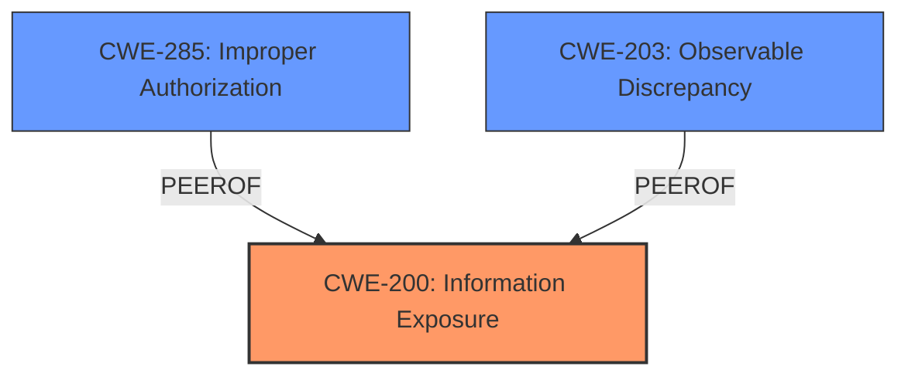

# Analysis Report for CVE-2025-31207

# Vulnerability Analysis Report: CVE-2025-31207

## Description

A **logic issue** was addressed with improved checks. This issue is fixed in iOS 18.5 and iPadOS 18.5. An app may be able to enumerate a users installed apps.

## Vulnerability Description Key Phrases

- **Weakness:** logic issue
- **Impact:** enumerate installed apps
- **Product:** iOS
- **Version:** 18.5

## Analysis (with Relationship Data)

# Summary
| CWE ID | CWE Name | Confidence | CWE Abstraction Level | CWE Vulnerability Mapping Label | CWE-Vulnerability Mapping Notes |
|---|---|---|---|---|---|
| **CWE-200** | **Information Exposure** | 0.7 | Class | Allowed-with-Review | Primary CWE. There might be Base-level children that would be more appropriate |
| CWE-285 | Improper Authorization | 0.3 | Class | Discouraged | Secondary candidate due to potential for authorization issues, but evidence is weak. |
| CWE-203 | Observable Discrepancy | 0.2 | Base | Allowed | Secondary candidate, but less likely than CWE-200. |

## Evidence and Confidence

*   **Confidence Score:** 0.7
*   **Evidence Strength:** MEDIUM

## Relationship Analysis
The primary focus is on **CWE-200 (Information Exposure)** as the app can enumerate installed apps, revealing information about the user's device.
  - **CWE-200** is a class-level CWE, and there may be more specific base-level CWEs.
  - **CWE-285** is considered due to the potential lack of authorization leading to the information exposure.
  - **CWE-203** is a weaker possibility, relating to observable discrepancies, but the description doesn't explicitly mention differing behavior based on circumstances.



## Vulnerability Chain
The chain of events is as follows:
  1.  **Root Cause:** **Logic issue** (unspecified).
  2.  **Weakness:** The **logic issue** allows an app to enumerate installed apps.
  3.  **Impact:** Information Exposure (an app may be able to enumerate a user's installed apps).

The primary CWE reflects the information exposure. The **logic issue** is the root cause, but it's too vague to assign a specific CWE.

## Summary of Analysis
The initial assessment focused on identifying the most relevant CWE based on the vulnerability description, key phrases, and reference links content. The primary indicator is the ability of an app to "enumerate a user's installed apps," which clearly points to **CWE-200 (Information Exposure)**.

The evidence supporting this decision is the vulnerability description stating, "An app may be able to enumerate a users installed apps." This directly implies that sensitive information (the list of installed apps) is being exposed.

The retriever results suggested several other CWEs, including **CWE-285 (Improper Authorization)** and **CWE-203 (Observable Discrepancy)**. While **CWE-285** could be a contributing factor (perhaps the app lacks proper authorization to access this information), the primary issue is the information exposure itself. **CWE-203** is less relevant as the description doesn't highlight any observable differences in behavior that could lead to information leakage.

Therefore, **CWE-200** is the most appropriate CWE as it directly addresses the core vulnerability: the exposure of sensitive information (the user's installed apps). The abstraction level is Class, and a more specific Base-level CWE might exist, but without further details, **CWE-200** is the best fit.

Relevant CWE Information:

# Enhanced Context (25 CWEs)
The following CWEs were identified as potentially relevant to this vulnerability:

## CWE-203: Observable Discrepancy
**Abstraction Level**: Base
**Similarity Score**: 0.72
**Source**: dense

**Description**:
The product behaves differently or sends different responses under different circumstances in a way that is observable to an unauthorized actor, which exposes security-relevant information about the state of the product, such as whether a particular operation was successful or not.

**Mapping Guidance**:
- Usage: Allowed
- Rationale: This CWE entry is at the Base level of abstraction, which is a preferred level of abstraction for mapping to the root causes of vulnerabilities.


## CWE-451: User Interface (UI) Misrepresentation of Critical Information
**Abstraction Level**: Class
**Similarity Score**: 0.70
**Source**: dense

**Description**:
The user interface (UI) does not properly represent critical information to the user, allowing the information - or its source - to be obscured or spoofed. This is often a component in phishing attacks.

**Mapping Guidance**:
- Usage: Allowed-with-Review
- Rationale: This CWE entry is a Class and might have Base-level children that would be more appropriate


## CWE-754: Improper Check for Unusual or Exceptional Conditions
**Abstraction Level**: Class
**Similarity Score**: 0.70
**Source**: dense

**Description**:
The product does not check or incorrectly checks for unusual or exceptional conditions that are not expected to occur frequently during day to day operation of the product.

**Mapping Guidance**:
- Usage: Allowed-with-Review
- Rationale: This CWE entry is a Class and might have Base-level children that would be more appropriate


## CWE-345: Insufficient Verification of Data Authenticity
**Abstraction Level**: Class
**Similarity Score**: 0.69
**Source**: dense

**Description**:
The product does not sufficiently verify the origin or authenticity of data, in a way that causes it to accept invalid data.

**Mapping Guidance**:
- Usage: Discouraged
- Rationale: This CWE entry is a level-1 Class (i.e., a child of a Pillar). It might have lower-level children that would be more appropriate


## CWE-843: Access of Resource Using Incompatible Type ('Type Confusion')
**Abstraction Level**: Base
**Similarity Score**: 0.69
**Source**: dense

**Description**:
The product allocates or initializes a resource such as a pointer, object, or variable using one type, but it later accesses that resource using a type that is incompatible with the original type.

**Mapping Guidance**:
- Usage: Allowed
- Rationale: This CWE entry is at the Base level of abstraction, which is a preferred level of abstraction for mapping to the root causes of vulnerabilities.


## CWE-755: Improper Handling of Exceptional Conditions
**Abstraction Level**: Class
**Similarity Score**: 0.68
**Source**: dense

**Description**:
The product does not handle or incorrectly handles an exceptional condition.

**Mapping Guidance**:
- Usage: Discouraged
- Rationale: This CWE entry is a level-1 Class (i.e., a child of a Pillar). It might have lower-level children that would be more appropriate


## CWE-252: Unchecked Return Value
**Abstraction Level**: Base
**Similarity Score**: 0.68
**Source**: dense

**Description**:
The product does not check the return value from a method or function, which can prevent it from detecting unexpected states and conditions.

**Mapping Guidance**:
- Usage: Allowed
- Rationale: This CWE entry is at the Base level of abstraction, which is a preferred level of abstraction for mapping to the root causes of vulnerabilities.


## CWE-347: Improper Verification of Cryptographic Signature
**Abstraction Level**: Base
**Similarity Score**: 0.68
**Source**: dense

**Description**:
The product does not verify, or incorrectly verifies, the cryptographic signature for data.

**Mapping Guidance**:
- Usage: Allowed
- Rationale: This CWE entry is at the Base level of abstraction, which is a preferred level of abstraction for mapping to the root causes of vulnerabilities.


## CWE-665: Improper Initialization
**Abstraction Level**: Class
**Similarity Score**: 0.68
**Source**: dense

**Description**:
The product does not initialize or incorrectly initializes a resource, which might leave the resource in an unexpected state when it is accessed or used.

**Mapping Guidance**:
- Usage: Discouraged
- Rationale: This CWE entry is a level-1 Class (i.e., a child of a Pillar). It might have lower-level children that would be more appropriate


## CWE-667: Improper Locking
**Abstraction Level**: Class
**Similarity Score**: 0.68
**Source**: dense

**Description**:
The product does not properly acquire or release a lock on a resource, leading to unexpected resource state changes and behaviors.

**Mapping Guidance**:
- Usage: Allowed-with-Review
- Rationale: This CWE entry is a Class and might have Base-level children that would be more appropriate


## CWE-347: Improper Verification of Cryptographic Signature
**Abstraction Level**: Base
**Similarity Score**: 441.4


## CWE Relationship Analysis

Current CWEs represent these abstraction levels: .


### Vulnerability Chain Analysis

**Chain starting from CWE-665:**
- 665 (Improper Initialization) - ROOT


**Chain starting from CWE-203:**
- 203 (Observable Discrepancy) - ROOT


### CWE Relationship Diagram

```mermaid
graph TD
    classDef primary fill:#f96,stroke:#333,stroke-width:2px
    classDef secondary fill:#69f,stroke:#333
    classDef tertiary fill:#9e9,stroke:#333
```


*Report generated on 2025-07-14 18:16:27*
