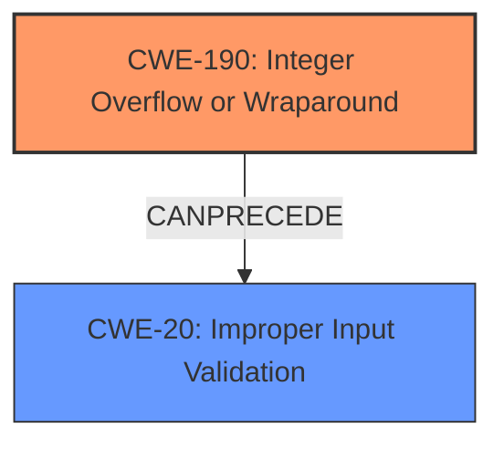

# Enhanced Analysis for CVE-2025-31221

# Summary
| CWE ID | CWE Name | Confidence | CWE Abstraction Level | CWE Vulnerability Mapping Label | CWE-Vulnerability Mapping Notes |
|---|---|---|---|---|---|
| CWE-190 | Integer Overflow or Wraparound | 1.0 | Base | Primary | Allowed |
| CWE-20 | Improper Input Validation | 0.7 | Class | Secondary | Discouraged |

## Evidence and Confidence

*   **Confidence Score:** 0.9
*   **Evidence Strength:** HIGH

## Relationship Analysis
The primary relationship influencing the CWE selection is that **CWE-190** [CWE-190: Integer Overflow or Wraparound] is a base-level weakness that directly addresses the **integer overflow** described in the vulnerability. The description explicitly states that an **integer overflow** was addressed. Additionally, the vulnerability description mentions "improved input validation," which suggests a secondary weakness related to **CWE-20** [CWE-20: Improper Input Validation]. However, **CWE-20** [CWE-20: Improper Input Validation] is a class-level CWE and is discouraged when more specific CWEs are available, but given the limited information, it serves as a reasonable secondary classification.



## Vulnerability Chain
The vulnerability chain starts with the **integer overflow** (**CWE-190** [CWE-190: Integer Overflow or Wraparound]), which leads to memory corruption and, ultimately, to a remote attacker being able to leak memory. The "improved input validation" suggests that the lack of proper input validation contributed to the overflow, thus making **CWE-20** [CWE-20: Improper Input Validation] a contributing factor or a prerequisite.

## Summary of Analysis
The analysis is primarily based on the vulnerability description, which explicitly mentions "**integer overflow** was addressed with improved input validation." The primary CWE, **CWE-190** [CWE-190: Integer Overflow or Wraparound], directly reflects this root cause. The secondary CWE, **CWE-20** [CWE-20: Improper Input Validation], is included because the fix involved "improved input validation," suggesting that the **lack of input validation** contributed to the **integer overflow**.

The graph relationships influenced the selection by highlighting potential chains of weaknesses. While the description is concise, it provides sufficient evidence to classify the vulnerability as **CWE-190** [CWE-190: Integer Overflow or Wraparound] with **CWE-20** [CWE-20: Improper Input Validation] as a contributing factor.

The selected CWEs are at an appropriate level of specificity because **CWE-190** [CWE-190: Integer Overflow or Wraparound] is a base-level CWE that accurately captures the root cause, and **CWE-20** [CWE-20: Improper Input Validation] highlights the broader issue of input handling.

The other CWEs from the **Complete CWE Specifications** were considered, but ultimately not used because they did not directly align with the core issue of the **integer overflow** and subsequent memory leak. For instance, **CWE-787** [CWE-787: Out-of-bounds Write] could be a potential consequence of the integer overflow, but the description doesn't explicitly state that an out-of-bounds write occurred, only that memory could be leaked.


## CWE Relationship Analysis

Current CWEs represent these abstraction levels: .


### Vulnerability Chain Analysis

**Chain starting from CWE-190:**
- 190 (Integer Overflow or Wraparound) - ROOT


**Chain starting from CWE-787:**
- 787 (Out-of-bounds Write) - ROOT


### CWE Relationship Diagram

```mermaid
graph TD
    classDef primary fill:#f96,stroke:#333,stroke-width:2px
    classDef secondary fill:#69f,stroke:#333
    classDef tertiary fill:#9e9,stroke:#333
```