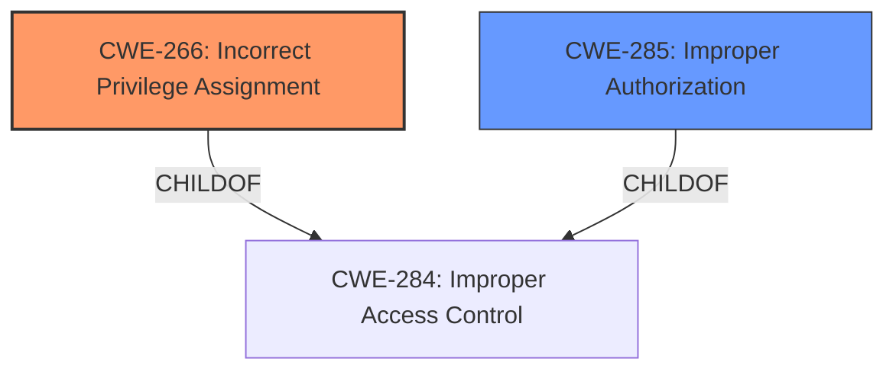

# Analysis Report for CVE-2025-31222

# Vulnerability Analysis Report: CVE-2025-31222

## Description

A **correctness issue** was addressed with improved checks. This issue is fixed in watchOS 11.5, macOS Sonoma 14.7.6, tvOS 18.5, iOS 18.5 and iPadOS 18.5, macOS Sequoia 15.5, visionOS 2.5, macOS Ventura 13.7.6. A user may be able to elevate privileges.

## Vulnerability Description Key Phrases

- **Weakness:** correctness issue
- **Product:** watchOS, macOS Sonoma, tvOS, iOS, iPadOS, macOS Sequoia, visionOS, macOS Ventura
- **Impact:** elevate privileges
- **Attacker:** user
- **Version:** 11.5, 14.7.6, 18.5, 18.5, 18.5, 15.5, 2.5, 13.7.6

## Analysis (with Relationship Data)

# Summary
| CWE ID | CWE Name | Confidence | CWE Abstraction Level | CWE Vulnerability Mapping Label | CWE-Vulnerability Mapping Notes |
|---|---|---|---|---|---|
| CWE-266 | Incorrect Privilege Assignment | 0.7 | Base | Allowed | Primary CWE |
| CWE-285 | Improper Authorization | 0.5 | Class | Discouraged | Secondary Candidate |

## Evidence and Confidence

*   **Confidence Score:** 0.7
*   **Evidence Strength:** LOW

## Relationship Analysis
The primary relationship that influenced my decision was the hierarchical structure within the CWE framework related to privileges and permissions. Specifically, the guidance clearly distinguishes between privilege assignment issues (CWE-266) and authorization flaws (CWE-285). The description states a user may be able to elevate privileges and the guidance notes that **privileges** represent the *actor's identity level* or capabilities, suggesting a problem with how privileges are assigned, leading to the selection of CWE-266.



## Vulnerability Chain
The vulnerability chain starts with a **correctness issue** that leads to a user being able to **elevate privileges**.

## Summary of Analysis
My analysis is heavily based on the provided evidence, particularly the vulnerability description and the CWE Classification Guidance. The description states "A user may be able to elevate privileges". The CWE guidance suggests that privilege escalation, in the context of assigning the wrong role, maps to CWE-266.

The graph relationships influenced my selection by highlighting the hierarchical structure. While CWE-285 (Improper Authorization) was considered, the guidance notes that "privileges" represent the *actor's identity level* which suggested a problem with how privileges are assigned, leading to the selection of CWE-266.

The selected CWEs are at the optimal level of specificity because CWE-266 is a Base level CWE, and provides a more specific description of the **incorrect privilege assignment** than the more generic Class level CWE-285.

Relevant CWE Information:

# Enhanced Context (25 CWEs)
The following CWEs were identified as potentially relevant to this vulnerability:

## CWE-266: Incorrect Privilege Assignment
**Abstraction Level**: Base
**Similarity Score**: 0.78
**Source**: dense

**Description**:
A product incorrectly assigns a privilege to a particular actor, creating an unintended sphere of control for that actor.

**Mapping Guidance**:
- Usage: Allowed
- Rationale: This CWE entry is at the Base level of abstraction, which is a preferred level of abstraction for mapping to the root causes of vulnerabilities.

*How the vulnerability's details match the CWE's characteristics:* The vulnerability description states that a user may be able to elevate privileges, suggesting that the user was incorrectly assigned a higher privilege level than intended.
*The security implications and potential impact:* An attacker could gain unauthorized access to sensitive data or perform actions that they are not authorized to perform.
*Any parent-child relationships or chain patterns that influenced your mapping:* CWE-266 is a child of CWE-284 (Improper Access Control).
*Whether the weakness is primary or secondary in the vulnerability:* Primary
*How the official MITRE mapping guidance influenced your decision:* The MITRE mapping guidance explicitly suggests CWE-266 when a user is assigned the wrong role.

## CWE-285: Improper Authorization
**Abstraction Level**: Class
**Similarity Score**: 1300.86
**Source**: sparse

**Description**:
The product does not perform or incorrectly performs an authorization check when an actor attempts to access a resource or perform an action.

**Mapping Guidance**:
- Usage: Discouraged
- Rationale: CWE-285 is high-level and lower-level CWEs can frequently be used instead. It is a level-1 Class (i.e., a child of a Pillar).

*How the vulnerability's details match the CWE's characteristics:* Could be applicable if the privilege elevation was due to an incorrect authorization check. However, the description focuses on the elevation itself, suggesting a privilege assignment issue.
*The security implications and potential impact:* An attacker could bypass security restrictions and gain unauthorized access to resources.
*Any parent-child relationships or chain patterns that influenced your mapping:* CWE-285 is a child of CWE-284 (Improper Access Control).
*Whether the weakness is primary or secondary in the vulnerability:* Secondary
*How the official MITRE mapping guidance influenced your decision:* The MITRE mapping guidance suggests using more specific CWEs than CWE-285 when possible.

**CWEs Considered But Not Used:**

*   CWE-787 (Out-of-bounds Write), CWE-843 (Access of Resource Using Incompatible Type), CWE-665 (Improper Initialization), CWE-415 (Double Free), CWE-20 (Improper Input Validation), CWE-1286 (Improper Validation of Syntactic Correctness of Input), CWE-119 (Improper Restriction of Operations within the Bounds of a Memory Buffer), CWE-347 (Improper Verification of Cryptographic Signature), CWE-123 (Write-what-where Condition): These CWEs were considered but not used because they don't directly relate to the **privilege elevation** aspect of the vulnerability. They describe memory corruption, input validation, or cryptographic issues, which are not the primary cause of the vulnerability as described.


## CWE Relationship Analysis

Current CWEs represent these abstraction levels: .


### Vulnerability Chain Analysis

**Chain starting from CWE-123:**
- 123 (Write-what-where Condition) - ROOT


**Chain starting from CWE-1286:**
- 1286 (Improper Validation of Syntactic Correctness of Input) - ROOT


### CWE Relationship Diagram

```mermaid
graph TD
    classDef primary fill:#f96,stroke:#333,stroke-width:2px
    classDef secondary fill:#69f,stroke:#333
    classDef tertiary fill:#9e9,stroke:#333
```


*Report generated on 2025-07-14 18:20:56*
