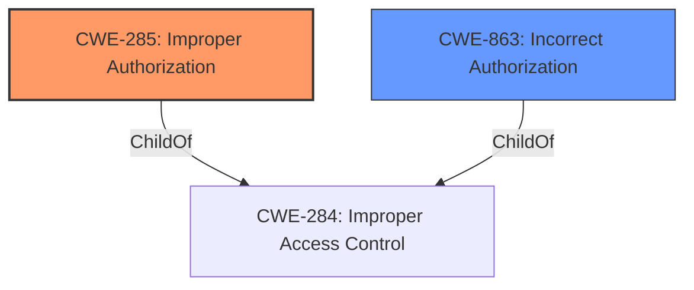

# Analysis for CVE-2025-31231

# Summary
| CWE ID | CWE Name | Confidence | CWE Abstraction Level | CWE Vulnerability Mapping Label | CWE-Vulnerability Mapping Notes |
|---|---|---|---|---|---|
| CWE-285 | Improper Authorization | 0.8 | Class | Primary | Discouraged |
| CWE-863 | Incorrect Authorization | 0.6 | Class | Secondary | Allowed-with-Review |

## Evidence and Confidence

*   **Confidence Score:** 0.7
*   **Evidence Strength:** MEDIUM

## Relationship Analysis
The primary relationship considered was the parent-child relationship between CWE-284 (Improper Access Control), CWE-285 (Improper Authorization), and CWE-863 (Incorrect Authorization). CWE-285 and CWE-863 are children of CWE-284, representing more specific types of access control issues. Since the description indicates a **permissions issue** that allows an app to read sensitive location information, it suggests a problem with the authorization process and not necessarily a complete lack of access control. I chose CWE-285 as the primary because the authorization is **improper**. CWE-863 was considered as a secondary weakness because the authorization check performed is **incorrect**.

## Vulnerability Chain
The vulnerability chain starts with a **permissions issue**, leading to the impact of an app being able to read sensitive location information.
- Root Cause: **permissions issue**
- Impact: read sensitive location information
The chain highlights a flawed or **improper** authorization mechanism, allowing unauthorized access to sensitive location data.

## Summary of Analysis
The vulnerability description indicates a **permissions issue** that allows an app to read sensitive location information. The **rootcause** is a **permissions issue**. Given the guidance, if the authorization logic is present but flawed, **CWE-863** is a potential mapping. However, since the **permissions** are **improper**, **CWE-285** is the better choice.
The retriever results also list **CWE-285** and **CWE-863** as potential candidates. The guidance emphasizes that if the authorization logic is present but flawed, **CWE-863** should be considered. However, given the limited information, it is difficult to determine whether the authorization logic is merely flawed or entirely missing/improper. Therefore, I chose **CWE-285** as the primary flaw because the authorization is **improper** and **CWE-863** as the secondary flaw because the authorization check performed is **incorrect**.
The selected CWEs are at the optimal level of specificity, providing a clear understanding of the vulnerability's nature and potential impact.

Relevant CWE Information:

# Enhanced Context (25 CWEs)
The following CWEs were identified as potentially relevant to this vulnerability:

## CWE-285: Improper Authorization
**Abstraction Level**: Class
**Similarity Score**: 1204.41
**Source**: sparse

**Description**:
The product does not perform or incorrectly performs an authorization check when an actor attempts to access a resource or perform an action.

**Mapping Guidance**:
- Usage: Discouraged
- Rationale: CWE-285 is high-level and lower-level CWEs can frequently be used instead. It is a level-1 Class (i.e., a child of a Pillar).

## CWE-863: Incorrect Authorization
**Abstraction Level**: Class
**Similarity Score**: 1237.30
**Source**: sparse

**Description**:
The product performs an authorization check when an actor attempts to access a resource or perform an action, but it does not correctly perform the check.

**Mapping Guidance**:
- Usage: Allowed-with-Review
- Rationale: This CWE entry is a Class and might have Base-level children that would be more appropriate