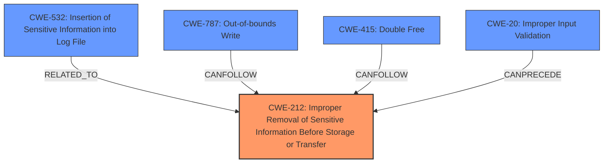

# Analysis for CVE-2025-31242

# Summary
| CWE ID | CWE Name | Confidence | CWE Abstraction Level | CWE Vulnerability Mapping Label | CWE-Vulnerability Mapping Notes |
|---|---|---|---|---|---|
| CWE-212 | Improper Removal of Sensitive Information Before Storage or Transfer | 0.8 | Base | Primary | Allowed |
| CWE-532 | Insertion of Sensitive Information into Log File | 0.7 | Base | Secondary | Allowed |
| CWE-787 | Out-of-bounds Write | 0.6 | Base | Secondary | Allowed |
| CWE-415 | Double Free | 0.6 | Variant | Secondary | Allowed |
| CWE-20 | Improper Input Validation | 0.5 | Class | Secondary | Discouraged |

## Evidence and Confidence

*   **Confidence Score:** 0.7
*   **Evidence Strength:** MEDIUM

## Relationship Analysis
The analysis focuses on identifying the root cause of the vulnerability related to the privacy issue of sensitive user data access. CWE-212 is selected as the primary CWE because the **vulnerability description** explicitly mentions a **privacy issue** that was addressed with improved private data redaction for log entries which means data was being stored or transfered without proper removal. Other CWEs are considered as contributing factors or consequences. The hierarchical and chain relationships help to refine the selection and understand the vulnerability's scope.

## Vulnerability Chain
The vulnerability chain starts with **improper input validation** (CWE-20), which can lead to **out-of-bounds write** (CWE-787) or **double free** (CWE-415) conditions. The core issue is the **improper removal of sensitive information** (CWE-212) before it's stored or transferred, potentially leading to it being logged (CWE-532).

## Summary of Analysis
The analysis is based on the provided vulnerability description and CVE reference links. The primary focus is on identifying the root cause of the **privacy issue** related to the access of sensitive user data.

The vulnerability description indicates that the issue was addressed with "improved private data redaction for log entries." This directly implies that sensitive information was not properly removed before being logged, which aligns with CWE-212 (Improper Removal of Sensitive Information Before Storage or Transfer). The CVE reference links content summary reveals a variety of underlying causes for related vulnerabilities, including memory corruption issues like double frees and out-of-bounds reads, as well as input validation failures.

The selection of CWE-212 is further justified by the fact that it directly addresses the described **privacy issue** resulting from the **lack of proper data redaction**. While other CWEs like CWE-787 and CWE-415 represent contributing factors that could lead to the exposure of sensitive data, they do not directly address the root cause of the **information leakage** as effectively as CWE-212.

The other CWEs considered but not used are:

*   CWE-787: Out-of-bounds Write - While the CVE summary mentions out-of-bounds read/write issues, it is not the direct cause of the privacy issue, but rather a potential contributing factor.
*   CWE-415: Double Free - Similar to CWE-787, double free issues are present in the CVE summary, but are not the direct cause of the **privacy issue**.
*   CWE-532: Insertion of Sensitive Information into Log File - Relates to the direct logging of data, but not the cause of the data being leaked.
*   CWE-20: Improper Input Validation - While input validation issues are present in the CVE summary, they are not the direct cause of the **privacy issue**, but rather a potential contributing factor.

The selected CWEs are at the optimal level of specificity because they directly address the weakness described in the vulnerability description.

Relevant CWE Information:

# Enhanced Context (25 CWEs)
The following CWEs were identified as potentially relevant to this vulnerability:

## CWE-203: Observable Discrepancy
**Abstraction Level**: Base
**Similarity Score**: 0.78
**Source**: dense

**Description**:
The product behaves differently or sends different responses under different circumstances in a way that is observable to an unauthorized actor, which exposes security-relevant information about the state of the product, such as whether a particular operation was successful or not.

**Mapping Guidance**:
- Usage: Allowed
- Rationale: This CWE entry is at the Base level of abstraction, which is a preferred level of abstraction for mapping to the root causes of vulnerabilities.

*Not Used*: While this could be a consequence, it doesn't directly address the root cause of the **data redaction** issue.

## CWE-665: Improper Initialization
**Abstraction Level**: Class
**Similarity Score**: 0.77
**Source**: dense

**Description**:
The product does not initialize or incorrectly initializes a resource, which might leave the resource in an unexpected state when it is accessed or used.

**Mapping Guidance**:
- Usage: Discouraged
- Rationale: This CWE entry is a level-1 Class (i.e., a child of a Pillar). It might have lower-level children that would be more appropriate

*Not Used*: Not directly related to the **data redaction** issue.

## CWE-212: Improper Removal of Sensitive Information Before Storage or Transfer
**Abstraction Level**: Base
**Similarity Score**: 0.77
**Source**: dense

**Description**:
The product stores, transfers, or shares a resource that contains sensitive information, but it does not properly remove that information before the product makes the resource available to unauthorized actors.

**Mapping Guidance**:
- Usage: Allowed
- Rationale: This CWE entry is at the Base level of abstraction, which is a preferred level of abstraction for mapping to the root causes of vulnerabilities.

*Used as Primary CWE*: Directly addresses the **privacy issue** described.

## CWE-667: Improper Locking
**Abstraction Level**: Class
**Similarity Score**: 0.77
**Source**: dense

**Description**:
The product does not properly acquire or release a lock on a resource, leading to unexpected resource state changes and behaviors.

**Mapping Guidance**:
- Usage: Allowed-with-Review
- Rationale: This CWE entry is a Class and might have Base-level children that would be more appropriate

*Not Used*: Not directly related to the **data redaction** issue.

## CWE-755: Improper Handling of Exceptional Conditions
**Abstraction Level**: Class
**Similarity Score**: 0.77
**Source**: dense

**Description**:
The product does not handle or incorrectly handles an exceptional condition.

**Mapping Guidance**:
- Usage: Discouraged
- Rationale: This CWE entry is a level-1 Class (i.e., a child of a Pillar). It might have lower-level children that would be more appropriate

*Not Used*: Too generic, doesn't relate directly to the **data redaction** issue.

## CWE-125: Out-of-bounds Read
**Abstraction Level**: Base
**Similarity Score**: 0.77
**Source**: dense

**Description**:
The product reads data past the end, or before the beginning, of the intended buffer.

**Mapping Guidance**:
- Usage: Allowed
- Rationale: This CWE entry is at the Base level of abstraction, which is a preferred level of abstraction for mapping to the root causes of vulnerabilities.

*Not Used*: While mentioned in the CVE Summary, it's not the direct cause of the **privacy issue**.

## CWE-119: Improper Restriction of Operations within the Bounds of a Memory Buffer
**Abstraction Level**: Class
**Similarity Score**: 0.76
**Source**: dense

**Description**:
The product performs operations on a memory buffer, but it reads from or writes to a memory location outside the buffer's intended boundary. This may result in read or write operations on unexpected memory locations that could be linked to other variables, data structures, or internal program data.

**Mapping Guidance**:
- Usage: Discouraged
- Rationale: CWE-119 is commonly misused in low-information vulnerability reports