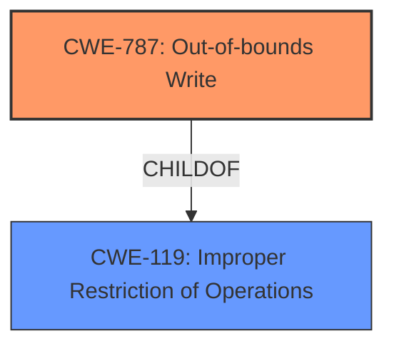

# Raw Analyzer Response for CVE-2025-31245

# Summary

| CWE ID   | CWE Name                                                                   | Confidence | CWE Abstraction Level | CWE Vulnerability Mapping Label | CWE-Vulnerability Mapping Notes |
| :-------- | :------------------------------------------------------------------------- | :--------- | :---------------------- | :------------------------------ | :------------------------------ |
| CWE-787 | Out-of-bounds Write                                                        | 0.75      | Base                    | Primary                         | Allowed                       |
| CWE-119 | Improper Restriction of Operations within the Bounds of a Memory Buffer | 0.5       | Class                   | Secondary                       | Discouraged                    |

## Evidence and Confidence

*   **Confidence Score:** 0.7
*   **Evidence Strength:** MEDIUM

## Relationship Analysis

The primary relationship that influenced the decision was the parent-child relationship between CWE-119 and CWE-787. CWE-787 (Out-of-bounds Write) is a specific type of CWE-119 (Improper Restriction of Operations within the Bounds of a Memory Buffer). The description indicates a potential memory corruption issue due to the system termination, making CWE-787 a more precise fit than its parent.

## Vulnerability Chain

The vulnerability chain starts with a weakness that leads to an **out-of-bounds write**, which results in unexpected system termination.

1.  An application has some vulnerability (**ROOTCAUSE**).
2.  The vulnerability leads to **CWE-787 Out-of-bounds Write**, which corrupts memory.
3.  The memory corruption leads to unexpected system termination (**IMPACT**).

## Summary of Analysis

The initial analysis focused on the potential for memory corruption leading to system termination. The vulnerability description indicates that "An app may be able to cause unexpected system termination." The CVE reference links content summary confirms this by stating, "Weaknesses/vulnerabilities present: An app may be able to cause unexpected system termination," and "Mitigation or fix: The issue was addressed with improved checks."

Given the limited information, the "improved checks" mitigate a memory corruption issue. Although the description doesn't explicitly mention memory corruption, the impact (system termination) suggests it, and the retriever results highlighted **CWE-787 Out-of-bounds Write** as the top candidate.

I considered other CWEs such as **CWE-415 Double Free** and **CWE-843 Access of Resource Using Incompatible Type**, but these are less likely given the impact and mitigation strategy. **CWE-787 Out-of-bounds Write** is a base-level CWE, which is the preferred level of abstraction. While **CWE-119 Improper Restriction of Operations within the Bounds of a Memory Buffer** could be considered, **CWE-787 Out-of-bounds Write** is a more specific and thus a better fit.

Relevant CWE Information:

# Enhanced Context (25 CWEs)
The following CWEs were identified as potentially relevant to this vulnerability:

## CWE-665: Improper Initialization
**Abstraction Level**: Class
**Similarity Score**: 0.76
**Source**: dense

**Description**:
The product does not initialize or incorrectly initializes a resource, which might leave the resource in an unexpected state when it is accessed or used.

**Mapping Guidance**:
- Usage: Discouraged
- Rationale: This CWE entry is a level-1 Class (i.e., a child of a Pillar). It might have lower-level children that would be more appropriate

*Not used because:* There's no evidence that this vulnerability is related to the initialization of any resource.

## CWE-843: Access of Resource Using Incompatible Type ('Type Confusion')
**Abstraction Level**: Base
**Similarity Score**: 0.76
**Source**: dense

**Description**:
The product allocates or initializes a resource such as a pointer, object, or variable using one type, but it later accesses that resource using a type that is incompatible with the original type.

**Mapping Guidance**:
- Usage: Allowed
- Rationale: This CWE entry is at the Base level of abstraction, which is a preferred level of abstraction for mapping to the root causes of vulnerabilities.

*Not used because:* While type confusion could lead to memory corruption and system termination, there is no explicit evidence for it in the vulnerability description.

## CWE-754: Improper Check for Unusual or Exceptional Conditions
**Abstraction Level**: Class
**Similarity Score**: 0.76
**Source**: dense

**Description**:
The product does not check or incorrectly checks for unusual or exceptional conditions that are not expected to occur frequently during day to day operation of the product.

**Mapping Guidance**:
- Usage: Allowed-with-Review
- Rationale: This CWE entry is a Class and might have Base-level children that would be more appropriate

*Not used because:* The fix mentions "improved checks," which could be related, but it does not directly imply a failure to handle exceptional conditions in a broader sense.

## CWE-667: Improper Locking
**Abstraction Level**: Class
**Similarity Score**: 0.76
**Source**: dense

**Description**:
The product does not properly acquire or release a lock on a resource, leading to unexpected resource state changes and behaviors.

**Mapping Guidance**:
- Usage: Allowed-with-Review
- Rationale: This CWE entry is a Class and might have Base-level children that would be more appropriate

*Not used because:* There is no information to suggest that the vulnerability is related to locking issues.

## CWE-203: Observable Discrepancy
**Abstraction Level**: Base
**Similarity Score**: 0.75
**Source**: dense

**Description**:
The product behaves differently or sends different responses under different circumstances in a way that is observable to an unauthorized actor, which exposes security-relevant information about the state of the product, such as whether a particular operation was successful or not.

**Mapping Guidance**:
- Usage: Allowed
- Rationale: This CWE entry is at the Base level of abstraction, which is a preferred level of abstraction for mapping to the root causes of vulnerabilities.

*Not used because:* This vulnerability does not have anything to do with the product behaving differently to expose security-relevant information.

## CWE-755: Improper Handling of Exceptional Conditions
**Abstraction Level**: Class
**Similarity Score**: 0.75
**Source**: dense

**Description**:
The product does not handle or incorrectly handles an exceptional condition.

**Mapping Guidance**:
- Usage: Discouraged
- Rationale: This CWE entry is a level-1 Class (i.e., a child of a Pillar). It might have lower-level children that would be more appropriate

*Not used because:* Similar to CWE-754, the provided information is too vague, although the description mentions 'improved checks'.

## CWE-451: User Interface (UI) Misrepresentation of Critical Information
**Abstraction Level**: Class
**Similarity Score**: 0.75
**Source**: dense

**Description**:
The user interface (UI) does not properly represent critical information to the user, allowing the information - or its source - to be obscured or spoofed. This is often a component in phishing attacks.

**Mapping Guidance**:
- Usage: Allowed-with-Review
- Rationale: This CWE entry is a Class and might have Base-level children that would be more appropriate

*Not used because:* This vulnerability has nothing to do with the User Interface.

## CWE-252: Unchecked Return Value
**Abstraction Level**: Base
**Similarity Score**: 0.75
**Source**: dense

**Description**:
The product does not check the return value from a method or function, which can prevent it from detecting unexpected states and conditions.

**Mapping Guidance**:
- Usage: Allowed
- Rationale: This CWE entry is at the Base level of abstraction, which is a preferred level of abstraction for mapping to the root causes of vulnerabilities.

*Not used because:* There's no mention of unchecked return values.

## CWE-131: Incorrect Calculation of Buffer Size
**Abstraction Level**: Base
**Similarity Score**: 0.74
**Source**: dense

**Description**:
The product does not correctly calculate the size to be used when allocating a buffer, which could lead to a buffer overflow.

**Mapping Guidance**:
- Usage: Allowed
- Rationale: This CWE entry is at the Base level of abstraction, which is a preferred level of abstraction for mapping to the root causes of vulnerabilities.

*Not used because:* Although this could lead to a buffer overflow, there is no direct evidence in the description.

## CWE-125: Out-of-bounds Read
**Abstraction Level**: Base
**Similarity Score**: 0.74
**Source**: dense

**Description**:
The product reads data past the end, or before the beginning, of the intended buffer.

**Mapping Guidance**: