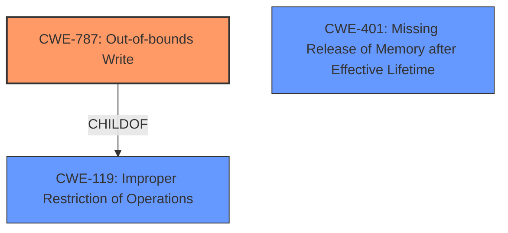

# Analysis for CVE-2025-31246

# Summary
| CWE ID | CWE Name | Confidence | CWE Abstraction Level | CWE Vulnerability Mapping Label | CWE-Vulnerability Mapping Notes |
|---|---|---|---|---|---|
| CWE-787 | Out-of-bounds Write | 0.8 | Base | Allowed | Primary CWE. The **corruption of kernel memory** is a result of writing data past the end, or before the beginning, of the intended buffer. |
| CWE-401 | Missing Release of Memory after Effective Lifetime | 0.6 | Variant | Allowed | Secondary candidate. The memory corruption may be related to memory management. |

## Evidence and Confidence

*   **Confidence Score:** 0.7
*   **Evidence Strength:** MEDIUM

## Relationship Analysis
The primary relationship influencing the decision is the hierarchical relationship.
CWE-787 (Out-of-bounds Write) is a base CWE, which is a preferred level of abstraction.
CWE-787 is a child of CWE-119 (Improper Restriction of Operations within the Bounds of a Memory Buffer), but CWE-119 is too general and discouraged.

## Vulnerability Chain
The vulnerability chain starts with a connection to a malicious AFP server which leads to **corruption of kernel memory** through an out-of-bounds write.
- Connection to malicious AFP server -> **Improper Memory Handling** (Root Cause) -> CWE-787 (Out-of-bounds Write) -> Kernel Memory Corruption.

## Summary of Analysis
The analysis is based on the provided evidence, primarily the description of the vulnerability as **corrupting kernel memory** when connecting to a malicious AFP server. This strongly suggests a memory corruption issue. The "Retriever Results" also suggested CWE-787 (Out-of-bounds Write) as the top candidate.

The selection of CWE-787 (Out-of-bounds Write) is at the optimal level of specificity because it directly describes the **corruption of kernel memory** caused by writing outside the intended buffer. This is more specific than a general memory corruption or memory management issue.

CWE-401 (Missing Release of Memory after Effective Lifetime) was considered as a secondary candidate, as memory management issues could contribute to memory corruption. However, without more specific evidence, CWE-787 (Out-of-bounds Write) is the more appropriate primary mapping.