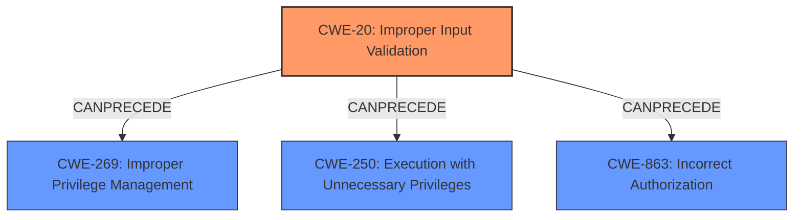

# Analysis for CVE-2025-31259

# Summary
| CWE ID    | CWE Name                                                                   | Confidence | CWE Abstraction Level | CWE Vulnerability Mapping Label | CWE-Vulnerability Mapping Notes |
| :-------- | :------------------------------------------------------------------------- | :--------- | :-------------------- | :------------------------------ | :------------------------------ |
| CWE-20    | Improper Input Validation                                                 | 0.8        | Class                 | Primary CWE                     | Discouraged                   |
| CWE-269   | Improper Privilege Management                                             | 0.5        | Class                 | Secondary Candidate             | Discouraged                   |
| CWE-250   | Execution with Unnecessary Privileges                                     | 0.4        | Base                  | Secondary Candidate             | Allowed                       |
| CWE-863   | Incorrect Authorization                                                   | 0.4        | Class                 | Secondary Candidate             | Allowed-with-Review           |

## Evidence and Confidence

*   **Confidence Score:** 0.8
*   **Evidence Strength:** MEDIUM

## Relationship Analysis
The primary CWE is CWE-20, Improper Input Validation, which is a class-level CWE. The vulnerability description indicates that the issue was addressed with improved input sanitization. Input validation issues often precede other vulnerabilities. We also considered CWE-269 (Improper Privilege Management), CWE-250 (Execution with Unnecessary Privileges) and CWE-863 (Incorrect Authorization). However, given the limited information, improper input validation seems to be the root cause.

## Vulnerability Chain
The vulnerability chain starts with **improper input validation (CWE-20)**, which leads to an application gaining elevated privileges. While the exact mechanism of how elevated privileges are gained isn't clear from the description, potential weaknesses that could result are:
1.  **CWE-20 Improper Input Validation**: Input is not properly validated or sanitized.
2.  **CWE-269 Improper Privilege Management**: Input leads to unintended modification of privilege levels.
3.  **CWE-250 Execution with Unnecessary Privileges**: Input causes a component to execute with higher privileges than needed.
4.  **CWE-863 Incorrect Authorization**: Input bypasses authorization checks allowing unintended access.

## Summary of Analysis
The primary weakness is **improper input validation**, as indicated by the fix being "improved input sanitization." This suggests that the application was not properly validating or sanitizing input, which allowed an attacker to potentially manipulate the application to gain elevated privileges. I am using CWE-20 because it is the root cause that triggers the vulnerability.

Based on the limited information, the other possible CWEs are not the most accurate.
*   CWE-269 (Improper Privilege Management) and CWE-250 (Execution with Unnecessary Privileges) are possible if the input validation issue directly led to privilege escalation or a component running with unnecessary privileges, but this is not explicitly stated.
*   CWE-863 (Incorrect Authorization) could be a factor if the input validation bypasses authorization checks, but again, the description lacks this level of detail.

Relevant CWE Information:

# Enhanced Context (25 CWEs)
The following CWEs were identified as potentially relevant to this vulnerability:

## CWE Classification Guidance

The following guidance has been automatically included because relevant keywords were detected in the vulnerability description:

### Privileges vs Permissions Guidance

## Complete CWE Specifications

CWE-787: Out-of-bounds Write

CWE-138: Improper Neutralization of Special Elements

CWE-187: Partial String Comparison

CWE-843: Access of Resource Using Incompatible Type ('Type Confusion')

CWE-20: Improper Input Validation

CWE-665: Improper Initialization

CWE-1263: Improper Physical Access Control

CWE-277: Insecure Inherited Permissions

CWE-250: Execution with Unnecessary Privileges

CWE-190: Integer Overflow or Wraparound

The vulnerability description mentions improved input sanitization, which directly aligns with CWE-20. The retriever results also include CWE-20, although with a lower score than other candidates.

**CWE-20: Improper Input Validation**
*   The product receives input or data, but it does not validate or incorrectly validates that the input has the properties that are required to process the data safely and correctly.
*   Security Implications: Improper input validation can lead to a wide variety of other weaknesses.
*   This is the most appropriate CWE based on the "improved input sanitization" fix.

The other suggested CWEs from the retriever results and enhanced context were considered but are less suitable:

*   CWE-787 (Out-of-bounds Write): Not directly indicated by the description.
*   CWE-138 (Improper Neutralization of Special Elements): Requires more specifics about special elements.
*   CWE-187 (Partial String Comparison): Not relevant as there's no mention of string comparison.
*   CWE-843 (Access of Resource Using Incompatible Type): Does not align with the provided information.
*   CWE-665 (Improper Initialization): No mention of initialization issues.
*   CWE-1263 (Improper Physical Access Control): Not applicable in this software context.
*   CWE-277 (Insecure Inherited Permissions): No indication of permission inheritance issues.
*   CWE-190 (Integer Overflow or Wraparound): Not relevant.

I am overriding the retriever results and choosing CWE-20 as the primary CWE because of the direct reference to "improved input sanitization" in the vulnerability description.