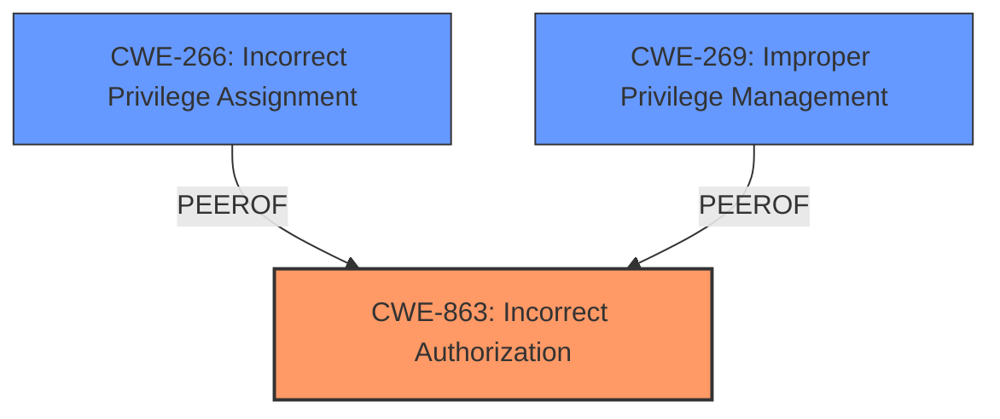

# Analysis for CVE-2025-31282

# Summary
| CWE ID | CWE Name | Confidence | CWE Abstraction Level | CWE Vulnerability Mapping Label | CWE-Vulnerability Mapping Notes |
|---|---|---|---|---|---|
| CWE-863 | Incorrect Authorization | 0.9 | Class | Primary CWE | Allowed-with-Review |
| CWE-266 | Incorrect Privilege Assignment | 0.7 | Base | Secondary Candidate | Allowed |
| CWE-269 | Improper Privilege Management | 0.6 | Class | Secondary Candidate | Discouraged |

## Evidence and Confidence

*   **Confidence Score:** 0.9
*   **Evidence Strength:** HIGH

## Relationship Analysis
The primary CWE selected is CWE-863, "Incorrect Authorization," which is a Class-level CWE. While it's generally preferred to select Base or Variant-level CWEs, the description indicates a flaw in the authorization logic itself, making CWE-863 a suitable choice. CWE-863 has child relationships to CWE-942 "Permissive Cross-domain Policy with Untrusted Domains" which is not relevant, and peers to CWE-285 "Improper Authorization" which is a more general class and less suitable. CWE-266, "Incorrect Privilege Assignment," and CWE-269, "Improper Privilege Management," are considered as secondary candidates due to the vulnerability leading to privilege escalation, but the root cause is an authorization flaw.

## Vulnerability Chain
The vulnerability chain starts with an **incorrect authorization** mechanism (CWE-863). This allows an administrator to create users with the ability to change their account role, leading to privilege escalation. The chain is:

1.  **Incorrect Authorization (CWE-863)**: The administrator is able to create users that have more privileges than they should
2.  Privilege Escalation (Impact): Users are able to modify their roles and escalate privileges.

## Summary of Analysis
The initial assessment focused on identifying the root cause of the vulnerability, which is a **broken access control vulnerability**. The analysis considered several CWEs related to access control, authentication, and authorization.

The evidence supports the selection of CWE-863 because the vulnerability lies in the **incorrect** implementation of authorization logic. The vulnerability description states that an administrator can create users that are able to change their account role which leads to privilege escalation. This indicates that the authorization check is either flawed or missing, which is the basis of **incorrect authorization**.

The retriever results also support this conclusion, with CWE-863 being a high-scoring candidate. The CWE Classification Guidance also supports this selection.

The final decision is based on the evidence that the access control mechanism is present, but flawed.

Relevant CWE Information:

# Enhanced Context (25 CWEs)
The following CWEs were identified as potentially relevant to this vulnerability:

## CWE-266: Incorrect Privilege Assignment
**Abstraction Level**: Base
**Similarity Score**: 0.74
**Source**: dense

**Description**:
A product incorrectly assigns a privilege to a particular actor, creating an unintended sphere of control for that actor.

**Mapping Guidance**:
- Usage: Allowed
- Rationale: This CWE entry is at the Base level of abstraction, which is a preferred level of abstraction for mapping to the root causes of vulnerabilities.

## CWE-269: Improper Privilege Management
**Abstraction Level**: Class
**Similarity Score**: 2273.37
**Source**: sparse

**Description**:
The product does not properly assign, modify, track, or check privileges for an actor, creating an unintended sphere of control for that actor.

**Mapping Guidance**:
- Usage: Discouraged
- Rationale: CWE-269 is commonly misused. It can be conflated with "privilege escalation," which is a technical impact that is listed in many low-information vulnerability reports [REF-1287]. It is not useful for trend analysis.