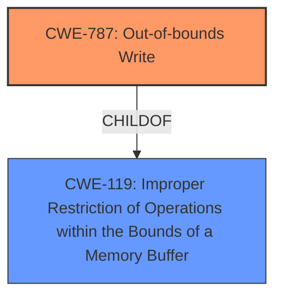

# Enhanced Analysis for CVE-2025-3136

# Summary
| CWE ID | CWE Name | Confidence | CWE Abstraction Level | CWE Vulnerability Mapping Label | CWE-Vulnerability Mapping Notes |
|---|---|---|---|---|---|
| CWE-787 | Out-of-bounds Write | 1.0 | Base | Allowed | Primary CWE. The vulnerability results in **memory corruption** due to manipulation of `torch.cuda.memory.caching_allocator_delete`. |
| CWE-119 | Improper Restriction of Operations within the Bounds of a Memory Buffer | 0.5 | Class | Allowed | Secondary CWE. CWE-787 is a child of CWE-119. |

## Evidence and Confidence

*   **Confidence Score:** 1.0
*   **Evidence Strength:** MEDIUM

## Relationship Analysis
The primary relationship influencing the decision is the parent-child relationship between CWE-787 and CWE-119. CWE-787 is a more specific case of CWE-119, so it is the preferred mapping. There are no chain relationships apparent from the provided information. The abstraction levels were considered to select the most specific base level CWE.



## Vulnerability Chain
The vulnerability chain starts with the manipulation of `torch.cuda.memory.caching_allocator_delete` which then leads to **memory corruption** due to an out-of-bounds write.
  - CWE-787 is the root cause of the **memory corruption**.

## Summary of Analysis
The primary CWE selected is CWE-787 (Out-of-bounds Write) because the vulnerability description explicitly mentions **memory corruption** due to manipulation of the `torch.cuda.memory.caching_allocator_delete` function. The Retriever Results also lists CWE-787 as the top combined result with a score of 1.0. The evidence indicates an out-of-bounds write condition, making CWE-787 the most appropriate choice.

The secondary CWE considered is CWE-119 (Improper Restriction of Operations within the Bounds of a Memory Buffer) since CWE-787 is a child of CWE-119.

CWEs considered but not used:

*   CWE-79 and CWE-89 are related to web-based vulnerabilities, and are not relevant to this vulnerability.
*   CWE-125 (Out-of-bounds Read): While related to memory issues, the description specifies a write, not a read.
*   CWE-190 (Integer Overflow or Wraparound), CWE-704 (Incorrect Type Conversion or Cast), CWE-252 (Unchecked Return Value), CWE-789 (Memory Allocation with Excessive Size Value), CWE-1284 (Improper Validation of Specified Quantity in Input) - These CWEs do not align with the provided vulnerability description.
*   CWE-824 (Access of Uninitialized Pointer), CWE-131 (Incorrect Calculation of Buffer Size), CWE-367 (Time-of-check Time-of-use (TOCTOU) Race Condition), CWE-843 (Access of Resource Using Incompatible Type ('Type Confusion')), CWE-1286 (Improper Validation of Syntactic Correctness of Input), CWE-197 (Numeric Truncation Error), CWE-195 (Signed to Unsigned Conversion Error) - These CWEs do not fit the vulnerability.


## CWE Relationship Analysis

Current CWEs represent these abstraction levels: .


### Vulnerability Chain Analysis

**Chain starting from CWE-89:**
- 89 (Improper Neutralization of Special Elements used in an SQL Command ('SQL Injection')) - ROOT


**Chain starting from CWE-1284:**
- 1284 (Improper Validation of Specified Quantity in Input) - ROOT


### CWE Relationship Diagram

```mermaid
graph TD
    classDef primary fill:#f96,stroke:#333,stroke-width:2px
    classDef secondary fill:#69f,stroke:#333
    classDef tertiary fill:#9e9,stroke:#333
```