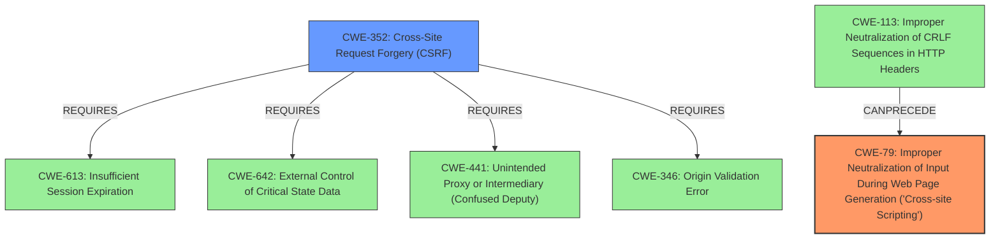

# Enhanced Analysis for CVE-2025-31382

# Summary
| CWE ID | CWE Name | Confidence | CWE Abstraction Level | CWE Vulnerability Mapping Label | CWE-Vulnerability Mapping Notes |
|---|---|---|---|---|---|
| CWE-79 | Improper Neutralization of Input During Web Page Generation ('Cross-site Scripting') | 1.0 | Base | Primary | Allowed |
| CWE-352 | Cross-Site Request Forgery (CSRF) | 0.9 | Compound | Secondary | Allowed |

## Evidence and Confidence

*   **Confidence Score:** 0.95
*   **Evidence Strength:** HIGH

## Relationship Analysis
The primary weakness is **CWE-79** Improper Neutralization of Input During Web Page Generation ('Cross-site Scripting'), which is a Base level CWE. **CWE-79** can be caused by **CWE-113** (Improper Neutralization of CRLF Sequences in HTTP Headers) as a prerequisite. The other weakness is **CWE-352** Cross-Site Request Forgery (CSRF), which is a Compound level CWE. **CWE-352** Requires **CWE-613**, **CWE-642**, **CWE-441**, and **CWE-346**.



## Vulnerability Chain
The vulnerability chain starts with **CWE-352** (Cross-Site Request Forgery) and **CWE-79** (Improper Neutralization of Input During Web Page Generation ('Cross-site Scripting')).

## Summary of Analysis
The vulnerability description clearly states a Cross-Site Request Forgery (CSRF) vulnerability allows for Stored Cross-Site Scripting (**XSS**). This means that the application is vulnerable to both **CWE-352** and **CWE-79**.

The primary weakness is **CWE-79** because the **XSS** is stored, meaning the input is not being properly neutralized before being stored and displayed to other users. The **CWE-352** is a secondary weakness because it is allowing the attacker to inject the malicious code into the application.

The selection of **CWE-79** and **CWE-352** is based on the vulnerability description and the keyphrase analysis. The retriever scores also support this selection. **CWE-79** is at the optimal level of specificity because it is a Base level CWE. **CWE-352** is at the optimal level of specificity because it is a Compound level CWE.

# Relevant CWE Information:

## CWE-79: Improper Neutralization of Input During Web Page Generation ('Cross-site Scripting')
**Technical Explanation:** The product does not neutralize or incorrectly neutralizes user-controllable input before it is placed in output that is used as a web page that is served to other users.
**Security Implications:** An attacker can inject malicious scripts into the web page, which will be executed by other users who visit the page. This can lead to a variety of attacks, including stealing cookies, redirecting users to malicious websites, and defacing the website.
**Relationship:** Base level CWE.
**Mapping Guidance Influence:** The mapping guidance suggests that **CWE-79** is an Allowed mapping.

## CWE-352: Cross-Site Request Forgery (CSRF)
**Technical Explanation:** The web application does not, or can not, sufficiently verify whether a well-formed, valid, consistent request was intentionally provided by the user who submitted the request.
**Security Implications:** An attacker can trick a user into performing an action on the web application without the user's knowledge or consent. This can lead to a variety of attacks, including changing the user's password, making purchases, or transferring funds.
**Relationship:** Compound level CWE.
**Mapping Guidance Influence:** The mapping guidance suggests that **CWE-352** is an Allowed mapping.

Other CWEs Considered but Not Used:

*   **CWE-89 Improper Neutralization of Special Elements used in an SQL Command ('SQL Injection')**: While SQL injection is possible given that a CSRF exists, the vulnerability description specifies Stored **XSS** is possible. There is no evidence to indicate this is occurring.
*   **CWE-918 Server-Side Request Forgery (SSRF)**: There is no evidence to indicate this is occurring.
*   **CWE-601 URL Redirection to Untrusted Site ('Open Redirect')**: There is no evidence to indicate this is occurring.
*   **CWE-434 Unrestricted Upload of File with Dangerous Type**: There is no evidence to indicate this is occurring.
*   **CWE-1004 Sensitive Cookie Without 'HttpOnly' Flag**: There is no evidence to indicate this is occurring.
*   **CWE-116 Improper Encoding or Escaping of Output**: While encoding/escaping is related to **XSS**, the vulnerability description specifies **XSS** is possible. There is no evidence to indicate improper encoding is the rootcause.
*   **CWE-80 Improper Neutralization of Script-Related HTML Tags in a Web Page (Basic XSS)**: **CWE-79** is the more general case of **XSS**. The description does not state that neutralization of HTML tags is a specific problem.
*   **CWE-22 Improper Limitation of a Pathname to a Restricted Directory ('Path Traversal')**: There is no evidence to indicate this is occurring.
*   **CWE-642 External Control of Critical State Data**: There is no evidence to indicate this is occurring.


## CWE Relationship Analysis

Current CWEs represent these abstraction levels: .


### Vulnerability Chain Analysis

**Chain starting from CWE-89:**
- 89 (Improper Neutralization of Special Elements used in an SQL Command ('SQL Injection')) - ROOT


**Chain starting from CWE-116:**
- 116 (Improper Encoding or Escaping of Output) - ROOT


### CWE Relationship Diagram

```mermaid
graph TD
    classDef primary fill:#f96,stroke:#333,stroke-width:2px
    classDef secondary fill:#69f,stroke:#333
    classDef tertiary fill:#9e9,stroke:#333
```