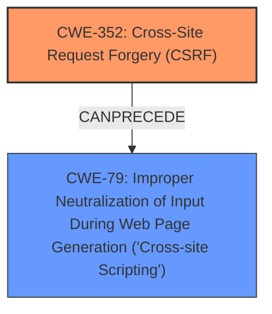

# Raw Analyzer Response for CVE-2025-31383

# Summary
| CWE ID | CWE Name | Confidence | CWE Abstraction Level | CWE Vulnerability Mapping Label | CWE-Vulnerability Mapping Notes |
|---|---|---|---|---|---|
| CWE-352 | Cross-Site Request Forgery (CSRF) | 0.9 | Compound | Allowed | Primary CWE. The vulnerability description explicitly mentions a "CSRF vulnerability". |
| CWE-79 | Improper Neutralization of Input During Web Page Generation ('Cross-site Scripting') | 0.9 | Base | Allowed | Secondary CWE. The vulnerability description indicates that the CSRF vulnerability allows for Stored XSS. |

## Evidence and Confidence

*   **Confidence Score:** 0.9
*   **Evidence Strength:** HIGH

## Relationship Analysis
The analysis considered the following relationships:
  - CWE-79 is a base CWE related to XSS, which is a direct consequence of the **CSRF vulnerability**.
  - CWE-352 is a compound CWE representing Cross-Site Request Forgery, the root cause of the vulnerability.
  - The relationship between CSRF leading to XSS is a common attack pattern.

## Vulnerability Chain
The vulnerability chain is as follows:
  1. The application has a **CSRF vulnerability** (CWE-352).
  2. An attacker exploits this CSRF vulnerability.
  3. The exploitation leads to Stored XSS (CWE-79) because the application **does not neutralize input** properly.

## Summary of Analysis
The initial analysis focused on identifying the root cause and the resulting weakness. The description clearly states a "CSRF vulnerability" which directly leads to Stored XSS. The retriever results also pointed towards both CWE-352 and CWE-79.

The relationship graph shows that CWE-352 can precede CWE-79, reinforcing the idea that the CSRF is the root cause that allows for XSS.

The evidence from the vulnerability description: "Cross-Site Request Forgery (CSRF) vulnerability in FrescoChat Live Chat allows Stored XSS" was used to justify selecting both CWE-352 and CWE-79.

The selected CWEs are at the optimal level of specificity because CWE-352 represents the **CSRF vulnerability** and CWE-79 represents the resulting XSS.

Relevant CWE Information:

# Enhanced Context (25 CWEs)
The following CWEs were identified as potentially relevant to this vulnerability:

## CWE-352: Cross-Site Request Forgery (CSRF)
**Abstraction Level**: Compound
**Similarity Score**: 0.72
**Source**: dense

**Description**:
The web application does not, or can not, sufficiently verify whether a well-formed, valid, consistent request was intentionally provided by the user who submitted the request.

**Mapping Guidance**:
- Usage: Allowed
- Rationale: This is a well-known Composite of multiple weaknesses that must all occur simultaneously, although it is attack-oriented in nature.

## CWE-79: Improper Neutralization of Input During Web Page Generation ('Cross-site Scripting')
**Abstraction Level**: Base
**Similarity Score**: 0.71
**Source**: dense

**Description**:
The product does not neutralize or incorrectly neutralizes user-controllable input before it is placed in output that is used as a web page that is served to other users.

**Mapping Guidance**:
- Usage: Allowed
- Rationale: This CWE entry is at the Base level of abstraction, which is a preferred level of abstraction for mapping to the root causes of vulnerabilities.

### Detailed Analysis of Selected CWEs:

*   **CWE-352: Cross-Site Request Forgery (CSRF)**
    *   **Technical Explanation:** The application is vulnerable to CSRF, meaning an attacker can trick a user into performing actions they did not intend to. This is possible because the application **does not properly verify** the origin of the request.
    *   **Security Implications:** An attacker can force a user to change settings, modify content, or perform other actions that can compromise the security of the application and other users.
    *   **Relationship:** This is the root cause of the vulnerability, which leads to XSS.
    *   **Mapping Guidance:** The usage is "ALLOWED".
*   **CWE-79: Improper Neutralization of Input During Web Page Generation ('Cross-site Scripting')**
    *   **Technical Explanation:** The application **does not properly neutralize** user-supplied input before displaying it on a web page. This allows an attacker to inject malicious scripts into the page, which will be executed by other users who visit the page.
    *   **Security Implications:** An attacker can steal cookies, redirect users to malicious websites, or deface the website.
    *   **Relationship:** This is a consequence of the CSRF vulnerability. An attacker exploits the **CSRF vulnerability** to inject malicious scripts.
    *   **Mapping Guidance:** The usage is "ALLOWED".

### CWEs Considered But Not Used:

*   **CWE-116: Improper Encoding or Escaping of Output:** While encoding/escaping issues can contribute to XSS, the primary issue is the **lack of neutralization** which makes CWE-79 a better fit.
*   **CWE-80: Improper Neutralization of Script-Related HTML Tags in a Web Page (Basic XSS):** This is a more specific variant of CWE-79. While relevant, CWE-79 is a more general description of the vulnerability and is sufficient.
*   **CWE-89: Improper Neutralization of Special Elements used in an SQL Command ('SQL Injection'):** The description mentions XSS, not SQL injection, making this CWE irrelevant.
*   **CWE-434: Unrestricted Upload of File with Dangerous Type:** This CWE is related to file uploads, which are not mentioned in the vulnerability description.
*   **CWE-918: Server-Side Request Forgery (SSRF):** This CWE is related to server-side requests, which are not mentioned in the vulnerability description.
*   **CWE-184: Incomplete List of Disallowed Inputs**: This is not the primary issue, the primary issue is the **lack of neutralization** and **CSRF**.