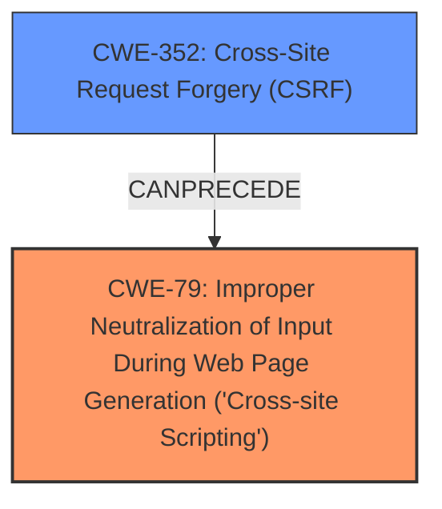

# Enhanced Analysis for CVE-2025-31385

# Summary
| CWE ID | CWE Name | Confidence | CWE Abstraction Level | CWE Vulnerability Mapping Label | CWE-Vulnerability Mapping Notes |
|---|---|---|---|---|---|
| CWE-79 | Improper Neutralization of Input During Web Page Generation ('Cross-site Scripting') | 1.0 | Base | Allowed | Primary CWE: The product does not neutralize or incorrectly neutralizes user-controllable input before it is placed in output that is used as a web page that is served to other users. |
| CWE-352 | Cross-Site Request Forgery (CSRF) | 1.0 | Compound | Allowed | Secondary CWE: The web application does not, or can not, sufficiently verify whether a well-formed, valid, consistent request was intentionally provided by the user who submitted the request. |

## Evidence and Confidence

*   **Confidence Score:** 1.0
*   **Evidence Strength:** HIGH

## Relationship Analysis
The primary weakness is Stored XSS (CWE-79), where user-supplied input is not properly neutralized before being displayed in a web page. This can be exploited via a Cross-Site Request Forgery (CSRF) attack (CWE-352) by tricking an authenticated user into submitting a malicious request. CWE-79 is a base level weakness, while CWE-352 is a compound weakness. The relationship here is that a CSRF attack is used to inject malicious content into the system that leads to the XSS vulnerability.



## Vulnerability Chain
The vulnerability chain starts with the **Cross-Site Request Forgery (CSRF)** vulnerability (CWE-352), which allows an attacker to trick a user into performing unwanted actions. This action leads to the **Improper Neutralization of Input During Web Page Generation ('Cross-site Scripting')** (CWE-79), resulting in stored XSS. Thus, the root cause is the CSRF that facilitates the XSS injection.

## Summary of Analysis
The vulnerability description and CVE Reference Links Content Summary clearly point to a Cross-Site Request Forgery (CSRF) vulnerability that leads to Stored XSS. The **weakness** is the **cross-site scripting, Stored XSS**. The root cause is the CSRF.

The selection of CWE-79 and CWE-352 is based on the following evidence:
*   The vulnerability description mentions "Cross-Site Request Forgery (CSRF) vulnerability" and "Stored XSS."
*   The CVE Reference Links Content Summary confirms the presence of a Cross Site Request Forgery (CSRF) vulnerability.
*   The CVE Reference Links Content Summary confirms the WordPress Site Table of Contents Plugin is vulnerable to Cross Site Request Forgery (CSRF).
*   The Retriever Results lists CWE-79 and CWE-352 as top candidates.

CWE-79 is selected because the product does not neutralize user-controllable input before placing it in a web page, leading to XSS. CWE-352 is selected as the means to inject the malicious code through a CSRF attack. Both CWEs are at the appropriate level of specificity (Base and Compound, respectively).

I considered other CWEs like CWE-80 (Improper Neutralization of Script-Related HTML Tags in a Web Page (Basic XSS)), CWE-89 (Improper Neutralization of Special Elements used in an SQL Command ('SQL Injection')), and CWE-434 (Unrestricted Upload of File with Dangerous Type), but these are not directly related to the described vulnerability. There is no mention of SQL injection or file uploads in the description. CWE-80 is related to XSS but it focuses on script-related HTML tags specifically. CWE-79 is a more general case of XSS.


## CWE Relationship Analysis

Current CWEs represent these abstraction levels: .


### Vulnerability Chain Analysis

**Chain starting from CWE-89:**
- 89 (Improper Neutralization of Special Elements used in an SQL Command ('SQL Injection')) - ROOT


**Chain starting from CWE-80:**
- 80 (Improper Neutralization of Script-Related HTML Tags in a Web Page (Basic XSS)) - ROOT


### CWE Relationship Diagram

```mermaid
graph TD
    classDef primary fill:#f96,stroke:#333,stroke-width:2px
    classDef secondary fill:#69f,stroke:#333
    classDef tertiary fill:#9e9,stroke:#333
```