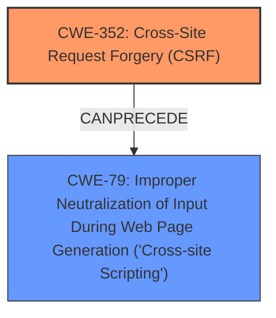

# Raw Analyzer Response for CVE-2025-31435

# Summary
| CWE ID | CWE Name | Confidence | CWE Abstraction Level | CWE Vulnerability Mapping Label | CWE-Vulnerability Mapping Notes |
|---|---|---|---|---|---|
| CWE-352 | Cross-Site Request Forgery (CSRF) | 0.9 | Compound | Primary | Allowed |
| CWE-79 | Improper Neutralization of Input During Web Page Generation ('Cross-site Scripting') | 0.8 | Base | Secondary | Allowed |

## Evidence and Confidence

*   **Confidence Score:** 0.85
*   **Evidence Strength:** MEDIUM

## Relationship Analysis
The primary weakness is CWE-352 [Cross-Site Request Forgery (CSRF)], which allows an attacker to induce users into performing actions they do not intend to. A consequence of the **improper CSRF protection** is the introduction of CWE-79 [Improper Neutralization of Input During Web Page Generation ('Cross-site Scripting')] because the attacker can inject malicious scripts. CWE-352 can lead to other weaknesses, including XSS.

## Vulnerability Chain
The vulnerability chain starts with **improper CSRF protection** (CWE-352). This **rootcause** allows an attacker to perform actions on behalf of an authenticated user, leading to **Stored XSS** (CWE-79). The chain is: CWE-352 -> CWE-79.

## Summary of Analysis
The vulnerability description indicates a Cross-Site Request Forgery (CSRF) vulnerability that allows for Stored XSS in the Efficient Scripts Microblog Poster plugin.

The key evidence is:
*   The description explicitly states "**Cross-Site Request Forgery (CSRF) vulnerability** in Efficient Scripts Microblog Poster allows **Stored XSS**."
*   The "Vulnerability Description Key Phrases" section identifies the **rootcause** as "**improper CSRF protection**" and the **weakness** as "**Stored XSS**".

Based on this evidence, the primary CWE is CWE-352 [Cross-Site Request Forgery (CSRF)], as it is the **rootcause** of the vulnerability. The secondary CWE is CWE-79 [Improper Neutralization of Input During Web Page Generation ('Cross-site Scripting')], which is a consequence of the **improper CSRF protection**. The **improper CSRF protection** leads to the ability to inject malicious scripts, resulting in Stored XSS.

The Retriever Results list CWE-79 as the top combined result, but this is the impact of the vulnerability. CWE-352 is also listed, but with a lower score. Given the explicit mention of CSRF as the initial weakness and **rootcause**, it is prioritized as the primary CWE.

The selected CWEs are at the optimal level of specificity. CWE-352 is a Compound weakness, but it accurately reflects the nature of the CSRF vulnerability. CWE-79 is a Base weakness, which is appropriate for the Stored XSS.

Other CWEs Considered but Not Used:
*   CWE-80 [Improper Neutralization of Script-Related HTML Tags in a Web Page (Basic XSS)]: While related to XSS, CWE-79 is a more general and appropriate classification in this case, as it focuses on the **improper neutralization** of input.
*   CWE-89 [Improper Neutralization of Special Elements used in an SQL Command ('SQL Injection')]: This is not relevant as the vulnerability is related to XSS and not SQL injection.
*   CWE-434 [Unrestricted Upload of File with Dangerous Type]: This is not relevant as the vulnerability does not involve file uploads.
*   CWE-601 [URL Redirection to Untrusted Site ('Open Redirect')]: This is not relevant as the vulnerability is not related to URL redirection.
*   CWE-918 [Server-Side Request Forgery (SSRF)]: This is not relevant as the vulnerability is not related to SSRF.
*   CWE-425 [Direct Request ('Forced Browsing')]: This is not the primary weakness, which is related to CSRF.