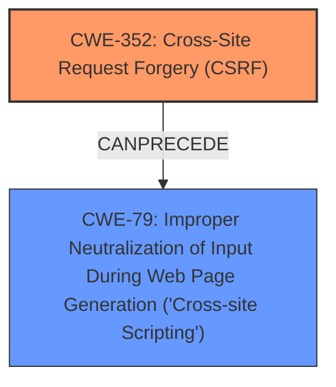

# Analysis Report for CVE-2025-31444

# Vulnerability Analysis Report: CVE-2025-31444

## Description

**Cross-Site Request Forgery** (CSRF) vulnerability in youtag ShowTime Slideshow allows **Stored XSS**. This issue affects ShowTime Slideshow from n/a through 1.6.

## Vulnerability Description Key Phrases

- **Rootcause:** Cross-Site Request Forgery
- **Weakness:** Stored XSS
- **Product:** ShowTime Slideshow
- **Version:** n/a through 1.6

## Analysis (with Relationship Data)

# Summary
| CWE ID | CWE Name | Confidence | CWE Abstraction Level | CWE Vulnerability Mapping Label | CWE-Vulnerability Mapping Notes |
|---|---|---|---|---|---|
| CWE-352 | Cross-Site Request Forgery (CSRF) | 0.9 | Compound | Primary | Allowed |
| CWE-79 | Improper Neutralization of Input During Web Page Generation ('Cross-site Scripting') | 0.7 | Base | Secondary | Allowed |

## Evidence and Confidence

*   **Confidence Score:** 0.8
*   **Evidence Strength:** HIGH

## Relationship Analysis
The primary weakness is identified as CWE-352 (Cross-Site Request Forgery). CWE-352 can precede CWE-79 (Cross-Site Scripting) in a vulnerability chain, where a successful CSRF attack leads to stored XSS by allowing an attacker to inject malicious scripts into the application. Both CWEs are at different abstraction levels: CWE-352 is Compound while CWE-79 is Base.



## Vulnerability Chain
The vulnerability chain starts with **Cross-Site Request Forgery** (CWE-352), which allows an attacker to perform actions on behalf of a user without their consent. This leads to **Stored XSS** (CWE-79) because the attacker can inject malicious scripts that are then stored and executed by other users.

## Summary of Analysis
The analysis identifies two CWEs: CWE-352 (Cross-Site Request Forgery) and CWE-79 (Improper Neutralization of Input During Web Page Generation ('Cross-site Scripting')).

The primary CWE is CWE-352, based on the description of the vulnerability being a "Cross-Site Request Forgery (CSRF) vulnerability". The vulnerability description key phrases also identifies "Cross-Site Request Forgery" as the rootcause. The "CVE Reference Links Content Summary" section states, "The vulnerability is a Cross-Site Request Forgery (CSRF)." This indicates that the plugin **does not properly verify** if a request was intentionally made by the user.

CWE-79 is a secondary CWE because the CSRF vulnerability leads to Stored XSS. The vulnerability description states the CSRF vulnerability "allows Stored XSS". This occurs because the lack of CSRF protection enables an attacker to inject malicious scripts into the application.

CWE-352 and CWE-79 have a CANPRECEDE relationship, which aligns with the description of the vulnerability.

Other CWEs like CWE-89 (SQL Injection) and CWE-918 (Server-Side Request Forgery) were considered but not selected because they do not accurately represent the specific vulnerability described.


## CWE Relationship Analysis

Current CWEs represent these abstraction levels: .


### Vulnerability Chain Analysis

**Chain starting from CWE-352:**
- 352 (Cross-Site Request Forgery (CSRF)) - ROOT


**Chain starting from CWE-79:**
- 79 (Improper Neutralization of Input During Web Page Generation ('Cross-site Scripting')) - ROOT


### CWE Relationship Diagram

```mermaid
graph TD
    classDef primary fill:#f96,stroke:#333,stroke-width:2px
    classDef secondary fill:#69f,stroke:#333
    classDef tertiary fill:#9e9,stroke:#333
```


*Report generated on 2025-07-14 18:44:19*
