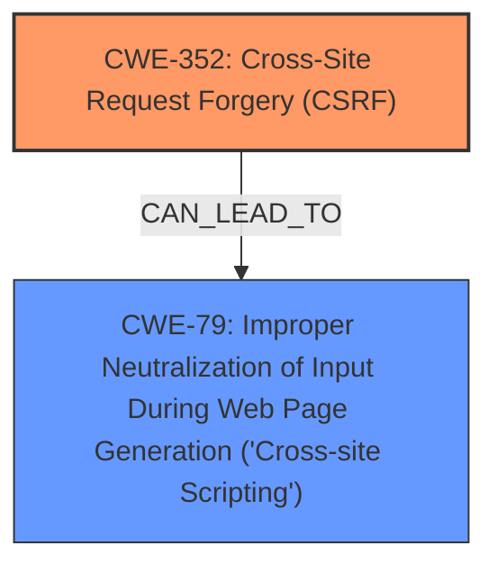

# Enhanced Analysis for CVE-2025-31458

# Summary
| CWE ID | CWE Name | Confidence | CWE Abstraction Level | CWE Vulnerability Mapping Label | CWE-Vulnerability Mapping Notes |
|---|---|---|---|---|---|
| CWE-352 | Cross-Site Request Forgery (CSRF) | 0.9 | Compound | Allowed | Primary CWE. Addresses the **lack of CSRF protection**. |
| CWE-79 | Improper Neutralization of Input During Web Page Generation ('Cross-site Scripting') | 0.9 | Base | Allowed | Secondary CWE. Represents the Stored **XSS** vulnerability. |

## Evidence and Confidence

*   **Confidence Score:** 0.9
*   **Evidence Strength:** HIGH

## Relationship Analysis
The primary weakness is the **lack of CSRF protection** (CWE-352). The successful exploitation of CSRF leads to Stored **XSS** (CWE-79). There isn't a direct parent-child relationship between CWE-352 and CWE-79, but a successful CSRF attack can lead to XSS if the application doesn't properly validate requests. CWE-352 is a Compound weakness, representing multiple underlying issues, while CWE-79 is a Base weakness, detailing the specific XSS issue.



## Vulnerability Chain
The vulnerability chain starts with the **lack of CSRF protection** (CWE-352). A malicious actor leverages this **lack of CSRF protection** to trick a privileged user into unknowingly submitting a request that injects malicious script. The injected script is then stored on the server and executed when other users view the content, leading to Stored **XSS** (CWE-79).
  - Root Cause: CWE-352 (Cross-Site Request Forgery)
  - Weakness: CWE-79 (Improper Neutralization of Input During Web Page Generation ('Cross-site Scripting'))
  - Impact: Stored XSS, allowing attackers to execute arbitrary JavaScript in the victim's browser.

## Summary of Analysis
The analysis is based on the provided vulnerability description and the CVE reference links. The key phrases indicate a **lack of CSRF protection**, leading to Stored **XSS**. The CVE reference confirms the **root cause** as Cross-Site Request Forgery (CSRF), which allows a malicious actor to force higher privileged users to execute unwanted actions. The resulting action leads to Stored **XSS**.

The relationship graph illustrates the flow of the vulnerability, with CSRF potentially leading to XSS. The retriever results also support these findings, with CWE-79 and CWE-352 as top candidates.

CWE-352 is selected as the primary CWE because the **root cause** is the **lack of CSRF protection**. CWE-79 is selected as a secondary CWE to represent the Stored **XSS** vulnerability. Both CWEs are at appropriate levels of specificity (Compound and Base, respectively).

Several other CWEs were considered, including:
*   CWE-434 (Unrestricted Upload of File with Dangerous Type): Not relevant, as the vulnerability is not related to file uploads.
*   CWE-116 (Improper Encoding or Escaping of Output): Could be related to XSS, but CWE-79 is more specific to the **weakness** being exploited.
*   CWE-89 (Improper Neutralization of Special Elements used in an SQL Command ('SQL Injection')) and CWE-918 (Server-Side Request Forgery (SSRF)): Not relevant, as the vulnerability is not related to SQL injection or server-side request forgery.
*   CWE-73 (External Control of File Name or Path): Not relevant, as the vulnerability is not related to file path manipulation.


## CWE Relationship Analysis

Current CWEs represent these abstraction levels: .


### Vulnerability Chain Analysis

**Chain starting from CWE-89:**
- 89 (Improper Neutralization of Special Elements used in an SQL Command ('SQL Injection')) - ROOT


**Chain starting from CWE-116:**
- 116 (Improper Encoding or Escaping of Output) - ROOT


### CWE Relationship Diagram

```mermaid
graph TD
    classDef primary fill:#f96,stroke:#333,stroke-width:2px
    classDef secondary fill:#69f,stroke:#333
    classDef tertiary fill:#9e9,stroke:#333
```