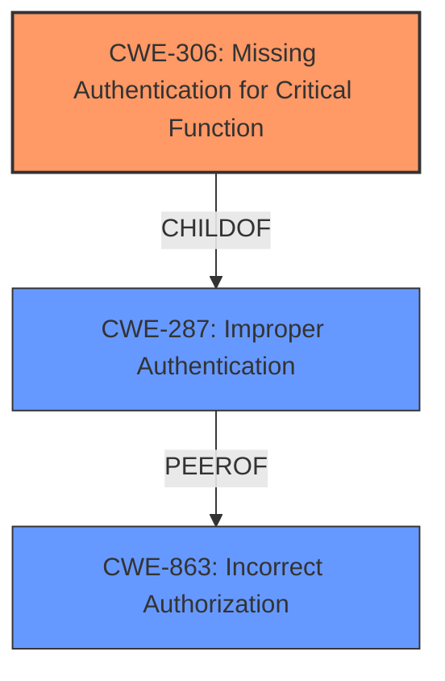

# Analysis Report for CVE-2025-31478

# Vulnerability Analysis Report: CVE-2025-31478

## Description

Zulip is an open-source team collaboration tool. Zulip supports a configuration where account creation is limited solely by being able to authenticate with a single-sign on authentication backend, meaning the organization places no restrictions on email address domains or invitations being required to join, but has disabled the EmailAuthBackend that is used for email/password authentication. A **bug in the Zulip server** means that it is possible to create an account in such organizations, without having an account with the configured SSO authentication backend. This issue is patched in version 10.2. A workaround includes requiring invitations to join the organization prevents the vulnerability from being accessed.

## Vulnerability Description Key Phrases

- **Rootcause:** bug in the Zulip server
- **Impact:** create an account without account with the configured SSO authentication backend
- **Product:** Zulip
- **Version:** before 10.2

## Analysis (with Relationship Data)

# Summary
| CWE ID | CWE Name | Confidence | CWE Abstraction Level | CWE Vulnerability Mapping Label | CWE-Vulnerability Mapping Notes |
|---|---|---|---|---|---|
| CWE-306 | Missing Authentication for Critical Function | 0.9 | Base | Allowed | Primary CWE. The application **failed to authenticate** the user trying to create an account and allowed the user to create the account without Single Sign-On, which is the **missing authentication** for this critical function. |
| CWE-287 | Improper Authentication | 0.7 | Class | Discouraged | Secondary Candidate. While authentication is missing, an improper implementation could be an underlying cause. |
| CWE-863 | Incorrect Authorization | 0.6 | Class | Allowed-with-Review | Secondary Candidate.  Authorization is not the primary issue, but could be a contributing factor. |

## Evidence and Confidence

*   **Confidence Score:** 0.8
*   **Evidence Strength:** HIGH

## Relationship Analysis
The primary relationship influencing the CWE selection is the parent-child relationship between CWE-287 Improper Authentication and CWE-306 Missing Authentication for Critical Function. Since the vulnerability involves a complete lack of authentication for account creation, CWE-306 is the more specific and appropriate choice. CWE-863 Incorrect Authorization was considered but deemed less relevant as the primary issue isn't an incorrect authorization check, but rather the absence of authentication.



## Vulnerability Chain
The vulnerability chain begins with a **bug in the Zulip server** that results in **missing authentication** for account creation. This allows an attacker to create an account without proper credentials, leading to unauthorized access and potential compromise of the system.

**Chain:** **Bug In Zulip Server** -> **CWE-306: Missing Authentication for Critical Function** -> Unauthorized Account Creation -> Potential System Compromise

## Summary of Analysis
The analysis is based on the provided vulnerability description and the CVE reference content. The **root cause** of the vulnerability is a **bug in the Zulip server** that leads to **missing authentication** for account creation when using SSO. The evidence for this is clear: "A **bug in the Zulip server** means that it is possible to create an account...without having an account with the configured SSO authentication backend." The primary CWE is CWE-306 Missing Authentication for Critical Function because it accurately describes the absence of authentication checks for a critical function (account creation).

Other CWEs were considered, but ultimately deemed less appropriate. CWE-287 Improper Authentication was considered because it relates to authentication issues, but the vulnerability is more specifically about completely missing authentication. CWE-863 Incorrect Authorization was also considered, but it focuses on flawed authorization checks, which is not the primary issue here.

The selected CWE, CWE-306, is at the optimal level of specificity (Base) because it precisely captures the **root cause** of the vulnerability: the **lack of authentication** for account creation.

Relevant CWE Information:

# Enhanced Context (25 CWEs)
The following CWEs were identified as potentially relevant to this vulnerability:

## CWE-267: Privilege Defined With Unsafe Actions
**Abstraction Level**: Base
**Similarity Score**: 0.76
**Source**: dense

**Description**:
A particular privilege, role, capability, or right can be used to perform unsafe actions that were not intended, even when it is assigned to the correct entity.

**Mapping Guidance**:
- Usage: Allowed
- Rationale: This CWE entry is at the Base level of abstraction, which is a preferred level of abstraction for mapping to the root causes of vulnerabilities.

## CWE-303: Incorrect Implementation of Authentication Algorithm
**Abstraction Level**: Base
**Similarity Score**: 0.75
**Source**: dense

**Description**:
The requirements for the product dictate the use of an established authentication algorithm, but the implementation of the algorithm is incorrect.

**Mapping Guidance**:
- Usage: Allowed
- Rationale: This CWE entry is at the Base level of abstraction, which is a preferred level of abstraction for mapping to the root causes of vulnerabilities.

## CWE-1390: Weak Authentication
**Abstraction Level**: Class
**Similarity Score**: 0.75
**Source**: dense

**Description**:
The product uses an authentication mechanism to restrict access to specific users or identities, but the mechanism does not sufficiently prove that the claimed identity is correct.

**Mapping Guidance**:
- Usage: Allowed-with-Review
- Rationale: This CWE entry is a Class and might have Base-level children that would be more appropriate

## CWE-212: Improper Removal of Sensitive Information Before Storage or Transfer
**Abstraction Level**: Base
**Similarity Score**: 0.75
**Source**: dense

**Description**:
The product stores, transfers, or shares a resource that contains sensitive information, but it does not properly remove that information before the product makes the resource available to unauthorized actors.

**Mapping Guidance**:
- Usage: Allowed
- Rationale: This CWE entry is at the Base level of abstraction, which is a preferred level of abstraction for mapping to the root causes of vulnerabilities.

## CWE-1391: Use of Weak Credentials
**Abstraction Level**: Class
**Similarity Score**: 0.75
**Source**: dense

**Description**:
The product uses weak credentials (such as a default key or hard-coded password) that can be calculated, derived, reused, or guessed by an attacker.

**Mapping Guidance**:
- Usage: Allowed-with-Review
- Rationale: This CWE entry is a Class and might have Base-level children that would be more appropriate

## CWE-639: Authorization Bypass Through User-Controlled Key
**Abstraction Level**: Base
**Similarity Score**: 0.74
**Source**: dense

**Description**:
The system's authorization functionality does not prevent one user from gaining access to another user's data or record by modifying the key value identifying the data.

**Mapping Guidance**:
- Usage: Allowed
- Rationale: This CWE entry is at the Base level of abstraction, which is a preferred level of abstraction for mapping to the root causes of vulnerabilities.

## CWE-807: Reliance on Untrusted Inputs in a Security Decision
**Abstraction Level**: Base
**Similarity Score**: 0.74
**Source**: dense

**Description**:
The product uses a protection mechanism that relies on the existence or values of an input, but the input can be modified by an untrusted actor in a way that bypasses the protection mechanism.

**Mapping Guidance**:
- Usage: Allowed
- Rationale: This CWE entry is at the Base level of abstraction, which is a preferred level of abstraction for mapping to the root causes of vulnerabilities.

## CWE-703: Improper Check or Handling of Exceptional Conditions
**Abstraction Level**: Pillar
**Similarity Score**: 0.74
**Source**: dense

**Description**:
The product does not properly anticipate or handle exceptional conditions that rarely occur during normal operation of the product.

**Mapping Guidance**:
- Usage: Discouraged
- Rationale: This CWE entry is extremely high-level, a Pillar.

## CWE-330: Use of Insufficiently Random Values
**Abstraction Level**: Class
**Similarity Score**: 0.74
**Source**: dense

**Description**:
The product uses insufficiently random numbers or values in a security context that depends on unpredictable numbers.

**Mapping Guidance**:
- Usage: Discouraged
- Rationale: This CWE entry is a level-1 Class (i.e., a child of a Pillar). It might have lower-level children that would be more appropriate

## CWE-345: Insufficient Verification of Data Authenticity
**Abstraction Level**: Class
**Similarity Score**: 0.74
**Source**: dense

**Description**:
The product does not sufficiently verify the origin or authenticity of data, in a way that causes it to accept invalid data.

**Mapping Guidance**:
- Usage: Discouraged
- Rationale: This CWE entry is a level-1 Class (i.e., a child of a Pillar). It might have lower-level children that would be more appropriate

## CWE-863: Incorrect Authorization
**Abstraction Level**: Class
**Similarity Score**: 1727.42
**Source**: sparse

**Description**:
The product performs an authorization check when an actor attempts to access a resource or perform an action, but it does not correctly perform the check.

**Mapping Guidance**:
- Usage: Allowed-with-Review
- Rationale: This CWE entry is a Class and might have Base-level children that would be more appropriate

## CWE-


## CWE Relationship Analysis

Current CWEs represent these abstraction levels: .


### Vulnerability Chain Analysis

**Chain starting from CWE-1390:**
- 1390 (Weak Authentication) - ROOT


**Chain starting from CWE-863:**
- 863 (Incorrect Authorization) - ROOT


### CWE Relationship Diagram

```mermaid
graph TD
    classDef primary fill:#f96,stroke:#333,stroke-width:2px
    classDef secondary fill:#69f,stroke:#333
    classDef tertiary fill:#9e9,stroke:#333
```


*Report generated on 2025-07-14 18:48:21*
