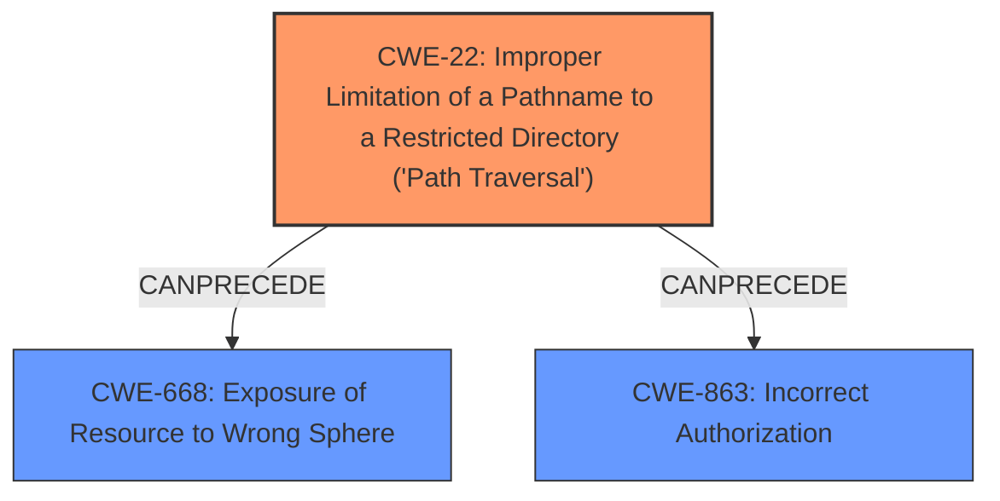

# Raw Analyzer Response for CVE-2025-31486

# Summary
| CWE ID | CWE Name | Confidence | CWE Abstraction Level | CWE Vulnerability Mapping Label | CWE-Vulnerability Mapping Notes |
|---|---|---|---|---|---|
| CWE-22 | Improper Limitation of a Pathname to a Restricted Directory ('Path Traversal') | 1.0 | Base | Allowed | Primary CWE: The vulnerability description and CVE reference link content summary clearly indicate path traversal as the root cause. |
| CWE-668 | Exposure of Resource to Wrong Sphere | 0.7 | Class | Discouraged | Secondary Candidate: The vulnerability results in the exposure of resources (arbitrary files) to the wrong sphere, but CWE-22 is a more specific root cause. |
| CWE-863 | Incorrect Authorization | 0.6 | Class | Allowed-with-Review | Secondary Candidate: The fs.deny restriction bypass suggests an authorization issue, but path traversal is the direct cause of the bypass.|

## Evidence and Confidence

*   **Confidence Score:** 0.9
*   **Evidence Strength:** HIGH

## Relationship Analysis
The primary weakness identified is CWE-22, which represents the **improper limitation of a pathname to a restricted directory**, leading to path traversal. This is a base-level CWE.

CWE-668 (Exposure of Resource to Wrong Sphere) is a class-level CWE that could be considered as a consequence of the path traversal, but is not as specific. CWE-22 can lead to CWE-668 since by traversing the path restrictions, resources can be exposed to unintended actors.

CWE-863 (Incorrect Authorization) is also a Class-level CWE that is a possible candidate because the **fs.deny restriction was able to bypass**, which implies an authorization problem. However, the root cause is the path traversal vulnerability.

## Vulnerability Chain
The vulnerability chain starts with the **improper limitation of a pathname (CWE-22)**. This leads to the ability to access arbitrary files, effectively **exposing resources to the wrong sphere (CWE-668)** and potentially bypassing authorization checks **(CWE-863)**.

## Summary of Analysis
The initial analysis identified CWE-22 as the primary root cause due to the path traversal vulnerability. The CVE reference content confirms this, stating that "the check for relative paths was performed before the ID normalization, enabling bypasses using paths like `../../`." This aligns with the description of CWE-22, which involves **improper neutralization of special elements within the pathname**. The **fs.deny restriction was able to bypass**, which indicates an authorization problem.

CWE-668 and CWE-863 are secondary candidates because they represent the impact of the path traversal, where arbitrary files are exposed and authorization checks are bypassed. However, the root cause remains the path traversal vulnerability.

The selection of CWE-22 is based on direct evidence from the vulnerability description and CVE reference content, as well as its base-level abstraction, which provides a more specific representation of the weakness.

Relevant CWE Information:
* CWE-22: Improper Limitation of a Pathname to a Restricted Directory ('Path Traversal')
    * Abstraction Level: Base
    * Description: The product uses external input to construct a pathname that is intended to identify a file or directory that is located underneath a restricted parent directory, but the product does not properly neutralize special elements within the pathname that can cause the pathname to resolve to a location that is outside of the restricted directory.
* CWE-668: Exposure of Resource to Wrong Sphere
    * Abstraction Level: Class
    * Description: The product exposes a resource to the wrong control sphere, providing unintended actors with inappropriate access to the resource.
* CWE-863: Incorrect Authorization
    * Abstraction Level: Class
    * Description: The product performs an authorization check when an actor attempts to access a resource or perform an action, but it does not correctly perform the check.