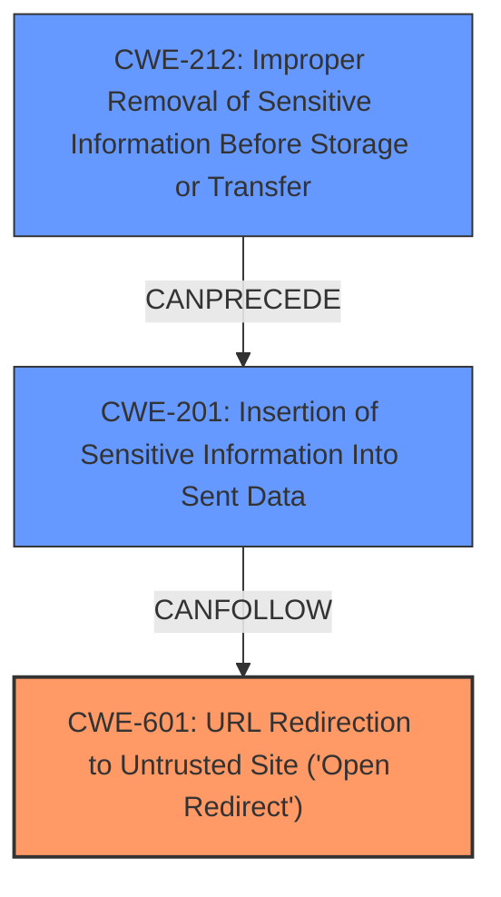

# Analysis Report for CVE-2025-31491

# Vulnerability Analysis Report: CVE-2025-31491

## Description

AutoGPT is a platform that allows users to create, deploy, and manage continuous artificial intelligence agents that automate complex workflows. Prior to 0.6.1, AutoGPT allows of leakage of cross-domain cookies and protected headers in requests redirect. AutoGPT uses a wrapper around the requests python library, located in autogpt_platform/backend/backend/util/request.py. In this wrapper, redirects are specifically NOT followed for the first request. If the wrapper is used with allow_redirects set to True (which is the default), any redirect is not followed by the initial request, but rather re-requested by the wrapper using the new location. However, there is a fundamental flaw in manually re-requesting the new location it does not account for security-sensitive headers which should not be sent cross-origin, such as the Authorization and Proxy-Authorization header, and cookies. For example in autogpt_platform/backend/backend/blocks/github/_api.py, an Authorization header is set when retrieving data from the GitHub API. However, if GitHub suffers from an open redirect vulnerability (such as the made-up example of https//api.github.com/repos/{owner}/{repo}/issues/comments/{comment_id}/../../../../../redirect/?url=https//joshua.hu/), and the script can be coerced into visiting it with the Authorization header, the GitHub credentials in the Authorization header will be leaked. This allows leaking auth headers and private cookies. This vulnerability is fixed in 0.6.1.

## Vulnerability Description Key Phrases

- **Weakness:** improper header handling, open redirect
- **Product:** AutoGPT
- **Impact:** cross-domain cookie leakage, leak protected headers in requests redirect
- **Version:** Prior to 0.6.1

## Analysis (with Relationship Data)

# Summary
| CWE ID    | CWE Name                                                                          | Confidence | CWE Abstraction Level | CWE Vulnerability Mapping Label | CWE-Vulnerability Mapping Notes |
| :-------- | :-------------------------------------------------------------------------------- | :--------- | :-------------------- | :------------------------------ | :------------------------------ |
| CWE-601   | URL Redirection to Untrusted Site ('Open Redirect')                               | 0.9        | Base                  | Primary                         | Allowed                       |
| CWE-201   | Insertion of Sensitive Information Into Sent Data                                 | 0.8        | Base                  | Secondary                       | Allowed                       |
| CWE-212   | Improper Removal of Sensitive Information Before Storage or Transfer             | 0.6        | Base                  | Secondary                       | Allowed                       |

## Evidence and Confidence

*   **Confidence Score:** 0.8
*   **Evidence Strength:** HIGH

## Relationship Analysis
The primary weakness is CWE-601 URL Redirection to Untrusted Site ('Open Redirect'), as the vulnerability hinges on the application's susceptibility to redirects to untrusted sites. This leads to the exposure of sensitive information, which is related to CWE-201 Insertion of Sensitive Information Into Sent Data and CWE-212 Improper Removal of Sensitive Information Before Storage or Transfer. CWE-201 is a consequence of the open redirect, while CWE-212 describes the more general class of weakness where sensitive data is not properly handled before being exposed. The hierarchical relationships and potential chains of weaknesses guided the selection of these CWEs, prioritizing the root cause (CWE-601) and its immediate consequence (CWE-201), and the broader issue (CWE-212).



## Vulnerability Chain
The vulnerability chain starts with the **improper handling of redirects (CWE-601)**. This allows an attacker to redirect a request to an untrusted site, leading to the **insertion of sensitive information into the sent data (CWE-201)**, as the application **does not properly remove sensitive information before transfer (CWE-212)**. The root cause is the **open redirect (CWE-601)**, and the impact is the **exposure of sensitive data (CWE-201, CWE-212)**.

## Summary of Analysis
The initial analysis focused on identifying the root cause of the vulnerability and its immediate consequences. The description clearly indicates that the vulnerability arises from the application's failure to properly handle redirects, which allows an attacker to redirect requests to untrusted sites. This leads to the exposure of sensitive information.

The selection of CWE-601 as the primary CWE is based on the evidence that the vulnerability hinges on the application's susceptibility to redirects to untrusted sites. The "CVE Reference Links Content Summary" section explicitly states that an attacker can exploit an open redirect vulnerability to cause sensitive headers or cookies to be sent to a malicious domain.

The selection of CWE-201 and CWE-212 as secondary CWEs is based on the fact that the open redirect leads to the exposure of sensitive information. The "CVE Reference Links Content Summary" section mentions the leakage of authorization headers and private cookies.

The selected CWEs are at the optimal level of specificity because they accurately represent the root cause and immediate consequences of the vulnerability. CWE-601 is a Base-level CWE that specifically addresses the issue of open redirects. CWE-201 and CWE-212 are also Base-level CWEs that accurately describe the exposure of sensitive information.

Other CWEs Considered but Not Used:

*   CWE-79 (Improper Neutralization of Input During Web Page Generation ('Cross-site Scripting')): While XSS could potentially be related, the core issue isn't about script injection, but rather about the redirect leading to information leakage.
*   CWE-113 (Improper Neutralization of CRLF Sequences in HTTP Headers ('HTTP Request/Response Splitting')): Similarly, while headers are involved, the issue isn't about CRLF injection, but rather about the leakage of header content due to redirects.
*   CWE-863 (Incorrect Authorization): The issue isn't directly related to incorrect authorization checks, but more about the leakage of sensitive data due to the redirect.
*   CWE-639 (Authorization Bypass Through User-Controlled Key): This is not relevant since the vulnerability does not involve modifying key values to gain unauthorized access.
*   CWE-285 (Improper Authorization), CWE-862 (Missing Authorization), CWE-306 (Missing Authentication for Critical Function): These authorization/authentication related CWEs are not applicable because the core issue stems from the **improper handling of redirects**, not from flaws in authentication or authorization mechanisms. The vulnerability allows for the leakage of sensitive information due to the application being redirected to a malicious URL.

Relevant CWE Information:
- **Vulnerability Description Key Phrases**:
  - **weakness:** **improper header handling, open redirect**
  - **product:** AutoGPT
  - **impact:** cross-domain cookie leakage, leak protected headers in requests redirect
  - **version:** Prior to 0.6.1
- **CVE Reference Links Content Summary**:
  - **Root cause of vulnerability:** The `AutoGPT` application uses a custom wrapper around the `requests` Python library. This wrapper manually handles redirects. When a redirect occurs to a different origin, the wrapper re-requests the new location but fails to account for security-sensitive headers like `Authorization` and `Proxy-Authorization`, and cookies.
  - **Weaknesses/vulnerabilities present:**
    - Leakage of cross-domain cookies.
    - Leakage of protected headers (e.g., `Authorization`, `Proxy-Authorization`).
    - CWE-200: Information Exposure.
  - **Impact of exploitation:**
    - Leakage of authorization headers (e.g., GitHub credentials).
    - Leakage of private cookies, potentially leading to account compromise or unauthorized access.


## CWE Relationship Analysis

Current CWEs represent these abstraction levels: .


### Vulnerability Chain Analysis

**Chain starting from CWE-863:**
- 863 (Incorrect Authorization) - ROOT


**Chain starting from CWE-862:**
- 862 (Missing Authorization) - ROOT


### CWE Relationship Diagram

```mermaid
graph TD
    classDef primary fill:#f96,stroke:#333,stroke-width:2px
    classDef secondary fill:#69f,stroke:#333
    classDef tertiary fill:#9e9,stroke:#333
```


*Report generated on 2025-07-14 18:51:00*
