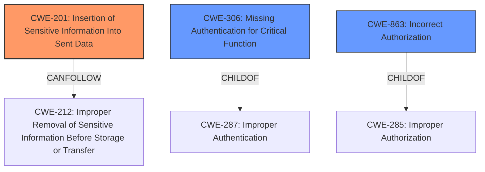

# Analysis Report for CVE-2025-31492

# Vulnerability Analysis Report: CVE-2025-31492

## Description

mod_auth_openidc is an OpenID Certified authentication and authorization module for the Apache 2.x HTTP server that implements the OpenID Connect Relying Party functionality. Prior to 2.4.16.11, a bug in a mod_auth_openidc results in disclosure of protected content to unauthenticated users. The conditions for disclosure are an OIDCProviderAuthRequestMethod POST, a valid account, and there mustnt be any application-level gateway (or load balancer etc) protecting the server. When you request a protected resource, the response includes the HTTP status, the HTTP headers, the intended response (the self-submitting form), and the protected resource (with no headers). This is an example of a request for a protected resource, including all the data returned. In the case where mod_auth_openidc returns a form, it has to return OK from check_userid so as not to go down the error path in httpd. This means httpd will try to issue the protected resource. oidc_content_handler is called early, which has the opportunity to prevent the normal output being issued by httpd. oidc_content_handler has a number of checks for when it intervenes, but it doesnt check for this case, so the handler returns DECLINED. Consequently, httpd appends the protected content to the response. The issue has been patched in mod_auth_openidc versions >= 2.4.16.11.

## Vulnerability Description Key Phrases

- **Impact:** disclosure of protected content
- **Vector:** OIDCProviderAuthRequestMethod POST
- **Attacker:** unauthenticated users
- **Product:** mod_auth_openidc
- **Version:** Prior to 2.4.16.11

## Analysis (with Relationship Data)

# Summary
| CWE ID | CWE Name | Confidence | CWE Abstraction Level | CWE Vulnerability Mapping Label | CWE-Vulnerability Mapping Notes |
|---|---|---|---|---|---|
| CWE-201 | Insertion of Sensitive Information Into Sent Data | 0.9 | Base | Primary | Allowed |
| CWE-306 | Missing Authentication for Critical Function | 0.6 | Base | Secondary Candidate | Allowed |
| CWE-863 | Incorrect Authorization | 0.5 | Class | Secondary Candidate | Allowed-with-Review |

## Evidence and Confidence

*   **Confidence Score:** 0.8
*   **Evidence Strength:** HIGH

## Relationship Analysis
The primary CWE identified is CWE-201, which focuses on the insertion of sensitive information into sent data. CWE-306 (Missing Authentication) and CWE-863 (Incorrect Authorization) were considered as potential related issues, but the core of the vulnerability is the exposure of the protected resource itself due to a mishandling of the response in the absence of external gateway protection. CWE-201 is a base-level CWE and fits the **root cause** described in the vulnerability details. The relationships considered were primarily parent-child and peer relationships to ensure the selected CWE was at the correct abstraction level and accurately captured the vulnerability.



## Vulnerability Chain
The vulnerability chain starts with a request for a protected resource. The mod_auth_openidc module processes the request, and due to a **missing** check in the `oidc_content_handler`, it returns `DECLINED`. This leads to httpd appending the protected content to the response. The chain is:
1.  Request for protected resource.
2.  **Missing** check in `oidc_content_handler`.
3.  `oidc_content_handler` returns `DECLINED`.
4.  httpd appends protected content to the response (**Insertion of Sensitive Information Into Sent Data**).

The **root cause** is the **missing** check which leads to the unintentional inclusion of sensitive information in the HTTP response.

## Summary of Analysis
The initial analysis focused on identifying the **root cause** of the vulnerability. While authentication and authorization issues were considered, the core issue is the unintended disclosure of protected content due to a **missing** check within the `oidc_content_handler`. This leads to sensitive information being included in the response.

The evidence from the "CVE Reference Links Content Summary" section is critical: "A bug in `mod_auth_openidc` causes disclosure of protected content to unauthenticated users when specific conditions are met. Specifically, the `oidc_content_handler` doesn't properly check for a specific case, leading to the appending of protected content to the HTTP response."

The graph relationships highlight that CWE-201 can lead to CWE-212 (Improper Removal of Sensitive Information Before Storage or Transfer), suggesting a potential follow-up weakness. The analysis has led to the conclusion that CWE-201 is the most appropriate CWE, with a confidence level of 0.9.

Relevant CWE Information:

*   **CWE-201 (Insertion of Sensitive Information Into Sent Data):** This CWE accurately captures the vulnerability because the protected content (sensitive information) is being inserted into the HTTP response due to a coding error. The security implication is the exposure of sensitive resources to unauthorized users.

*   **CWE-306 (Missing Authentication for Critical Function):** While unauthenticated users can access the content, the primary issue isn't a complete lack of authentication but rather a failure in the module's content handling that bypasses the intended protection mechanisms when certain conditions are met. Therefore, it's a secondary consideration.

*   **CWE-863 (Incorrect Authorization):** Similar to CWE-306, this isn't the primary issue. The authorization might be in place, but the content handler **incorrectly** allows the protected content to be sent in certain scenarios.

CWE-201 is at the optimal level of specificity because it directly addresses the insertion of sensitive data into the response, which is the core weakness. The alternatives, CWE-306 and CWE-863, are related but do not fully capture the essence of the vulnerability.


## CWE Relationship Analysis

Current CWEs represent these abstraction levels: .


### Vulnerability Chain Analysis

**Chain starting from CWE-863:**
- 863 (Incorrect Authorization) - ROOT


**Chain starting from CWE-306:**
- 306 (Missing Authentication for Critical Function) - ROOT


### CWE Relationship Diagram

```mermaid
graph TD
    classDef primary fill:#f96,stroke:#333,stroke-width:2px
    classDef secondary fill:#69f,stroke:#333
    classDef tertiary fill:#9e9,stroke:#333
```


*Report generated on 2025-07-14 18:51:21*
