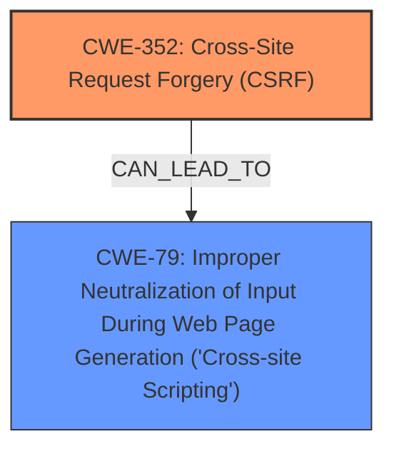

# Analysis Report for CVE-2025-31566

# Vulnerability Analysis Report: CVE-2025-31566

## Description

Cross-Site Request Forgery (CSRF) vulnerability in riosisgroup Rio Video Gallery allows Stored XSS. This issue affects Rio Video Gallery from n/a through 2.3.6.

## Vulnerability Description Key Phrases

- **Rootcause:** cross-site request forgery
- **Weakness:** cross-site scripting, XSS
- **Product:** riosisgroup Rio Video Gallery
- **Impact:** stored XSS
- **Version:** n/a through 2.3.6

## Analysis (with Relationship Data)

# Summary
| CWE ID | CWE Name | Confidence | CWE Abstraction Level | CWE Vulnerability Mapping Label | CWE-Vulnerability Mapping Notes |
|---|---|---|---|---|---|
| CWE-352 | Cross-Site Request Forgery (CSRF) | 0.9 | Compound | Allowed | Primary CWE: The vulnerability is triggered by a CSRF, where an attacker can force a user to perform actions without their consent. |
| CWE-79 | Improper Neutralization of Input During Web Page Generation ('Cross-site Scripting') | 0.8 | Base | Allowed | Secondary: The impact of the CSRF is Stored XSS. |

## Evidence and Confidence

*   **Confidence Score:** 0.85
*   **Evidence Strength:** HIGH

## Relationship Analysis
The primary weakness is CWE-352, Cross-Site Request Forgery, which allows an attacker to induce a user to perform unwanted actions. The impact of this CSRF is Stored XSS (CWE-79).



## Vulnerability Chain
The vulnerability chain starts with CWE-352, Cross-Site Request Forgery. Successful exploitation of the CSRF vulnerability leads to Stored XSS, CWE-79.

## Summary of Analysis
The vulnerability description and CVE reference link clearly state the presence of a Cross-Site Request Forgery (CSRF) vulnerability that leads to Stored XSS. The evidence supports the classification of CWE-352 as the primary weakness and CWE-79 as a secondary weakness. The relationship analysis shows that the CSRF vulnerability can lead to XSS. The selection of these CWEs is based on the provided evidence.

**Supporting Evidence:**
*   **Vulnerability Description Key Phrases:** "rootcause: **cross-site request forgery**" and "weakness: **cross-site scripting, XSS**"
*   **CVE Reference Links Content Summary:** "The vulnerability is a Cross-Site Request Forgery (CSRF)." and "A malicious actor could force higher privileged users to execute unwanted actions under their current authentication."

CWE-79 is selected because the CSRF leads to Stored XSS within the application.

**CWEs Considered But Not Used:**

*   **CWE-89: Improper Neutralization of Special Elements used in an SQL Command ('SQL Injection')**: While SQL Injection is a common vulnerability, it is not mentioned in the provided vulnerability description or CVE reference. Therefore, it is not appropriate to assign this CWE.
*   **CWE-918: Server-Side Request Forgery (SSRF)**: This CWE is not relevant as the description doesn't mention any server-side request forgery.
*   **CWE-434: Unrestricted Upload of File with Dangerous Type**: This CWE is not relevant because there is no mention of file uploads in the description.
*   **CWE-601: URL Redirection to Untrusted Site ('Open Redirect')**: This CWE is not relevant because there is no mention of URL redirection.
*   **CWE-116: Improper Encoding or Escaping of Output**: Although related to XSS, CWE-79 is more specific in this case.
*   **CWE-73: External Control of File Name or Path**: This CWE is not relevant as the description doesn't mention file paths.
*   **CWE-1275: Sensitive Cookie with Improper SameSite Attribute**: This CWE could be a contributing factor to CSRF, but is not directly stated.


## CWE Relationship Analysis

Current CWEs represent these abstraction levels: .


### Vulnerability Chain Analysis

**Chain starting from CWE-89:**
- 89 (Improper Neutralization of Special Elements used in an SQL Command ('SQL Injection')) - ROOT


**Chain starting from CWE-116:**
- 116 (Improper Encoding or Escaping of Output) - ROOT


### CWE Relationship Diagram

```mermaid
graph TD
    classDef primary fill:#f96,stroke:#333,stroke-width:2px
    classDef secondary fill:#69f,stroke:#333
    classDef tertiary fill:#9e9,stroke:#333
```


*Report generated on 2025-07-14 18:53:48*
