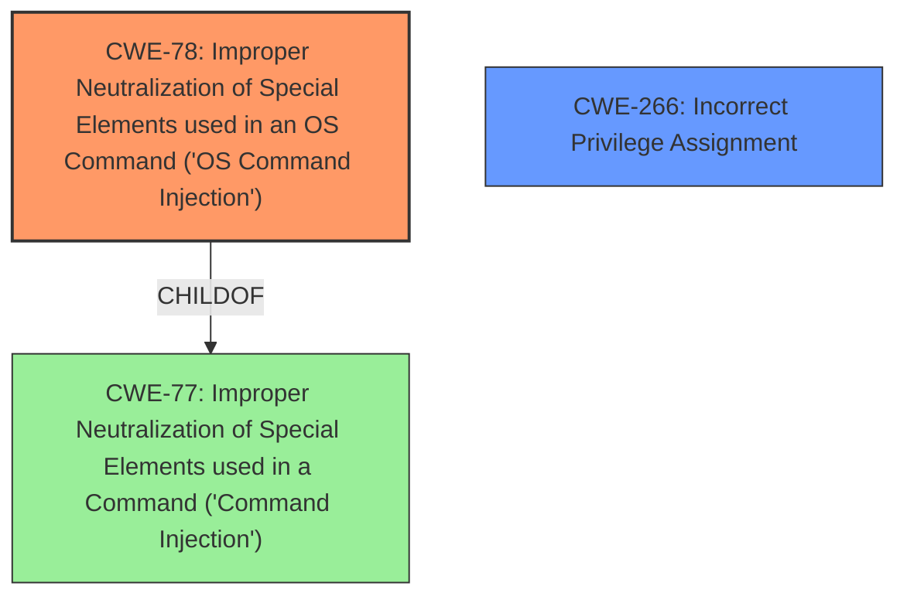

# Analysis for CVE-2025-31644

# Summary
| CWE ID  | CWE Name                                                                                    | Confidence | CWE Abstraction Level | CWE Vulnerability Mapping Label | CWE-Vulnerability Mapping Notes |
| :-------- | :------------------------------------------------------------------------------------------ | :--------- | :---------------------- | :------------------------------ | :------------------------------ |
| CWE-78  | Improper Neutralization of Special Elements used in an OS Command ('OS Command Injection') | 1.0        | Base                    | Primary CWE                    | Allowed                         |
| CWE-266 | Incorrect Privilege Assignment                                                              | 0.5        | Base                    | Secondary Candidate            | Allowed                         |

## Evidence and Confidence

*   **Confidence Score:** 0.75
*   **Evidence Strength:** MEDIUM

## Relationship Analysis
The primary relationship is that CWE-78 [Improper Neutralization of Special Elements used in an OS Command ('OS Command Injection')] is a child of the class CWE-77 [Improper Neutralization of Special Elements used in a Command ('Command Injection')], which is a more general form of command injection. Since the vulnerability description specifies the injection occurs within the OS command, CWE-78 is the more specific and appropriate choice. I also considered CWE-266 [Incorrect Privilege Assignment] because the vulnerability mentions an authenticated attacker with administrator role privileges being able to execute arbitrary system commands, which implies there could be an issue with how privileges are assigned. However, the root cause appears to be the command injection vulnerability itself.

## Vulnerability Chain
The vulnerability chain starts with the **improper neutralization** of special elements within an OS command (**CWE-78**). This allows an attacker to inject malicious commands, leading to arbitrary system command execution and a cross of a security boundary. While the attacker needs administrator privileges, the root cause is the command injection itself.

## Summary of Analysis
The primary weakness is **CWE-78** [Improper Neutralization of Special Elements used in an OS Command ('OS Command Injection')] because the vulnerability description explicitly mentions a "**command injection vulnerability**" in an iControl REST and BIG-IP TMOS Shell (tmsh) command. The vulnerability allows an authenticated attacker to "**execute arbitrary system commands**," indicating that the injected commands are being executed by the system.

The retriever results also support this classification, with CWE-77 [Improper Neutralization of Special Elements used in a Command ('Command Injection')] and CWE-78 [Improper Neutralization of Special Elements used in an OS Command ('OS Command Injection')] being the top two matches. CWE-78 is a more specific version of CWE-77, which makes it a better fit given the context.

I considered CWE-266 [Incorrect Privilege Assignment] because the attacker needs "administrator role privileges" to exploit the vulnerability. This might suggest an issue with privilege assignment, where an attacker with admin privileges is able to perform actions they shouldn't. However, the core issue is the command injection, which allows the attacker to bypass intended security controls. Therefore, CWE-266 is a secondary concern.

Relevant CWE Information:
*   CWE-77: Improper Neutralization of Special Elements used in a Command ('Command Injection')
*   CWE-78: Improper Neutralization of Special Elements used in an OS Command ('OS Command Injection')
*   CWE-266: Incorrect Privilege Assignment