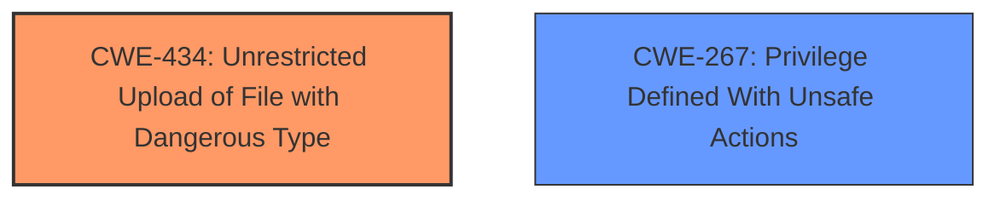

# Analysis for CVE-2025-3169

# Summary
| CWE ID | CWE Name | Confidence | CWE Abstraction Level | CWE Vulnerability Mapping Label | CWE-Vulnerability Mapping Notes |
|---|---|---|---|---|---|
| CWE-434 | Unrestricted Upload of File with Dangerous Type | 1.0 | Base | Allowed | Primary CWE. The vulnerability allows the upload of dangerous file types. |
| CWE-267 | Privilege Defined With Unsafe Actions | 0.4 | Base | Allowed | Secondary Candidate. Only applicable to installations that are not securely configured. |

## Evidence and Confidence

*   **Confidence Score:** 0.8
*   **Evidence Strength:** MEDIUM

## Relationship Analysis
The primary relationship that influenced the decision was the direct match of the vulnerability description to the definition of CWE-434. While other CWEs like CWE-22 (Path Traversal) or CWE-79 (Cross-site Scripting) could potentially be related depending on the specific implementation and file handling, the provided description focuses on the **unrestricted upload** aspect. CWE-267 is added because the vendor mentions that the vulnerability can be exploited only on not securely installed instances, where the attachment directory is not out of web reach.

## Vulnerability Chain
The vulnerability chain starts with the **unrestricted upload** (CWE-434) of a file with a dangerous type. If the system is misconfigured, this can lead to code execution.

## Summary of Analysis
The primary CWE, CWE-434, was chosen because the vulnerability description explicitly mentions "**unrestricted upload**". The description states that the manipulation of the argument `attachmentFiles` leads to this **weakness**. This aligns perfectly with the definition of CWE-434, which states: "The product allows the upload or transfer of dangerous file types that are automatically processed within its environment."

The vendor's statement suggests that the vulnerability is only exploitable if the system is not securely installed, meaning that the attachment directory is within web reach. In this case, CWE-267 could be applicable because a privilege (the ability to upload files) is defined with unsafe actions (allowing the uploaded file to be executed from the web).

I considered other CWEs, such as CWE-22 (Path Traversal) and CWE-79 (Cross-site Scripting), but these are not directly supported by the provided evidence. While it's possible that a path traversal vulnerability could be exploited during the file upload process to place the file in a dangerous location, this is not explicitly stated in the vulnerability description. Similarly, while the uploaded file could contain malicious code that results in XSS, this is also not the primary **weakness** described.

Therefore, the decision to map CWE-434 as the primary CWE is based on the explicit evidence of an **unrestricted upload** vulnerability, with CWE-267 as a secondary consideration due to the vendor's comments.

Relevant CWE Information:

# Enhanced Context (25 CWEs)
The following CWEs were identified as potentially relevant to this vulnerability:

## CWE-434: Unrestricted Upload of File with Dangerous Type
**Abstraction Level**: Base
**Similarity Score**: 0.78
**Source**: dense

**Description**:
The product allows the upload or transfer of dangerous file types that are automatically processed within its environment.

**Mapping Guidance**:
- Usage: Allowed
- Rationale: This CWE entry is at the Base level of abstraction, which is a preferred level of abstraction for mapping to the root causes of vulnerabilities.

## CWE-267: Privilege Defined With Unsafe Actions
**Abstraction Level**: Base
**Similarity Score**: 0.72
**Source**: dense

**Description**:
A particular privilege, role, capability, or right can be used to perform unsafe actions that were not intended, even when it is assigned to the correct entity.

**Mapping Guidance**:
- Usage: Allowed
- Rationale: This CWE entry is at the Base level of abstraction, which is a preferred level of abstraction for mapping to the root causes of vulnerabilities.