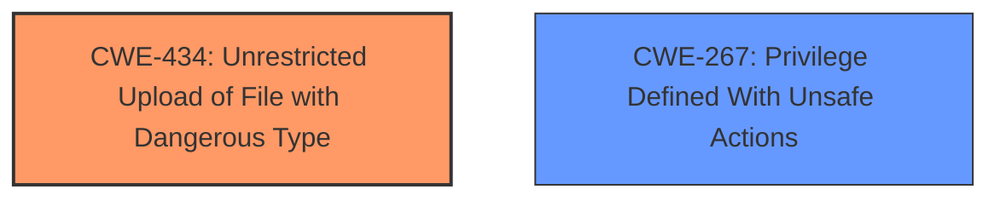

# Analysis Report for CVE-2025-3169

# Vulnerability Analysis Report: CVE-2025-3169

## Description

A vulnerability was found in Projeqtor up to 12.0.2. It has been rated as critical. Affected by this issue is some unknown functionality of the file /tool/saveAttachment.php. The manipulation of the argument attachmentFiles leads to **unrestricted upload**. The attack may be launched remotely. The complexity of an attack is rather high. The exploitation is known to be difficult. The exploit has been disclosed to the public and may be used. Upgrading to version 12.0.3 is able to address this issue. It is recommended to upgrade the affected component. The vendor explains, that this vulnerability can be exploited only on not securely installed instances, as it is adviced during product install attachment directory should be out of web reach, so that even if executable file can be uploaded, it cannot be executed through the web.

## Vulnerability Description Key Phrases

- **Weakness:** unrestricted upload
- **Vector:** manipulation of argument attachmentFiles
- **Product:** Projeqtor
- **Version:** up to 12.0.2
- **Component:** /tool/saveAttachment.php

## Analysis (with Relationship Data)

# Summary
| CWE ID | CWE Name | Confidence | CWE Abstraction Level | CWE Vulnerability Mapping Label | CWE-Vulnerability Mapping Notes |
|---|---|---|---|---|---|
| CWE-434 | Unrestricted Upload of File with Dangerous Type | 1.0 | Base | Allowed | Primary CWE. The vulnerability allows the upload of dangerous file types. |
| CWE-267 | Privilege Defined With Unsafe Actions | 0.4 | Base | Allowed | Secondary Candidate. Only applicable to installations that are not securely configured. |

## Evidence and Confidence

*   **Confidence Score:** 0.8
*   **Evidence Strength:** MEDIUM

## Relationship Analysis
The primary relationship that influenced the decision was the direct match of the vulnerability description to the definition of CWE-434. While other CWEs like CWE-22 (Path Traversal) or CWE-79 (Cross-site Scripting) could potentially be related depending on the specific implementation and file handling, the provided description focuses on the **unrestricted upload** aspect. CWE-267 is added because the vendor mentions that the vulnerability can be exploited only on not securely installed instances, where the attachment directory is not out of web reach.



## Vulnerability Chain
The vulnerability chain starts with the **unrestricted upload** (CWE-434) of a file with a dangerous type. If the system is misconfigured, this can lead to code execution.

## Summary of Analysis
The primary CWE, CWE-434, was chosen because the vulnerability description explicitly mentions "**unrestricted upload**". The description states that the manipulation of the argument `attachmentFiles` leads to this **weakness**. This aligns perfectly with the definition of CWE-434, which states: "The product allows the upload or transfer of dangerous file types that are automatically processed within its environment."

The vendor's statement suggests that the vulnerability is only exploitable if the system is not securely installed, meaning that the attachment directory is within web reach. In this case, CWE-267 could be applicable because a privilege (the ability to upload files) is defined with unsafe actions (allowing the uploaded file to be executed from the web).

I considered other CWEs, such as CWE-22 (Path Traversal) and CWE-79 (Cross-site Scripting), but these are not directly supported by the provided evidence. While it's possible that a path traversal vulnerability could be exploited during the file upload process to place the file in a dangerous location, this is not explicitly stated in the vulnerability description. Similarly, while the uploaded file could contain malicious code that results in XSS, this is also not the primary **weakness** described.

Therefore, the decision to map CWE-434 as the primary CWE is based on the explicit evidence of an **unrestricted upload** vulnerability, with CWE-267 as a secondary consideration due to the vendor's comments.

Relevant CWE Information:

# Enhanced Context (25 CWEs)
The following CWEs were identified as potentially relevant to this vulnerability:

## CWE-434: Unrestricted Upload of File with Dangerous Type
**Abstraction Level**: Base
**Similarity Score**: 0.78
**Source**: dense

**Description**:
The product allows the upload or transfer of dangerous file types that are automatically processed within its environment.

**Mapping Guidance**:
- Usage: Allowed
- Rationale: This CWE entry is at the Base level of abstraction, which is a preferred level of abstraction for mapping to the root causes of vulnerabilities.

## CWE-267: Privilege Defined With Unsafe Actions
**Abstraction Level**: Base
**Similarity Score**: 0.72
**Source**: dense

**Description**:
A particular privilege, role, capability, or right can be used to perform unsafe actions that were not intended, even when it is assigned to the correct entity.

**Mapping Guidance**:
- Usage: Allowed
- Rationale: This CWE entry is at the Base level of abstraction, which is a preferred level of abstraction for mapping to the root causes of vulnerabilities.


## CWE Relationship Analysis

Current CWEs represent these abstraction levels: .


### Vulnerability Chain Analysis

**Chain starting from CWE-267:**
- 267 (Privilege Defined With Unsafe Actions) - ROOT


**Chain starting from CWE-79:**
- 79 (Improper Neutralization of Input During Web Page Generation ('Cross-site Scripting')) - ROOT


### CWE Relationship Diagram

```mermaid
graph TD
    classDef primary fill:#f96,stroke:#333,stroke-width:2px
    classDef secondary fill:#69f,stroke:#333
    classDef tertiary fill:#9e9,stroke:#333
```


*Report generated on 2025-07-14 19:01:38*
