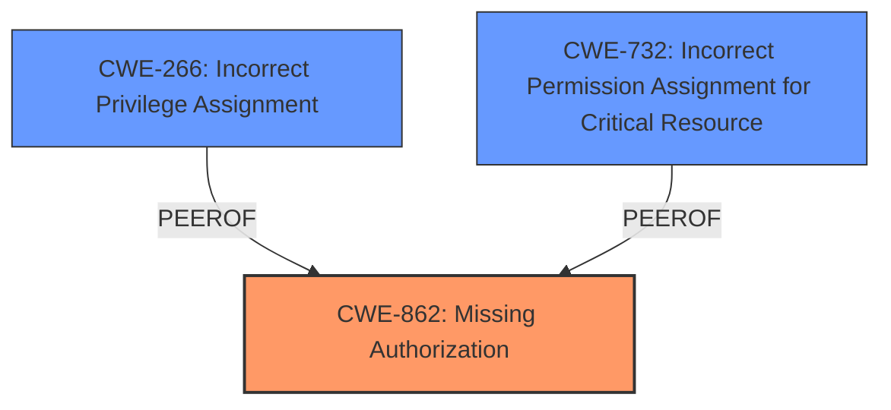

# Analysis Report for CVE-2025-31721

# Vulnerability Analysis Report: CVE-2025-31721

## Description

A **missing permission check** in Jenkins 2.503 and earlier, LTS 2.492.2 and earlier allows attackers with Computer/Create permission but without Computer/Configure permission to copy an agent, gaining access to encrypted secrets in its configuration.

## Vulnerability Description Key Phrases

- **Rootcause:** missing permission check
- **Impact:** copy an agent, gaining access to encrypted secrets in its configuration
- **Attacker:** attackers with Computer/Create permission but without Computer/Configure permission
- **Product:** Jenkins
- **Version:** ['2.503 and earlier', 'LTS 2.492.2 and earlier']

## Analysis (with Relationship Data)

# Summary
| CWE ID  | CWE Name                     | Confidence | CWE Abstraction Level | CWE Vulnerability Mapping Label | CWE-Vulnerability Mapping Notes |
| :------- | :--------------------------- | :--------- | :-------------------- | :------------------------------ | :------------------------------ |
| CWE-862  | Missing Authorization        | 1.0        | Class                 | Allowed-with-Review             | Primary CWE                     |
| CWE-266  | Incorrect Privilege Assignment | 0.7        | Base                 | Allowed                         | Secondary Candidate               |
| CWE-732  | Incorrect Permission Assignment for Critical Resource | 0.6        | Class                | Allowed-with-Review                         | Secondary Candidate               |

## Evidence and Confidence

*   **Confidence Score:** 0.9
*   **Evidence Strength:** HIGH

## Relationship Analysis
The primary relationship influencing the decision is the hierarchical structure with CWE-862 (Missing Authorization) as a class-level CWE that could potentially have more specific children. However, based on the description, the **missing permission check** is the core issue, making CWE-862 the most appropriate high-level classification. CWE-266 (Incorrect Privilege Assignment) is considered as it relates to privilege management, but the description focuses more on a **missing check** rather than an incorrect assignment. CWE-732, while seemingly relevant, is also a class-level CWE and the issue is not so much the assignment of permissions, but the lack of authorization check.



## Vulnerability Chain
The vulnerability chain starts with the **missing permission check** (CWE-862). This allows attackers with Computer/Create permission but without Computer/Configure permission to copy an agent, which leads to gaining access to encrypted secrets in its configuration.

*   Root Cause: CWE-862 (**Missing Authorization**)
*   Impact: Access to encrypted secrets.

## Summary of Analysis
The initial analysis identified CWE-862 as the primary candidate due to the explicit mention of a **missing permission check**. The retriever results also listed CWE-862 with a high score. The guidance on Privileges vs. Permissions suggests looking at CWE-285 (Improper Authorization) or descendants if authorization logic is present but flawed, but since the vulnerability description highlights a **missing check**, CWE-862 is more appropriate. CWE-266 was considered because the attacker gains access to something they should not (encrypted secrets), but the root cause is the **missing check**, not the incorrect assignment of privilege. CWE-732 was considered but the description focuses on a missing check rather than the incorrect assignment of permissions to a critical resource.

The selection of CWE-862 is based primarily on the evidence from the vulnerability description and CVE summary, which clearly states "does not perform a permission check." The analysis is at the class level, acknowledging the possibility of more specific base-level CWEs, but none of the child CWEs or related CWEs provide a better fit given the information available. The confidence level is high (0.9) due to the clear statement of the **missing check** in the source material.

Relevant CWE Information:

# Enhanced Context (25 CWEs)
The following CWEs were identified as potentially relevant to this vulnerability:

## CWE-266: Incorrect Privilege Assignment
**Abstraction Level**: Base
**Similarity Score**: 0.78
**Source**: dense

**Description**:
A product incorrectly assigns a privilege to a particular actor, creating an unintended sphere of control for that actor.

**Mapping Guidance**:
- Usage: Allowed
- Rationale: This CWE entry is at the Base level of abstraction, which is a preferred level of abstraction for mapping to the root causes of vulnerabilities.


## CWE-267: Privilege Defined With Unsafe Actions
**Abstraction Level**: Base
**Similarity Score**: 0.78
**Source**: dense

**Description**:
A particular privilege, role, capability, or right can be used to perform unsafe actions that were not intended, even when it is assigned to the correct entity.

**Mapping Guidance**:
- Usage: Allowed
- Rationale: This CWE entry is at the Base level of abstraction, which is a preferred level of abstraction for mapping to the root causes of vulnerabilities.


## CWE-280: Improper Handling of Insufficient Permissions or Privileges
**Abstraction Level**: Base
**Similarity Score**: 0.77
**Source**: dense

**Description**:
The product does not handle or incorrectly handles when it has insufficient privileges to access resources or functionality as specified by their permissions. This may cause it to follow unexpected code paths that may leave the product in an invalid state.

**Mapping Guidance**:
- Usage: Allowed
- Rationale: This CWE entry is at the Base level of abstraction, which is a preferred level of abstraction for mapping to the root causes of vulnerabilities.


## CWE-276: Incorrect Default Permissions
**Abstraction Level**: Base
**Similarity Score**: 0.76
**Source**: dense

**Description**:
During installation, installed file permissions are set to allow anyone to modify those files.

**Mapping Guidance**:
- Usage: Allowed
- Rationale: This CWE entry is at the Base level of abstraction, which is a preferred level of abstraction for mapping to the root causes of vulnerabilities.


## CWE-274: Improper Handling of Insufficient Privileges
**Abstraction Level**: Base
**Similarity Score**: 0.76
**Source**: dense

**Description**:
The product does not handle or incorrectly handles when it has insufficient privileges to perform an operation, leading to resultant weaknesses.

**Mapping Guidance**:
- Usage: Discouraged
- Rationale: This CWE entry could be deprecated in a future version of CWE.


## CWE-668: Exposure of Resource to Wrong Sphere
**Abstraction Level**: Class
**Similarity Score**: 0.76
**Source**: dense

**Description**:
The product exposes a resource to the wrong control sphere, providing unintended actors with inappropriate access to the resource.

**Mapping Guidance**:
- Usage: Discouraged
- Rationale: CWE-668 is high-level and is often misused as a catch-all when lower-level CWE IDs might be applicable. It is sometimes used for low-information vulnerability reports [REF-1287]. It is a level-1 Class (i.e., a child of a Pillar). It is not useful for trend analysis.


## CWE-212: Improper Removal of Sensitive Information Before Storage or Transfer
**Abstraction Level**: Base
**Similarity Score**: 0.75
**Source**: dense

**Description**:
The product stores, transfers, or shares a resource that contains sensitive information, but it does not properly remove that information before the product makes the resource available to unauthorized actors.

**Mapping Guidance**:
- Usage: Allowed
- Rationale: This CWE entry is at the Base level of abstraction, which is a preferred level of abstraction for mapping to the root causes of vulnerabilities.


## CWE-281: Improper Preservation of Permissions
**Abstraction Level**: Base
**Similarity Score**: 0.75
**Source**: dense

**Description**:
The product does not preserve permissions or incorrectly preserves permissions when copying, restoring, or sharing objects, which can cause them to have less restrictive permissions than intended.

**Mapping Guidance**:
- Usage: Allowed
- Rationale: This CWE entry is at the Base level of abstraction, which is a preferred level of abstraction for mapping to the root causes of vulnerabilities.


## CWE-41: Improper Resolution of Path Equivalence
**Abstraction Level**: Base
**Similarity Score**: 0.74
**Source**: dense

**Description**:
The product is vulnerable to file system contents disclosure through path equivalence. Path equivalence involves the use of special characters in file and directory names. The associated manipulations are intended to generate multiple names for the same object.

**Mapping Guidance**:
- Usage: Allowed
- Rationale: This CWE entry is at the Base level of abstraction, which is a preferred level of abstraction for mapping to the root causes of vulnerabilities.


## CWE-807: Reliance on Untrusted Inputs in a Security Decision
**Abstraction Level**: Base
**Similarity Score**: 0.74
**Source**: dense

**Description**:
The product uses a protection mechanism that relies on the existence or values of an input, but the input can be modified by an untrusted actor in a way that bypasses the protection mechanism.

**Mapping Guidance**:
- Usage: Allowed
- Rationale: This CWE entry is at the Base level of abstraction, which is a preferred level of abstraction for mapping to the root causes of vulnerabilities.


## CWE-863: Incorrect Authorization
**Abstraction Level**: Class
**Similarity Score**: 1689.02
**Source**:


## CWE Relationship Analysis

Current CWEs represent these abstraction levels: .


### Vulnerability Chain Analysis

**Chain starting from CWE-274:**
- 274 (Improper Handling of Insufficient Privileges) - ROOT


**Chain starting from CWE-863:**
- 863 (Incorrect Authorization) - ROOT


### CWE Relationship Diagram

```mermaid
graph TD
    classDef primary fill:#f96,stroke:#333,stroke-width:2px
    classDef secondary fill:#69f,stroke:#333
    classDef tertiary fill:#9e9,stroke:#333
```


*Report generated on 2025-07-14 19:03:33*
