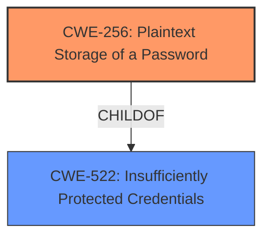

# Analysis Report for CVE-2025-31727

# Vulnerability Analysis Report: CVE-2025-31727

## Description

Jenkins AsakusaSatellite Plugin 0.1.1 and earlier stores **AsakusaSatellite API keys unencrypted** in job config.xml files on the Jenkins controller where they can be viewed by users with Item/Extended Read permission or access to the Jenkins controller file system.

## Vulnerability Description Key Phrases

- **Rootcause:** AsakusaSatellite API keys unencrypted
- **Attacker:** users with Item/Extended Read permission or access to the Jenkins controller file system
- **Product:** Jenkins AsakusaSatellite Plugin
- **Version:** 0.1.1 and earlier

## Analysis (with Relationship Data)

# Summary
| CWE ID | CWE Name | Confidence | CWE Abstraction Level | CWE Vulnerability Mapping Label | CWE-Vulnerability Mapping Notes |
|---|---|---|---|---|---|
| CWE-256 | Plaintext Storage of a Password | 1.0 | Base | Primary | Allowed |
| CWE-522 | Insufficiently Protected Credentials | 0.7 | Class | Secondary | Allowed-with-Review |

## Evidence and Confidence

*   **Confidence Score:** 0.85
*   **Evidence Strength:** HIGH

## Relationship Analysis
The primary relationship is that CWE-256 is a child of CWE-522. CWE-256 is the more specific case of storing passwords in plaintext, while CWE-522 is a more general case of insufficient protection of credentials. Choosing CWE-256 provides a more precise classification of the vulnerability.



## Vulnerability Chain
The vulnerability chain begins with the **unencrypted storage** of the AsakusaSatellite API keys in the `config.xml` files. This leads directly to the exposure of sensitive information, as users with Item/Extended Read permission or access to the Jenkins controller file system can view the keys.

## Summary of Analysis
The initial analysis strongly suggests CWE-256 because the **rootcause** is that the "AsakusaSatellite API keys are **unencrypted**" This is a direct match for the description of CWE-256, "Storing a password in plaintext may result in a system compromise." The retriever results also listed CWE-256 as the top candidate. The relationship information confirms that CWE-256 is a child of CWE-522, making it more specific. The evidence from the vulnerability description is clear, providing high confidence in this assessment. CWE-256 is at the optimal level of specificity.

Relevant CWE Information:

# Enhanced Context (25 CWEs)
The following CWEs were identified as potentially relevant to this vulnerability:

## CWE-538: Insertion of Sensitive Information into Externally-Accessible File or Directory
**Abstraction Level**: Base
**Similarity Score**: 0.78
**Source**: dense

**Description**:
The product places sensitive information into files or directories that are accessible to actors who are allowed to have access to the files, but not to the sensitive information.

**Mapping Guidance**:
- Usage: Allowed
- Rationale: This CWE entry is at the Base level of abstraction, which is a preferred level of abstraction for mapping to the root causes of vulnerabilities.

## Vulnerability Description
Jenkins AsakusaSatellite Plugin 0.1.1 and earlier stores **AsakusaSatellite API keys unencrypted** in job config.xml files on the Jenkins controller where they can be viewed by users with Item/Extended Read permission or access to the Jenkins controller file system.

### Vulnerability Description Key Phrases
- **rootcause:** **AsakusaSatellite API keys unencrypted**
- **attacker:** users with Item/Extended Read permission or access to the Jenkins controller file system
- **product:** Jenkins AsakusaSatellite Plugin
- **version:** 0.1.1 and earlier

## CVE Reference Links Content Summary
## Analysis of CVE-2025-31727 based on provided content

This content **relates** to CVE-2025-31727. The content provides more detail than the official CVE description (which is currently a placeholder).

**Root cause of vulnerability:**

The AsakusaSatellite Plugin stores AsakusaSatellite API keys unencrypted in job `config.xml` files. Additionally, the job configuration form does not mask these API keys.

**Weaknesses/vulnerabilities present:**

*   Storage of sensitive information (API keys) in plain text.
*   Lack of masking of sensitive information in the user interface.

**Impact of exploitation:**

Users with Item/Extended Read permission or access to the Jenkins controller file system can view the API keys. This could lead to unauthorized access to AsakusaSatellite resources.

**Attack vectors:**

*   Access to the Jenkins controller file system.
*   Item/Extended Read permission on jobs using the plugin.

**Required attacker capabilities/position:**

*   Attacker needs Item/Extended Read permission or access to the Jenkins controller file system.

**Mitigation or fix:**

As of the publication of the advisory, there is no fix available.


## CWE Relationship Analysis

Current CWEs represent these abstraction levels: .


### Vulnerability Chain Analysis

**Chain starting from CWE-522:**
- 522 (Insufficiently Protected Credentials) - ROOT


**Chain starting from CWE-538:**
- 538 (Insertion of Sensitive Information into Externally-Accessible File or Directory) - ROOT


### CWE Relationship Diagram

```mermaid
graph TD
    classDef primary fill:#f96,stroke:#333,stroke-width:2px
    classDef secondary fill:#69f,stroke:#333
    classDef tertiary fill:#9e9,stroke:#333
```


*Report generated on 2025-07-14 19:04:59*
