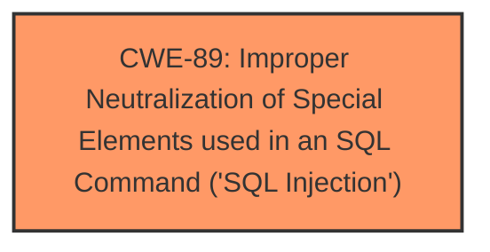

# Enhanced Analysis for CVE-2025-3175

# Summary
| CWE ID | CWE Name | Confidence | CWE Abstraction Level | CWE Vulnerability Mapping Label | CWE-Vulnerability Mapping Notes |
|---|---|---|---|---|---|
| CWE-89 | Improper Neutralization of Special Elements used in an SQL Command ('SQL Injection') | 1.0 | Base | Allowed | Primary CWE. The application constructs an SQL command using externally-influenced input without proper neutralization. |

## Evidence and Confidence

*   **Confidence Score:** 1.0
*   **Evidence Strength:** HIGH

## Relationship Analysis
The primary relationship is that CWE-89 is a base-level weakness related to improper neutralization in SQL commands. No other relationships significantly influenced the decision, as the description clearly points to a SQL injection vulnerability.



## Vulnerability Chain
The vulnerability chain consists of:
1.  **Root Cause:** **Improper Neutralization** of input in `/save_user_edit_profile.php` leading to CWE-89.
2.  **Impact:** **SQL Injection** allows unauthorized database access, sensitive data leakage, data tampering, system control, and service interruption.

## Summary of Analysis
The analysis is primarily based on the provided evidence, which explicitly states that the vulnerability is an **SQL Injection** due to the **improper handling** of the `first_Name` parameter.

> The manipulation of the argument first_Name leads to **sql injection**.

> The root cause is insufficient user input validation of the 'first\_Name' parameter in the '/save\_user\_edit\_profile.php' file. The application directly uses this parameter in SQL queries without proper sanitization or validation, allowing attackers to inject malicious SQL code.

The retriever results also strongly support CWE-89 as the primary weakness. The relationship analysis did not significantly alter the assessment, as the description is clear and direct.

CWE-89 is at the optimal level of specificity (Base) because it directly describes the root cause of the vulnerability.

Relevant CWE Information:

# Enhanced Context (25 CWEs)
The following CWEs were identified as potentially relevant to this vulnerability:

## CWE-89: Improper Neutralization of Special Elements used in an SQL Command ('SQL Injection')
**Abstraction Level**: Base
**Similarity Score**: 0.78
**Source**: dense

**Description**:
The product constructs all or part of an SQL command using externally-influenced input from an upstream component, but it does not neutralize or incorrectly neutralizes special elements that could modify the intended SQL command when it is sent to a downstream component. Without sufficient removal or quoting of SQL syntax in user-controllable inputs, the generated SQL query can cause those inputs to be interpreted as SQL instead of ordinary user data.

**Mapping Guidance**:
- Usage: Allowed
- Rationale: This CWE entry is at the Base level of abstraction, which is a preferred level of abstraction for mapping to the root causes of vulnerabilities.

## CWE-79: Improper Neutralization of Input During Web Page Generation ('Cross-site Scripting')
**Abstraction Level**: Base
**Similarity Score**: 0.76
**Source**: dense

**Description**:
The product receives input from an upstream component, but it does not neutralize or incorrectly neutralizes special characters such as "<", ">", and "&" that could be interpreted as web-scripting elements when they are sent to a downstream component that processes web pages.

**Mapping Guidance**:
- Usage: Allowed
- Rationale: This CWE entry is at the Variant level of abstraction, which is a preferred level of abstraction for mapping to the root causes of vulnerabilities.

*Other CWEs Considered but Not Used:*

*   *CWE-79 (Improper Neutralization of Input During Web Page Generation ('Cross-site Scripting'))*: While neutralization is a common theme, the specific vulnerability is related to SQL commands, not web page generation.
*   *CWE-434 (Unrestricted Upload of File with Dangerous Type)*: This is not relevant to the described vulnerability.
*   *CWE-1336 (Improper Neutralization of Special Elements Used in a Template Engine)*: This is not relevant to the described vulnerability.
*   *CWE-117 (Improper Output Neutralization for Logs)*: This is not relevant to the described vulnerability.
*   *CWE-74 (Improper Neutralization of Special Elements in Output Used by a Downstream Component ('Injection'))*: While this is a broader "Injection" class, CWE-89 is more specific to SQL Injection.
*   *CWE-352 (Cross-Site Request Forgery (CSRF))*: This is not relevant to the described vulnerability.
*   *CWE-472 (External Control of Assumed-Immutable Web Parameter)*: This is not the primary issue.
*   *CWE-471 (Modification of Assumed-Immutable Data (MAID))*: Not relevant to this SQL Injection.


## CWE Relationship Analysis

Current CWEs represent these abstraction levels: .


### Vulnerability Chain Analysis

**Chain starting from CWE-89:**
- 89 (Improper Neutralization of Special Elements used in an SQL Command ('SQL Injection')) - ROOT


**Chain starting from CWE-471:**
- 471 (Modification of Assumed-Immutable Data (MAID)) - ROOT


### CWE Relationship Diagram

```mermaid
graph TD
    classDef primary fill:#f96,stroke:#333,stroke-width:2px
    classDef secondary fill:#69f,stroke:#333
    classDef tertiary fill:#9e9,stroke:#333
```