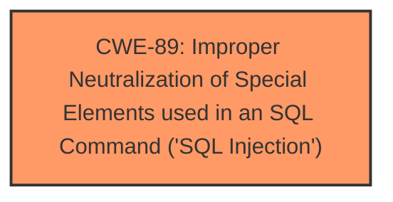

# Analysis for CVE-2025-3179

# Summary
| CWE ID | CWE Name | Confidence | CWE Abstraction Level | CWE Vulnerability Mapping Label | CWE-Vulnerability Mapping Notes |
|---|---|---|---|---|---|
| CWE-89 | Improper Neutralization of Special Elements used in an SQL Command ('SQL Injection') | 1.0 | Base | Primary | Allowed |

## Evidence and Confidence

*   **Confidence Score:** 1.0
*   **Evidence Strength:** HIGH

## Relationship Analysis
The primary relationship that influenced the decision was the direct match between the vulnerability description and the definition of CWE-89. Although other CWEs were considered, they were either too general (Class level) or didn't directly address the root cause of the **SQL injection**. The focus on direct user input leading to **SQL injection** solidifies CWE-89 as the most accurate classification. There are no parent-child or chain relationships in this case because the evidence points directly to the root cause.

## Vulnerability Chain
The vulnerability chain is straightforward:

1.  **Root Cause:** **Improper Neutralization of Special Elements used in an SQL Command ('SQL Injection')** (CWE-89) due to the direct use of the 'ic' parameter in SQL queries without proper sanitization.
2.  **Impact:** Unauthorized database access, sensitive data leakage, data tampering, system control, service interruption.

## Summary of Analysis
The initial analysis identified **SQL injection** as the primary issue, and the retriever results confirmed CWE-89 as the top candidate. The CVE description explicitly states the manipulation of the 'ic' argument leading to **SQL injection** in `/doctor/deletepatient.php`.

> Vulnerability Description Key Phrases:
> - **weakness:** **sql injection**
> - **vector:** manipulation of argument ic
> - **component:** /doctor/deletepatient.php

The "CVE Reference Links Content Summary" section reinforces this by stating:

> Root cause of vulnerability:
> * A **SQL injection** vulnerability exists because the `/doctor/deletepatient.php` file directly uses the 'ic' parameter in SQL queries without proper cleaning or validation.

The confidence in selecting CWE-89 is high because the evidence directly aligns with the CWE's definition and characteristics. The other CWEs were considered but were deemed less specific or representative of the root cause. CWE-89 is at the optimal level of specificity (Base) as it directly addresses the coding error that leads to the vulnerability.

Relevant CWE Information:

# Enhanced Context (25 CWEs)
The following CWEs were identified as potentially relevant to this vulnerability:

## CWE-89: Improper Neutralization of Special Elements used in an SQL Command ('SQL Injection')
**Abstraction Level**: Base
**Similarity Score**: 0.79
**Source**: dense

**Description**:
The product constructs all or part of an SQL command using externally-influenced input from an upstream component, but it does not neutralize or incorrectly neutralizes special elements that could modify the intended SQL command when it is sent to a downstream component. Without sufficient removal or quoting of SQL syntax in user-controllable inputs, the generated SQL query can cause those inputs to be interpreted as SQL instead of ordinary user data.

**Mapping Guidance**:
- Usage: Allowed
- Rationale: This CWE entry is at the Base level of abstraction, which is a preferred level of abstraction for mapping to the root causes of vulnerabilities.

## CWE-79: Improper Neutralization of Input During Web Page Generation ('Cross-site Scripting')
**Abstraction Level**: Base
**Similarity Score**: 0.75
**Source**: dense

**Description**:
The product does not neutralize or incorrectly neutralizes user-controllable input before it is placed in output that is used as a web page that is served to other users.

**Mapping Guidance**:
- Usage: Allowed
- Rationale: This CWE entry is at the Base level of abstraction, which is a preferred level of abstraction for mapping to the root causes of vulnerabilities.

## CWE-434: Unrestricted Upload of File with Dangerous Type
**Abstraction Level**: Base
**Similarity Score**: 0.77
**Source**: dense

**Description**:
The product allows the upload or transfer of dangerous file types that are automatically processed within its environment.

**Mapping Guidance**:
- Usage: Allowed
- Rationale: This CWE entry is at the Base level of abstraction, which is a preferred level of abstraction for mapping to the root causes of vulnerabilities.

## CWE-93: Improper Neutralization of CRLF Sequences ('CRLF Injection')
**Abstraction Level**: Base
**Similarity Score**: 0.77
**Source**: dense

**Description**:
The product uses CRLF (carriage return line feeds) as a special element, e.g. to separate lines or records, but it does not neutralize or incorrectly neutralizes CRLF sequences from inputs.

**Mapping Guidance**:
- Usage: Allowed
- Rationale: This CWE entry is at the Base level of abstraction, which is a preferred level of abstraction for mapping to the root causes of vulnerabilities.

## CWE-1336: Improper Neutralization of Special Elements Used in a Template Engine
**Abstraction Level**: Base
**Similarity Score**: 0.77
**Source**: dense

**Description**:
The product uses a template engine to insert or process externally-influenced input, but it does not neutralize or incorrectly neutralizes special elements or syntax that can be interpreted as template expressions or other code directives when processed by the engine.

**Mapping Guidance**:
- Usage: Allowed
- Rationale: This CWE entry is at the Base level of abstraction, which is a preferred level of abstraction for mapping to the root causes of vulnerabilities.

**CWEs Considered But Not Used:**

*   **CWE-79 (Improper Neutralization of Input During Web Page Generation ('Cross-site Scripting'))**: While input is involved, the vulnerability isn't directly related to web page generation. It's specific to SQL queries.
*   **CWE-434 (Unrestricted Upload of File with Dangerous Type)**: This CWE is irrelevant because the vulnerability doesn't involve file uploads.
*   **CWE-93 (Improper Neutralization of CRLF Sequences ('CRLF Injection'))**: The vulnerability does not involve CRLF sequences.
*   **CWE-1336 (Improper Neutralization of Special Elements Used in a Template Engine)**: This CWE is not relevant because the issue is not related to template engine usage.