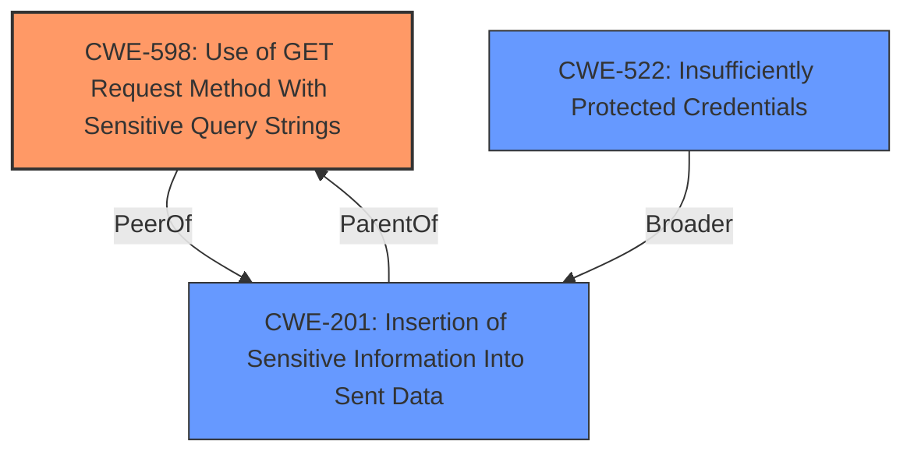

# Analysis for CVE-2025-32021

# Summary
| CWE ID | CWE Name | Confidence | CWE Abstraction Level | CWE Vulnerability Mapping Label | CWE-Vulnerability Mapping Notes |
|---|---|---|---|---|---|
| CWE-598 | Use of GET Request Method With Sensitive Query Strings | 0.9 | Variant |  | Allowed |
| CWE-201 | Insertion of Sensitive Information Into Sent Data | 0.7 | Base |  | Allowed |
| CWE-522 | Insufficiently Protected Credentials | 0.6 | Class |  | Allowed-with-Review |

## Evidence and Confidence

*   **Confidence Score:** 0.8
*   **Evidence Strength:** HIGH

## Relationship Analysis
The primary relationship influencing the CWE selection is a combination of direct matching to the vulnerability description and hierarchical context. CWE-598 is a variant that exposes sensitive information via GET requests. CWE-201 is a broader base class, indicating the insertion of sensitive information into sent data. These two CWEs effectively capture the specific weakness. CWE-522, Insufficiently Protected Credentials, while relevant, is a higher-level classification and thus less specific than CWE-598 and CWE-201.

## Vulnerability Chain
The vulnerability chain starts with the **rootcause**, which is the inclusion of the source code repository URL in the client's URL parameters during component creation. This leads to the exposure of sensitive information such as GitHub credentials in plaintext via the GET request (CWE-598). This information then gets logged, further exacerbating the problem.

## Summary of Analysis
The analysis is strongly based on the provided evidence, particularly the "Vulnerability Description Key Phrases" and "CVE Reference Links Content Summary". The key phrase "including source code repository URL in client URL parameters during component creation" clearly points to the **rootcause**. The "impact: plaintext display of GitHub credentials" directly supports the selection of CWE-598 (Use of GET Request Method With Sensitive Query Strings) and CWE-201 (Insertion of Sensitive Information Into Sent Data).

CWE-598 is selected as the primary CWE because it accurately captures how the sensitive data is exposed, namely through the GET request. CWE-201 supplements this by highlighting the general issue of sensitive data being included in sent data.

Other CWEs were considered but deemed less appropriate:
*   CWE-79 (Improper Neutralization of Input During Web Page Generation ('Cross-site Scripting')): Not applicable, as the vulnerability isn't related to web page generation or XSS.
*   CWE-639 (Authorization Bypass Through User-Controlled Key): Irrelevant, as the issue isn't about bypassing authorization.
*   CWE-88 (Improper Neutralization of Argument Delimiters in a Command ('Argument Injection')): Not applicable, as this isn't related to command injection.
*   CWE-918 (Server-Side Request Forgery (SSRF)): Irrelevant, as this isn't about SSRF.
*   CWE-209 (Generation of Error Message Containing Sensitive Information): While sensitive information is exposed, it's not specifically through error messages, making this less relevant.
*   CWE-540 (Inclusion of Sensitive Information in Source Code): While the URL *could* be considered source code, the core problem is the transmission via URL, not inclusion in source.
*   CWE-78 (Improper Neutralization of Special Elements used in an OS Command ('OS Command Injection')): Irrelevant, as this isn't about OS command injection.

The selected CWEs are at the optimal level of specificity, providing a clear and accurate representation of the vulnerability.

Relevant CWE Information:

# Enhanced Context (25 CWEs)
The following CWEs were identified as potentially relevant to this vulnerability:

## CWE-212: Improper Removal of Sensitive Information Before Storage or Transfer
**Abstraction Level**: Base
**Similarity Score**: 0.75
**Source**: dense

**Description**:
The product stores, transfers, or shares a resource that contains sensitive information, but it does not properly remove that information before the product makes the resource available to unauthorized actors.

**Mapping Guidance**:
- Usage: Allowed
- Rationale: This CWE entry is at the Base level of abstraction, which is a preferred level of abstraction for mapping to the root causes of vulnerabilities.

## CWE-116: Improper Encoding or Escaping of Output
**Abstraction Level**: Class
**Similarity Score**: 0.75
**Source**: dense

**Description**:
The product prepares a structured message for communication with another component, but encoding or escaping of the data is either missing or done incorrectly. As a result, the intended structure of the message is not preserved.

**Mapping Guidance**:
- Usage: Allowed-with-Review
- Rationale: This CWE entry is a Class and might have Base-level children that would be more appropriate

## CWE-1286: Improper Validation of Syntactic Correctness of Input
**Abstraction Level**: Base
**Similarity Score**: 0.74
**Source**: dense

**Description**:
The product receives input that is expected to be well-formed - i.e., to comply with a certain syntax - but it does not validate or incorrectly validates that the input complies with the syntax.

**Mapping Guidance**:
- Usage: Allowed
- Rationale: This CWE entry is at the Base level of abstraction, which is a preferred level of abstraction for mapping to the root causes of vulnerabilities.

## CWE-201: Insertion of Sensitive Information Into Sent Data
**Abstraction Level**: Base
**Similarity Score**: 0.74
**Source**: dense

**Description**:
The code transmits data to another actor, but a portion of the data includes sensitive information that should not be accessible to that actor.

**Mapping Guidance**:
- Usage: Allowed
- Rationale: This CWE entry is at the Base level of abstraction, which is a preferred level of abstraction for mapping to the root causes of vulnerabilities.

## CWE-79: Improper Neutralization of Input During Web Page Generation ('Cross-site Scripting')
**Abstraction Level**: Base
**Similarity Score**: 0.73
**Source**: dense

**Description**:
The product does not neutralize or incorrectly neutralizes user-controllable input before it is placed in output that is used as a web page that is served to other users.

**Mapping Guidance**:
- Usage: Allowed
- Rationale: This CWE entry is at the Base level of abstraction, which is a preferred level of abstraction for mapping to the root causes of vulnerabilities.

## CWE-209: Generation of Error Message Containing Sensitive Information
**Abstraction Level**: Base
**Similarity Score**: 0.73
**Source**: dense

**Description**:
The product generates an error message that includes sensitive information about its environment, users, or associated data.

**Mapping Guidance**:
- Usage: Allowed
- Rationale: This CWE entry is at the Base level of abstraction, which is a preferred level of abstraction for mapping to the root causes of vulnerabilities.

## CWE-80: Improper Neutralization of Script-Related HTML Tags in a Web Page (Basic XSS)
**Abstraction Level**: Variant
**Similarity Score**: 0.73
**Source**: dense

**Description**:
The product receives input from an upstream component, but it does not neutralize or incorrectly neutralizes special characters such as "<", ">", and "&" that could be interpreted as web-scripting elements when they are sent to a downstream component that processes web pages.

**Mapping Guidance**:
- Usage: Allowed
- Rationale: This CWE entry is at the Variant level of abstraction, which is a preferred level of abstraction for mapping to the root causes of vulnerabilities.

## CWE-74: Improper Neutralization of Special Elements in Output Used by a Downstream Component ('Injection')
**Abstraction Level**: Class
**Similarity Score**: 0.73
**Source**: dense

**Description**:
The product constructs all or part of a command, data structure, or record using externally-influenced input from an upstream component, but it does not neutralize or incorrectly neutralizes special elements that could modify how it is parsed or interpreted when it is sent to a downstream component.

**Mapping Guidance**:
- Usage: Discouraged
- Rationale: CWE-74 is high-level and often misused when lower-level weaknesses are more appropriate.

## CWE-93: Improper Neutralization of CRLF Sequences ('CRLF Injection')
**Abstraction Level**: Base
**Similarity Score**: 0.